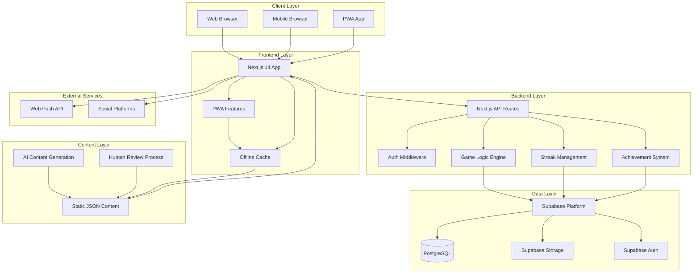
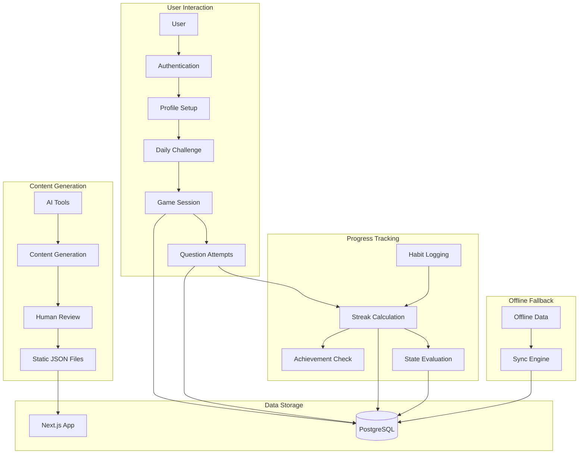

# FitJourney Game High-Level Architecture Document

## Executive Summary

FitJourney is a gamified fitness knowledge platform that combines daily quiz challenges, habit tracking, and avatar progression to motivate users to learn about fitness while building healthy habits. The system uses pre-generated AI content to minimize runtime costs while providing engaging, personalized experiences through streak tracking, achievements, and social sharing.

The architecture follows a modern web application pattern with Next.js frontend, Supabase backend, and enhanced offline capabilities through PWA features. Content is generated offline using AI tools and stored as static JSON files, ensuring fast performance and low operational costs. Users primarily interact online with offline fallback for content viewing.

## System Context

### Business Context
The system addresses the challenge of making fitness education engaging and habit-forming through gamification. Success is measured by user engagement (daily challenge completion rates), habit formation (streak maintenance), and knowledge retention (quiz performance improvements).

### System Boundaries
- **In Scope**: User authentication, daily challenges, habit tracking, streak management, achievement system, avatar progression, offline PWA functionality, social sharing, basic notifications.

- **Out of Scope**: Real-time multiplayer features, advanced analytics, payment processing (Phase 1), complex AI content generation at runtime.

### Key Stakeholders
- **Primary Users**: Fitness enthusiasts, beginners learning about fitness, users building healthy habits
- **Business Owners**: Fitness education platform operators
- **Content Creators**: AI tools and human reviewers for content generation

## Core User Journeys

### User Onboarding Journey
**Purpose**: Guide new users through initial setup and first engagement

**Flow**: 
1. **Authentication** → Supabase Auth integration
2. **Profile Setup** → Required display_name, optional avatar preferences
3. **First Daily Challenge** → Introduction to quiz format and scoring
4. **Achievement Unlock** → First completion achievement celebration
5. **Habit Introduction** → Brief tutorial on habit logging system

**Architecture Impact**: 
- Auth middleware ensures profile completion before feature access
- Static content provides onboarding guidance and first challenge
- Achievement system triggers immediate engagement feedback

### Daily Challenge Journey
**Purpose**: Core engagement loop for daily fitness knowledge testing

**Flow**:
1. **Challenge Access** → Home screen displays current day's challenge
2. **Session Creation** → GameSession record with timezone locking
3. **Question Progression** → Mixed standalone and passage-based questions
4. **Retry Logic** → Up to 3 attempts if needed before day ends
5. **Completion & Streak Update** → Streak calculation and achievement checks
6. **Habit Update** -> Habit Tracking Journey
6. **Social Sharing** → Optional result sharing with challenge URLs

**Architecture Impact**:
- Game Session Engine manages state and progression
- Timezone locking prevents manipulation attempts
- Streak Management System updates user progress
- Achievement System checks unlock conditions

### Habit Tracking Journey
**Purpose**: Build healthy fitness habits through daily logging

**Flow**:
1. **Habit Interface** → Toggle buttons for all habit types
2. **Daily Logging** → StreakLog entries with timestamp validation
3. **Streak Calculation** → Multi-type streak tracking and milestones
4. **Perfect Day Detection** → "All" streak type for complete habit days
5. **Achievement Rewards** → Habit-specific and perfect day achievements

**Architecture Impact**:
- Streak Management System handles multi-type calculations
- Event-driven updates trigger achievement checks
- User State evaluation considers habit patterns

### Practice Session Journey
**Purpose**: Allow users to practice specific content categories

**Flow**:
1. **Category Selection** → Browse available ContentCategory options
2. **Session Initiation** → 10-question practice session (ephemeral)
3. **Mixed Content** → Standalone and passage-based questions
4. **Immediate Feedback** → Show correct answers and explanations
5. **Performance Summary** → Score, accuracy, and time metrics

**Architecture Impact**:
- Content Management System provides category-specific questions
- No persistent GameSession records (ephemeral sessions)
- Performance tracking for analytics and difficulty calibration

### Achievement & Progress Journey
**Purpose**: Maintain long-term engagement through milestone recognition

**Flow**:
1. **Progress Monitoring** → Track streaks, quiz performance, habit completion
2. **Achievement Checking** → Automatic unlock condition evaluation
3. **Celebration Display** → Modal with achievement details and rewards
4. **Profile Updates** → Avatar progression and state changes
5. **Social Recognition** → Share achievements and progress milestones

**Architecture Impact**:
- Achievement System continuously monitors unlock conditions
- Avatar Progression System evaluates user state changes
- Event-driven architecture ensures real-time updates

### Offline Engagement Journey
**Purpose**: Provide continuity when users are offline

**Flow**:
1. **Content Caching** → PWA caches previously viewed content
2. **Offline Viewing** → Access cached questions and avatar status
3. **Action Queuing** → Queue offline actions (habit logging, quiz attempts)
4. **Sync on Reconnection** → Process queued actions and update server
5. **Conflict Resolution** → Handle any data conflicts using timestamp logic

**Architecture Impact**:
- PWA features provide offline content access
- Sync Engine handles offline data synchronization
- Conflict resolution maintains data integrity

### Social Sharing Journey
**Purpose**: Increase engagement through social interaction

**Flow**:
1. **Result Generation** → Create shareable challenge results
2. **URL Generation** → Unique challenge URLs for direct access
3. **Social Platform Integration** → Native sharing to social media
4. **Challenge Acceptance** → Other users access shared challenges
5. **Score Comparison** → Display performance comparison

**Architecture Impact**:
- Social sharing APIs integrate with challenge results
- Unique URL generation for challenge accessibility
- Performance comparison requires data aggregation

## Architectural Vision

### Core Architecture Principles
- **Pre-Generated Content First**: All knowledge content generated offline to minimize runtime costs and ensure quality
- **Progressive Web App Enhanced**: PWA features built-in from day one for offline fallback and mobile experience
- **Data Integrity by Design**: Timezone locking, streak validation, and audit trails prevent gaming the system
- **Scalable Foundation**: Modern tech stack that can grow from MVP to enterprise scale

### Quality Attributes & Trade-offs
- **Performance vs. Content Freshness**: Static content ensures fast loading but requires manual updates
- **Offline Capability vs. Data Consistency**: Offline fallback approach may lead to sync conflicts requiring resolution
- **Security vs. User Experience**: Timezone locking prevents manipulation but adds complexity to user flows

## System Architecture

### High-Level System Diagram

### Architecture Patterns
- **Layered Architecture**: Clear separation between presentation, business logic, and data layers
- **Event-Driven**: Streak and achievement systems respond to user actions
- **Repository Pattern**: Static content management through JSON files
- **CQRS-like**: Separate read (content display) and write (user progress) operations

### Technology Stack
#### **Frontend/Presentation Tier**
- **Next.js 14**: Server-side rendering, PWA support, and API routes
- **Tailwind CSS**: Rapid UI development with consistent design system
- **Framer Motion**: Smooth animations for avatar progression and transitions

#### **Application Tier**
- **Next.js API Routes**: Backend logic and game mechanics
- **Zustand**: Lightweight state management for client-side state
- **React Query**: Server state management and caching

#### **Data Tier**
- **Supabase**: PostgreSQL database, authentication, and file storage
- **Drizzle ORM**: Type-safe database operations and migrations

#### **Infrastructure & Platform**
- **Vercel**: Next.js optimized hosting with edge functions
- **Supabase**: Managed database and authentication platform

## Core Components

### Content Management System
- **Purpose**: Manages all pre-generated fitness knowledge content including questions, passages, and knowledge base articles
- **Key Responsibilities**: Content validation, versioning, and distribution to frontend
- **Technology Approach**: JSON file-based storage with build-time validation

### Game Session Engine
- **Purpose**: Orchestrates daily challenges, practice sessions, and tracks user progress
- **Key Responsibilities**: Session management, question sequencing, timezone handling, retry logic
- **Technology Approach**: State machine pattern with persistent session storage

### Streak Management System
- **Purpose**: Tracks user progress across multiple habit types and quiz completion
- **Key Responsibilities**: Multi-type streak calculation, milestone detection, streak history
- **Technology Approach**: Event-driven updates with timezone-aware date calculations

### Achievement System
- **Purpose**: Rewards user milestones and maintains engagement through unlockable achievements
- **Key Responsibilities**: Condition checking, achievement unlocking, celebration display
- **Technology Approach**: Rule engine pattern with extensible unlock conditions

### Avatar Progression System
- **Purpose**: Visual representation of user fitness state and progress
- **Key Responsibilities**: State evaluation, avatar selection, progression visualization
- **Technology Approach**: Rule-based state machine with visual asset management

### Mobile Enabled User Interface
- **Purpose**: Provide native app-like experience across all devices with responsive design and PWA capabilities
- **Key Responsibilities**: Responsive layout, touch-optimized interactions, PWA installation, offline content access, mobile-first design patterns
- **Technology Approach**: Progressive Web App with responsive Tailwind CSS, Framer Motion animations, and mobile-optimized component library

## Data Architecture

### Data Flow Diagram

### Data Strategy
- **Data Sources**: AI-generated content, user interactions, habit logging, quiz attempts
- **Data Storage**: PostgreSQL for user data, JSON files for static content, Supabase Storage for images
- **Data Processing**: Real-time streak calculations, batch achievement processing, offline data sync resolution
- **Data Access**: Drizzle ORM for database operations, direct JSON loading for static content

## Integration Architecture

### External Integrations
- **Web Push API**: Browser-based notifications for daily reminders
- **Social Sharing APIs**: Native sharing for challenge results
- **Content Generation**: Use Claude/Gemini to generate textual content via API/Manual process. Include descriptive placeholder prompts for Images.
- **Image Generation**: Gemini/DALL-E/Midjourney for avatar creation (offline process)

### Internal Communication
- **Synchronous**: API calls for immediate user actions
- **Event-Driven**: Streak updates trigger achievement checks
- **State Management**: Centralized state for UI consistency

## Cross-Cutting Concerns

### Security Architecture
- **Authentication & Authorization**: Supabase Auth with JWT tokens and row-level security
- **Data Protection**: Encrypted data transmission, user data isolation, timezone manipulation prevention
- **Network Security**: HTTPS enforcement, API rate limiting, input validation

### Observability Strategy
- **Monitoring Approach**: Vercel Analytics for performance, Supabase dashboard for database metrics
- **Logging Strategy**: Structured logging for user actions and system events
- **Analytics & Metrics**: User engagement, streak patterns, content performance

### Performance & Scalability
- **Scalability Strategy**: Horizontal scaling through Vercel edge functions, database read replicas
- **Performance Requirements**: <200ms for cached data, <1s for server requests
- **Caching Strategy**: Static content caching, user data caching with React Query, PWA offline fallback caching

### Reliability & Resilience
- **Availability Requirements**: 99.9% uptime target with graceful degradation
- **Fault Tolerance**: Graceful error handling, data validation, offline fallback for content viewing
- **Backup & Recovery**: Supabase automated backups, static content version control

## Deployment Architecture

### Environment Strategy
- **Development**: Local development with Supabase local instance
- **Staging**: Vercel preview deployments with staging database
- **Production**: Vercel production with production Supabase instance

### Deployment Model
- **Frontend**: Vercel automatic deployments from Git
- **Database**: Supabase managed PostgreSQL with Drizzle migrations
- **Static Content**: Git-based versioning with build-time validation

### Infrastructure Requirements
- **Compute**: Vercel serverless functions and edge functions
- **Storage**: Supabase PostgreSQL (500MB free tier), Supabase Storage (1GB free tier)
- **CDN**: Vercel edge network for global performance

## Development & Operations

### CI/CD Strategy
- **GitHub Integration**: Automatic deployments to Vercel
- **Database Migrations**: Drizzle Kit for schema changes
- **Content Validation**: Build-time checks for static content integrity

### Testing Strategy
- **Test Pyramid**: Unit tests for business logic, integration tests for API endpoints, E2E tests for critical user flows. Use Playwright for UI/E2E tests. Vitest for other applicable testing.
- **Quality Gates**: Automated content validation, database schema checks, performance budgets
- **Performance Testing**: Lighthouse CI for PWA metrics, load testing for API endpoints

### Release Management
- **Content Updates**: Manual content generation and review process
- **Feature Releases**: Git-based deployment with feature flags
- **Rollback Strategy**: Vercel instant rollbacks, database migration rollbacks

## Risk Assessment

### Technical Risks
- **Content Quality**: Mitigation through human review process and AI content validation
- **Offline Sync Conflicts**: Mitigation through timestamp-based conflict resolution
- **Timezone Complexity**: Mitigation through comprehensive testing and validation

### Operational Risks
- **Content Generation Delays**: Mitigation through automated pipelines and content versioning
- **Database Performance**: Mitigation through proper indexing and read replica scaling
- **PWA Compatibility**: Mitigation through progressive enhancement and fallback strategies

### Compliance & Regulatory
- **Data Privacy**: GDPR compliance through Supabase data controls
- **User Consent**: Clear notification preferences and data usage transparency

## Migration & Evolution

### Migration Strategy
- **Phase 1**: Core MVP with basic features and content
- **Phase 2**: Advanced analytics, payment integration, expanded content
- **Phase 3**: Social features, advanced gamification, AI-powered personalization

### Future Considerations
- **Real-time Features**: WebSocket support for live multiplayer challenges
- **Advanced AI**: Runtime content personalization and adaptive difficulty
- **Mobile Apps**: Native iOS/Android apps with shared backend

### Technical Debt & Improvements
- **Content Management**: Move to headless CMS for easier content updates
- **Testing Coverage**: Increase automated testing coverage for business logic
- **Performance Monitoring**: Implement real user monitoring and performance budgets

## Appendices

### Glossary
- **PWA**: Progressive Web App - web application with native app-like features
- **Streak**: Consecutive days of completing a specific habit or activity
- **GameSession**: Individual user session for completing a daily challenge
- **UserState**: Current fitness level and avatar state based on user progress

### References
- Supabase Documentation: https://supabase.com/docs
- Next.js PWA Documentation: https://nextjs.org/docs
- Drizzle ORM Documentation: https://orm.drizzle.team

### Decision Log
- **Next.js 14**: Chosen for built-in PWA support and server-side rendering capabilities
- **Supabase**: Selected for managed PostgreSQL, authentication, and file storage in single platform
- **Static Content Strategy**: Pre-generated content approach to minimize runtime costs and ensure quality
- **Timezone Locking**: Session-based timezone storage to prevent manipulation and ensure fair play