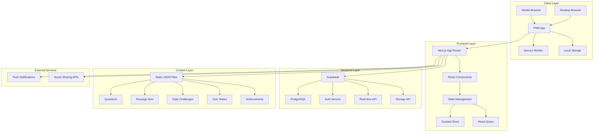
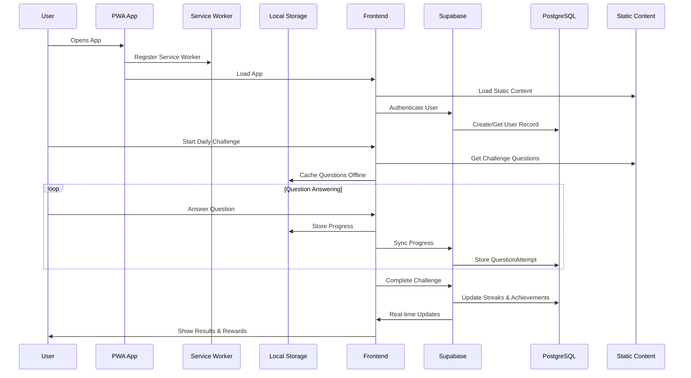
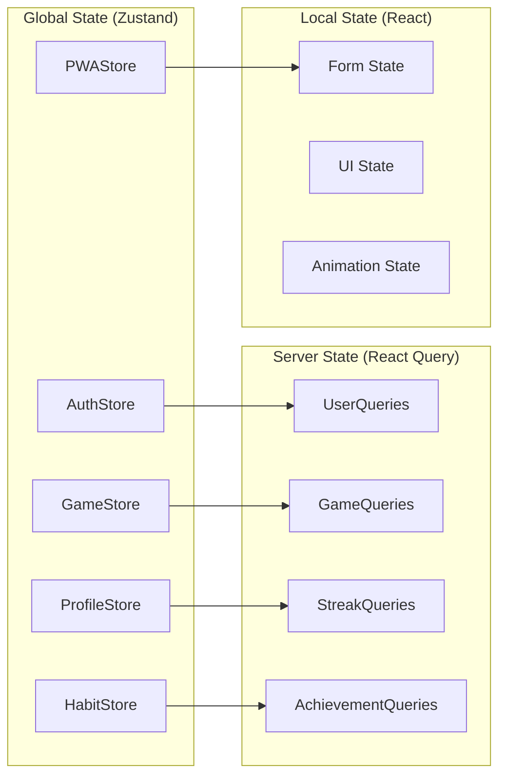
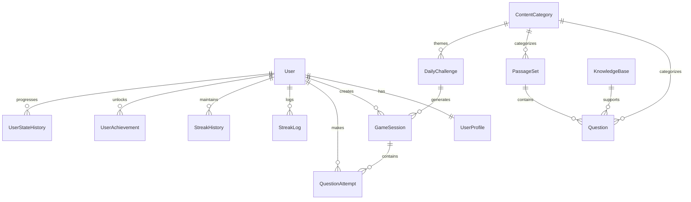
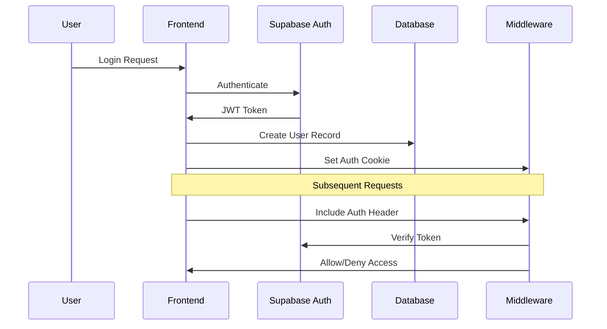
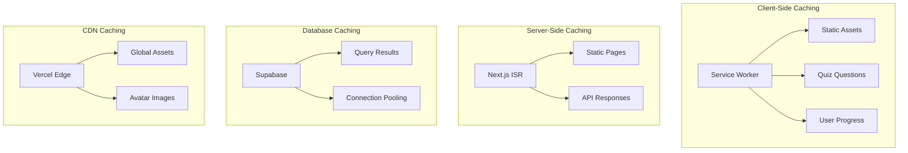
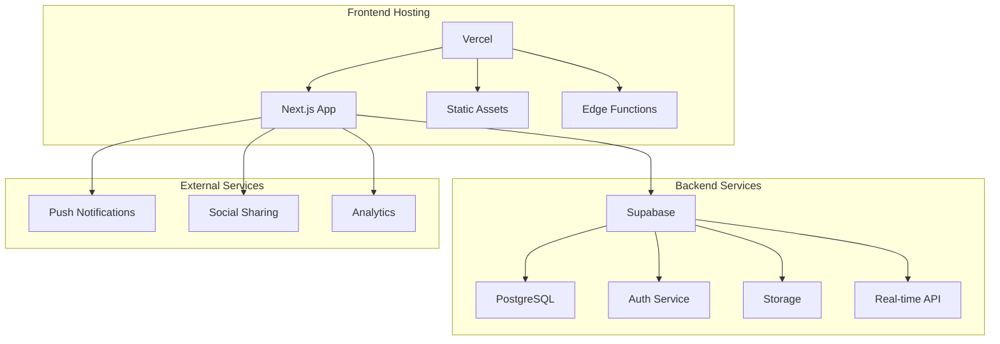
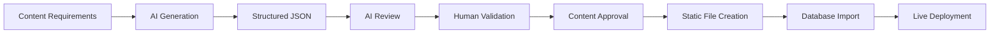
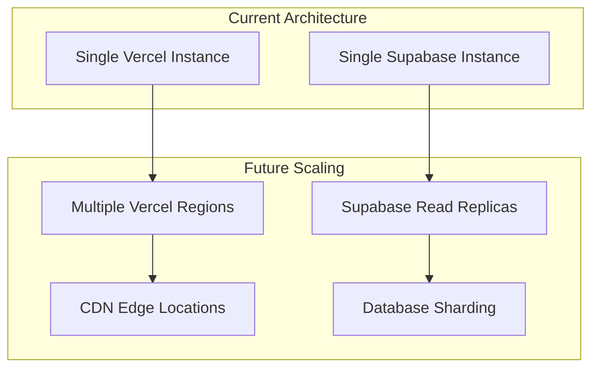

# FitJourney Game - High-Level Architecture

## Executive Summary

The FitJourney Game is a Progressive Web Application (PWA) that combines gamified fitness education with habit tracking. The system uses pre-generated AI content to provide engaging daily challenges while maintaining low operational costs and high performance.

## System Overview

```
┌─────────────────────────────────────────────────────────────────────────────┐
│                              FITNESS AI GAME                               │
├─────────────────────────────────────────────────────────────────────────────┤
│  Frontend (Next.js 14)  │  Backend (Supabase)  │  Content Pipeline      │
│  • PWA Support          │  • PostgreSQL DB     │  • AI Generation       │
│  • Offline Capability   │  • Real-time Auth    │  • Human Review        │
│  • Social Sharing       │  • Row Level Security│  • Static JSON Files   │
└─────────────────────────────────────────────────────────────────────────────┘
```

## Core Architecture Principles

1. **Pre-Generated Content**: All quiz questions and avatar images are generated offline using AI tools, reviewed, and stored as static JSON files
2. **Progressive Web App**: Full offline capability with service worker and local storage
3. **Real-time Updates**: Supabase real-time subscriptions for live streak and achievement updates
4. **Scalable Foundation**: Built on modern web technologies with clear separation of concerns

## High-Level System Architecture



## Data Flow Architecture



## Component Architecture

### Frontend Component Hierarchy

```
App (Layout)
├── AuthProvider
│   ├── LoginForm
│   ├── SignupForm
│   └── ProtectedRoute
├── GameProvider
│   ├── DailyChallenge
│   │   ├── QuestionRenderer
│   │   ├── PassageRenderer
│   │   └── ProgressTracker
│   ├── PracticeMode
│   │   ├── CategorySelector
│   │   └── QuestionSet
│   └── ResultsDisplay
├── ProfileProvider
│   ├── UserProfile
│   ├── AvatarDisplay
│   ├── StreakTracker
│   └── AchievementShowcase
├── HabitProvider
│   ├── HabitLogger
│   ├── StreakCalendar
│   └── ProgressCharts
└── PWAProvider
    ├── InstallPrompt
    ├── OfflineIndicator
    └── NotificationManager
```

### State Management Architecture



## Database Architecture

### Core Tables Structure



### Static Content Organization

```
static-content/
├── content-categories/
│   ├── equipment.json
│   ├── form.json
│   ├── nutrition.json
│   └── injury-prevention.json
├── questions/
│   ├── equipment.json
│   ├── form.json
│   ├── nutrition.json
│   └── injury-prevention.json
├── passage-sets/
│   ├── equipment.json
│   ├── form.json
│   ├── nutrition.json
│   └── injury-prevention.json
├── daily-challenges/
│   ├── challenge-1.json
│   ├── challenge-2.json
│   └── challenge-30.json
├── user-states/
│   ├── average.json
│   ├── fit-healthy.json
│   ├── lean-tired.json
│   └── injured-recovering.json
├── achievements/
│   ├── streak-achievements.json
│   ├── knowledge-achievements.json
│   └── habit-achievements.json
└── avatar-assets/
    ├── male-teen/
    ├── female-young-adult/
    └── non-binary-middle-age/
```

## API Architecture

### RESTful Endpoints

```typescript
// Authentication
POST   /api/auth/login
POST   /api/auth/signup
POST   /api/auth/logout
GET    /api/auth/user

// Game Sessions
GET    /api/challenges/daily
POST   /api/sessions/start
POST   /api/sessions/:id/complete
POST   /api/questions/:id/attempt

// User Profile
GET    /api/profile
PUT    /api/profile
GET    /api/profile/avatar
PUT    /api/profile/avatar

// Streaks & Habits
GET    /api/streaks/current
POST   /api/habits/log
GET    /api/streaks/history

// Achievements
GET    /api/achievements
GET    /api/achievements/unlocked

// Practice Mode
GET    /api/categories
GET    /api/categories/:id/questions
```

### Real-time Subscriptions

```typescript
// Supabase Real-time Channels
const channels = {
  userProfile: `user:${userId}:profile`,
  streaks: `user:${userId}:streaks`,
  achievements: `user:${userId}:achievements`,
  gameProgress: `user:${userId}:game-progress`
};
```

## Security Architecture

### Authentication Flow



### Data Protection Layers

```
┌─────────────────────────────────────────────────────────────────────────────┐
│                              SECURITY LAYERS                               │
├─────────────────────────────────────────────────────────────────────────────┤
│ 1. Row Level Security (RLS) in Supabase                                   │
│ 2. JWT Token Validation                                                   │
│ 3. Input Validation with Zod Schemas                                      │
│ 4. Rate Limiting on API Endpoints                                         │
│ 5. CORS Configuration                                                     │
│ 6. XSS Prevention via React Security                                      │
└─────────────────────────────────────────────────────────────────────────────┘
```

## Performance Architecture

### Caching Strategy



### Offline-First Strategy

```
┌─────────────────────────────────────────────────────────────────────────────┐
│                              OFFLINE STRATEGY                              │
├─────────────────────────────────────────────────────────────────────────────┤
│ 1. Service Worker caches all static content                               │
│ 2. Local Storage stores user progress                                     │
│ 3. IndexedDB for larger offline datasets                                  │
│ 4. Background sync when connection restored                                │
│ 5. Conflict resolution for offline changes                                │
└─────────────────────────────────────────────────────────────────────────────┘
```

## Deployment Architecture

### Infrastructure Components



### CI/CD Pipeline

```
┌─────────────────────────────────────────────────────────────────────────────┐
│                              CI/CD PIPELINE                                │
├─────────────────────────────────────────────────────────────────────────────┤
│ 1. GitHub Actions for automated testing                                    │
│ 2. Drizzle Kit for database migrations                                     │
│ 3. Vercel for automatic deployments                                        │
│ 4. Supabase for database schema updates                                    │
│ 5. Content validation before deployment                                    │
└─────────────────────────────────────────────────────────────────────────────┘
```

## Content Generation Pipeline

### AI Content Workflow



### Content Validation Rules

```typescript
// Content validation schemas
const questionSchema = z.object({
  id: z.string().uuid(),
  content_category_id: z.string(),
  question_text: z.string().min(10),
  options: z.array(z.string()).min(2).max(4),
  correct_answer_index: z.number().min(0).max(3),
  explanation: z.string().min(20),
  difficulty_level: z.number().min(1).max(5),
  is_standalone: z.boolean(),
  passage_set_id: z.string().uuid().optional()
});

const dailyChallengeSchema = z.object({
  id: z.string().uuid(),
  day: z.number().min(1),
  content_category_id: z.string(),
  challenge_structure: z.array(z.object({
    type: z.enum(['standalone', 'passage']),
    question_id: z.string().uuid().optional(),
    passage_set_id: z.string().uuid().optional(),
    question_ids: z.array(z.string().uuid()).optional()
  })),
  total_questions: z.number().min(1),
  theme: z.string().optional()
});
```

## Monitoring & Analytics

### Key Metrics

```typescript
// User Engagement Metrics
const metrics = {
  dailyActiveUsers: 'DAU tracking',
  challengeCompletionRate: 'Daily challenge success rate',
  streakRetention: 'User streak continuation',
  habitAdoption: 'Habit logging frequency',
  socialSharing: 'Challenge sharing rate',
  offlineUsage: 'PWA offline engagement'
};

// Performance Metrics
const performance = {
  pageLoadTime: 'Core Web Vitals',
  offlineAvailability: 'Service worker effectiveness',
  databaseResponseTime: 'Supabase performance',
  cacheHitRate: 'Static content caching',
  errorRate: 'System reliability'
};
```

### Error Handling Strategy

```
┌─────────────────────────────────────────────────────────────────────────────┐
│                              ERROR HANDLING                                │
├─────────────────────────────────────────────────────────────────────────────┤
│ 1. Global Error Boundary for React errors                                 │
│ 2. API error handling with user-friendly messages                         │
│ 3. Offline error handling with retry mechanisms                           │
│ 4. Database error logging and monitoring                                  │
│ 5. Graceful degradation for missing content                               │
└─────────────────────────────────────────────────────────────────────────────┘
```

## Scalability Considerations

### Horizontal Scaling



### Performance Optimization

```
┌─────────────────────────────────────────────────────────────────────────────┐
│                              PERFORMANCE                                   │
├─────────────────────────────────────────────────────────────────────────────┤
│ 1. Image optimization with Next.js Image component                        │
│ 2. Code splitting and lazy loading                                        │
│ 3. Database query optimization                                            │
│ 4. Service worker caching strategies                                      │
│ 5. Edge computing for global performance                                  │
└─────────────────────────────────────────────────────────────────────────────┘
```

## Risk Mitigation

### Technical Risks

1. **Content Generation Quality**: Implement multi-stage review process
2. **Offline Sync Conflicts**: Use timestamp-based conflict resolution
3. **Database Performance**: Monitor and optimize queries, implement caching
4. **PWA Compatibility**: Progressive enhancement and fallback strategies

### Business Risks

1. **User Engagement**: Gamification mechanics and social features
2. **Content Freshness**: Regular content updates and seasonal themes
3. **Platform Dependencies**: Vendor lock-in mitigation strategies
4. **Scalability Costs**: Monitor usage and implement cost controls

## Success Metrics

### Technical KPIs

- **Performance**: Page load time < 2 seconds, offline functionality > 95%
- **Reliability**: 99.9% uptime, error rate < 0.1%
- **Scalability**: Support 10K+ concurrent users without degradation

### Business KPIs

- **User Engagement**: Daily active users, challenge completion rate
- **Retention**: 7-day, 30-day, and 90-day retention rates
- **Growth**: User acquisition, social sharing, viral coefficient

## Implementation Roadmap

### Phase 1: Core Foundation (Weeks 1-4)
- [ ] Database schema implementation
- [ ] Authentication system
- [ ] Basic UI components
- [ ] Static content generation

### Phase 2: Game Mechanics (Weeks 5-8)
- [ ] Daily challenge system
- [ ] Question rendering engine
- [ ] Streak tracking
- [ ] Achievement system

### Phase 3: PWA Features (Weeks 9-12)
- [ ] Service worker implementation
- [ ] Offline functionality
- [ ] Push notifications
- [ ] Social sharing

### Phase 4: Polish & Launch (Weeks 13-16)
- [ ] Performance optimization
- [ ] User testing
- [ ] Content refinement
- [ ] Production deployment

This architecture provides a solid foundation for building a scalable, engaging fitness game that meets all the specified requirements while maintaining performance and cost efficiency.
