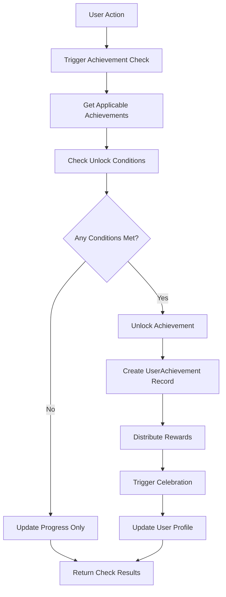
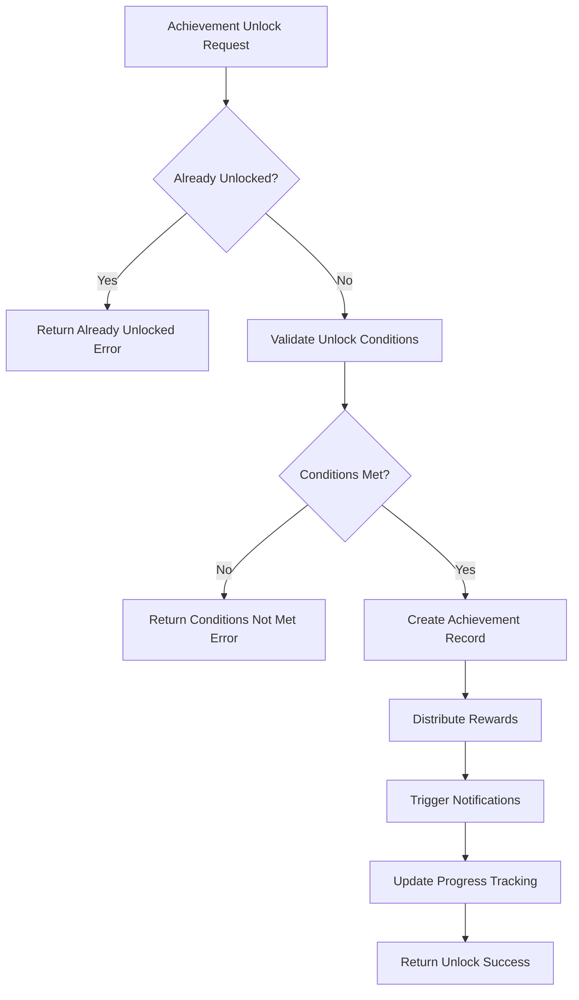
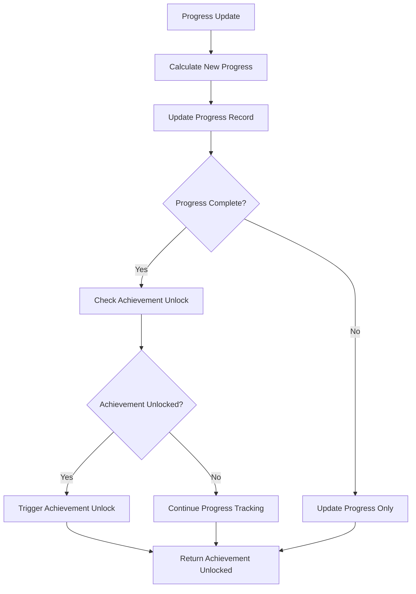

# Achievement System Low-Level Design Document

## Executive Summary

The Achievement System rewards user milestones and maintains engagement through unlockable achievements. This component uses a rule engine pattern with extensible unlock conditions to automatically detect when users meet achievement criteria and trigger celebration displays and reward systems.

## Design Context

### Requirements Reference
**Functional Requirements**: R7.1, R7.2, R17.1, R5.2, R6.2

**Non-Functional Requirements**: Real-time achievement checking, extensible unlock conditions, performance under high user activity, achievement data integrity

**User Journey Reference**: Achievement & Progress Journey, Daily Challenge Journey, Habit Tracking Journey

**Dependencies**: Streak Management System, Game Session Engine, Content Management System, Database Layer (Drizzle)

### Scope & Boundaries
**In Scope**: Achievement unlock condition checking, achievement unlocking, achievement display, achievement history, reward system integration

**Out of Scope**: Content generation, user authentication, streak calculation, avatar progression

**Assumptions**: Achievement definitions are available, user progress data is accurate, database is accessible

## Detailed Component Design

### Component Architecture

#### Class/Module Diagram

```mermaid
graph TB
    subgraph "Achievement System"
        AchievementChecker[Achievement Checker]
        UnlockEngine[Unlock Engine]
        AchievementDisplay[Achievement Display]
        RewardManager[Reward Manager]
        AchievementValidator[Achievement Validator]
    end
    
    subgraph "Achievement Types"
        StreakAchievement[Streak Achievement]
        QuestionAchievement[Question Achievement]
        HabitAchievement[Habit Achievement]
        PerfectDayAchievement[Perfect Day Achievement]
        HiddenAchievement[Hidden Achievement]
    end
    
    subgraph "Unlock Conditions"
        StreakCondition[Streak Condition]
        QuestionCountCondition[Question Count Condition]
        TimeCondition[Time Condition]
        CustomCondition[Custom Condition]
    end
    
    subgraph "External Dependencies"
        StreakSystem[Streak Management System]
        GameEngine[Game Session Engine]
        ContentSystem[Content Management System]
        Database[(Database via Drizzle)]
        NotificationSystem[Notification System]
    end
    
    subgraph "Data Models"
        Achievement[Achievement]
        UserAchievement[UserAchievement]
        AchievementProgress[Achievement Progress]
        UnlockCondition[Unlock Condition]
    end
    
    AchievementChecker --> UnlockEngine
    UnlockEngine --> AchievementDisplay
    UnlockEngine --> RewardManager
    AchievementValidator --> AchievementChecker
    
    AchievementChecker --> StreakSystem
    AchievementChecker --> GameEngine
    AchievementChecker --> ContentSystem
    AchievementChecker --> Database
    
    Achievement --> UnlockEngine
    UserAchievement --> AchievementDisplay
    AchievementProgress --> AchievementChecker
    UnlockCondition --> UnlockEngine
    
    StreakCondition --> UnlockEngine
    QuestionCountCondition --> UnlockEngine
    TimeCondition --> UnlockEngine
    CustomCondition --> UnlockEngine
    
    StreakAchievement --> StreakCondition
    QuestionAchievement --> QuestionCountCondition
    HabitAchievement --> StreakCondition
    PerfectDayAchievement --> StreakCondition
    HiddenAchievement --> CustomCondition
```


#### Component Responsibilities
**AchievementChecker**
- **Primary Responsibility**: Check all applicable achievements for unlock conditions
- **Secondary Responsibilities**: Achievement progress tracking, condition evaluation
- **Dependencies**: Streak System, Game Engine, Content System, Database
- **Dependents**: UnlockEngine, AchievementDisplay

**UnlockEngine**
- **Primary Responsibility**: Evaluate unlock conditions and trigger achievements
- **Secondary Responsibilities**: Condition validation, achievement unlocking logic
- **Dependencies**: AchievementChecker, Achievement definitions, Unlock conditions
- **Dependents**: AchievementDisplay, RewardManager

**AchievementDisplay**
- **Primary Responsibility**: Display achievement celebrations and progress
- **Secondary Responsibilities**: Achievement modal, progress visualization, history display
- **Dependencies**: UnlockEngine, UserAchievement data, Achievement definitions
- **Dependents**: UI Components, User Interface

**RewardManager**
- **Primary Responsibility**: Manage achievement rewards and benefits
- **Secondary Responsibilities**: Reward distribution, reward tracking, reward validation
- **Dependencies**: UnlockEngine, Achievement definitions, User data
- **Dependents**: User Profile System, Notification System

**AchievementValidator**
- **Primary Responsibility**: Validate achievement data integrity and unlock conditions
- **Secondary Responsibilities**: Achievement schema validation, condition rule validation
- **Dependencies**: Achievement definitions, Unlock condition schemas
- **Dependents**: AchievementChecker, UnlockEngine

### Interface Specifications

#### Public APIs
**checkAchievements**: Achievement Check API
```typescript
Signature: checkAchievements(userId: string, context?: AchievementContext): Promise<AchievementCheckResult>
Purpose: Check all applicable achievements for unlock conditions
Preconditions: User authenticated, user exists, achievement data available
Postconditions: Achievement status checked, any new unlocks processed
Error Conditions: User not found, achievement data error, validation failure
```

**unlockAchievement**: Achievement Unlock API
```typescript
Signature: unlockAchievement(input: UnlockAchievementInput): Promise<UnlockAchievementResult>
Purpose: Unlock a specific achievement for a user
Preconditions: Achievement exists, user meets unlock conditions, not already unlocked
Postconditions: Achievement unlocked, rewards distributed, celebration triggered
Error Conditions: Achievement not found, conditions not met, already unlocked
```

**getUserAchievements**: User Achievements Retrieval API
```typescript
Signature: getUserAchievements(userId: string, options?: AchievementQueryOptions): Promise<UserAchievementsResult>
Purpose: Get all achievements for a user with progress information
Preconditions: User authenticated, user exists
Postconditions: Achievement data returned with unlock status and progress
Error Conditions: User not found, access denied, data loading failure
```

**getAchievementProgress**: Achievement Progress API
```typescript
Signature: getAchievementProgress(userId: string, achievementId: string): Promise<AchievementProgressResult>
Purpose: Get detailed progress for a specific achievement
Preconditions: User authenticated, achievement exists
Postconditions: Progress details returned with completion percentage
Error Conditions: Achievement not found, access denied, progress calculation failure
```

**validateAchievement**: Achievement Validation API
```typescript
Signature: validateAchievement(achievementId: string): Promise<AchievementValidationResult>
Purpose: Validate achievement definition and unlock conditions
Preconditions: Achievement exists, validation rules configured
Postconditions: Validation result with any detected issues
Error Conditions: Achievement not found, validation rule failure, system error
```

## Data Design

### Data Models
**Achievement** (Static Content)
```typescript
interface Achievement {
  id: string;
  name: string;
  description: string;
  icon_name: string;
  unlock_condition: UnlockCondition;
  is_hidden: boolean;
  category: 'streaks' | 'knowledge' | 'social' | 'habits';
  rewards?: AchievementReward[];
  created_at: string;
}
```

**UserAchievement** (Database Entity via Drizzle)
```typescript
// Drizzle schema
export const userAchievements = pgTable('user_achievements', {
  id: uuid('id').primaryKey().defaultRandom(),
  user_id: uuid('user_id').notNull().references(() => users.id),
  achievement_id: text('achievement_id').notNull(), // References static content
  unlocked_at: timestamp('unlocked_at').notNull().defaultNow(),
  progress_data: jsonb('progress_data'), // Additional progress information
  created_at: timestamp('created_at').notNull().defaultNow(),
  updated_at: timestamp('updated_at').notNull().defaultNow(),
});
```

**AchievementProgress** (Database Entity via Drizzle)
```typescript
// Drizzle schema
export const achievementProgress = pgTable('achievement_progress', {
  id: uuid('id').primaryKey().defaultRandom(),
  user_id: uuid('user_id').notNull().references(() => users.id),
  achievement_id: text('achievement_id').notNull(),
  progress_value: integer('progress_value').notNull().default(0),
  target_value: integer('target_value').notNull(),
  progress_percentage: integer('progress_percentage').notNull().default(0),
  last_updated: timestamp('last_updated').notNull().defaultNow(),
  created_at: timestamp('created_at').notNull().defaultNow(),
  updated_at: timestamp('updated_at').notNull().defaultNow(),
});
```

**UnlockCondition** (TypeScript Interface)
```typescript
interface UnlockCondition {
  type: 'streak' | 'questions' | 'time' | 'custom';
  value: number;
  streak_type?: string; // For streak-based achievements
  content_category?: string; // For category-specific achievements
  time_period?: string; // For time-based achievements
  custom_logic?: string; // For custom condition logic
  metadata?: Record<string, any>; // Additional condition data
}
```

**AchievementContext** (Zod Schema)
```typescript
const AchievementContextSchema = z.object({
  action_type: z.enum(['quiz_completed', 'habit_logged', 'streak_updated', 'question_answered']),
  action_data: z.record(z.any()),
  timestamp: z.date(),
  timezone: z.string(),
  metadata: z.record(z.any()).optional(),
});

type AchievementContext = z.infer<typeof AchievementContextSchema>;
```

**UnlockAchievementInput** (Zod Schema)
```typescript
const UnlockAchievementInputSchema = z.object({
  userId: z.string().uuid(),
  achievementId: z.string(),
  unlockContext: z.record(z.any()).optional(),
  forceUnlock: z.boolean().default(false),
});

type UnlockAchievementInput = z.infer<typeof UnlockAchievementInputSchema>;
```

**Business Rules**: 
- Achievements can only be unlocked once per user
- Unlock conditions must be validated before unlocking
- Hidden achievements are not shown until unlocked
- Achievement progress is tracked continuously
- Rewards are distributed immediately upon unlocking

**Relationships**: 
- UserAchievement belongs to User and references Achievement
- AchievementProgress belongs to User and tracks progress toward Achievement
- UnlockCondition defines the requirements for Achievement unlocking
- Achievement can have multiple rewards and conditions

**Indexing Strategy**: 
- Primary key on UserAchievement.id
- Composite index on (user_id, achievement_id) for user achievement queries
- Index on UserAchievement.unlocked_at for achievement history queries
- Index on AchievementProgress(user_id, achievement_id) for progress queries

### Data Access Patterns
**Achievement Check Pattern**
- **Query Pattern**: SELECT applicable achievements, check unlock conditions, UPDATE progress
- **Caching Strategy**: Achievement definitions cached, user progress cached with TTL
- **Transaction Boundaries**: Single transaction for achievement check and progress update
- **Concurrency Handling**: User-level locking for achievement updates

**Achievement Unlock Pattern**
- **Query Pattern**: INSERT into userAchievements, UPDATE user profile, trigger rewards
- **Caching Strategy**: No caching for achievement unlocks
- **Transaction Boundaries**: Single transaction for unlock and reward distribution
- **Concurrency Handling**: Optimistic locking on achievement unlocks

**Achievement Query Pattern**
- **Query Pattern**: SELECT user achievements with progress information
- **Caching Strategy**: User achievements cached with TTL, progress cached separately
- **Transaction Boundaries**: Read-only transactions for achievement queries
- **Concurrency Handling**: Read-only access, no concurrency issues

## Algorithm Design

### Core Algorithms
**Achievement Check Algorithm**
```
Input: User ID, achievement context, achievement definitions
Output: Achievement check results with any new unlocks
Complexity: Time O(n), Space O(n) where n is applicable achievements

Pseudocode:
1. Get all applicable achievements for user
2. For each achievement, check unlock conditions
3. Update achievement progress
4. Identify newly unlocked achievements
5. Trigger unlock process for new achievements
6. Return check results
```

**Unlock Condition Evaluation Algorithm**
```
Input: Achievement unlock condition, user progress data
Output: Condition evaluation result
Complexity: Time O(1), Space O(1)

Pseudocode:
1. Determine condition type (streak, questions, time, custom)
2. Fetch relevant user data for condition
3. Apply condition logic and comparison
4. Return condition evaluation result
5. Handle edge cases and validation
```

**Achievement Progress Calculation Algorithm**
```
Input: User progress data, achievement target values
Output: Progress percentages and completion status
Complexity: Time O(1), Space O(1)

Pseudocode:
1. Calculate current progress value
2. Compare with target value
3. Calculate percentage completion
4. Determine if achievement is unlocked
5. Update progress tracking
```

**Business Logic Flows**
**Achievement Check Flow**


**Achievement Unlock Flow**


**Progress Tracking Flow**


## Implementation Specifications

### Key Implementation Details
**Achievement Checking**
- **Approach**: Event-driven checking with configurable trigger conditions
- **Libraries/Frameworks**: Drizzle ORM, custom rule engine, event system
- **Configuration**: Check triggers, condition evaluation rules, progress tracking
- **Environment Variables**: ACHIEVEMENT_CHECK_ENABLED, PROGRESS_TRACKING_INTERVAL

**Unlock Condition Evaluation**
- **Approach**: Rule-based condition evaluation with extensible condition types
- **Libraries/Frameworks**: Custom condition evaluator, validation schemas
- **Configuration**: Condition types, evaluation rules, validation parameters
- **Environment Variables**: CONDITION_EVALUATION_STRICT, CUSTOM_LOGIC_ENABLED

**Achievement Display**
- **Approach**: Real-time achievement display with celebration animations
- **Libraries/Frameworks**: React components, animation libraries, notification system
- **Configuration**: Display settings, animation preferences, notification options
- **Environment Variables**: ACHIEVEMENT_DISPLAY_ENABLED, CELEBRATION_ANIMATIONS

**Reward Management**
- **Approach**: Immediate reward distribution with tracking and validation
- **Libraries/Frameworks**: Reward engine, validation system, tracking database
- **Configuration**: Reward types, distribution rules, validation parameters
- **Environment Variables**: REWARD_DISTRIBUTION_ENABLED, REWARD_VALIDATION_STRICT

### Core Data Operations
**Achievement Check Operation**
```typescript
async function checkAchievements(userId: string, context?: AchievementContext): Promise<AchievementCheckResult> {
  // Get all applicable achievements
  const achievements = await getApplicableAchievements(userId, context);
  const results: AchievementCheckResult[] = [];
  
  for (const achievement of achievements) {
    // Check if already unlocked
    const isUnlocked = await isAchievementUnlocked(userId, achievement.id);
    if (isUnlocked) continue;
    
    // Evaluate unlock condition
    const conditionMet = await evaluateUnlockCondition(achievement.unlock_condition, userId, context);
    
    if (conditionMet) {
      // Unlock achievement
      const unlockResult = await unlockAchievement({
        userId,
        achievementId: achievement.id,
        unlockContext: context,
      });
      
      results.push({
        achievementId: achievement.id,
        unlocked: true,
        unlockResult,
      });
    } else {
      // Update progress
      const progress = await updateAchievementProgress(achievement.id, userId, context);
      
      results.push({
        achievementId: achievement.id,
        unlocked: false,
        progress,
      });
    }
  }
  
  return {
    userId,
    checkedAt: new Date(),
    results,
    newUnlocks: results.filter(r => r.unlocked).length,
  };
}
```

**Unlock Condition Evaluation Operation**
```typescript
async function evaluateUnlockCondition(condition: UnlockCondition, userId: string, context?: AchievementContext): Promise<boolean> {
  switch (condition.type) {
    case 'streak':
      return await evaluateStreakCondition(condition, userId);
    
    case 'questions':
      return await evaluateQuestionCondition(condition, userId);
    
    case 'time':
      return await evaluateTimeCondition(condition, userId);
    
    case 'custom':
      return await evaluateCustomCondition(condition, userId, context);
    
    default:
      throw new Error(`Unknown unlock condition type: ${condition.type}`);
  }
}

async function evaluateStreakCondition(condition: UnlockCondition, userId: string): Promise<boolean> {
  const { value, streak_type } = condition;
  
  if (!streak_type) {
    throw new Error('Streak condition requires streak_type');
  }
  
  const currentStreak = await getCurrentStreak(userId, streak_type);
  return currentStreak >= value;
}

async function evaluateQuestionCondition(condition: UnlockCondition, userId: string): Promise<boolean> {
  const { value, content_category } = condition;
  
  let questionCount: number;
  
  if (content_category) {
    questionCount = await getQuestionCountForCategory(userId, content_category);
  } else {
    questionCount = await getTotalQuestionCount(userId);
  }
  
  return questionCount >= value;
}
```

**Achievement Unlock Operation**
```typescript
async function unlockAchievement(input: UnlockAchievementInput): Promise<UnlockAchievementResult> {
  const { userId, achievementId, unlockContext, forceUnlock } = input;
  
  // Validate achievement exists
  const achievement = await getAchievement(achievementId);
  if (!achievement) {
    throw new Error(`Achievement not found: ${achievementId}`);
  }
  
  // Check if already unlocked (unless force unlock)
  if (!forceUnlock) {
    const isUnlocked = await isAchievementUnlocked(userId, achievementId);
    if (isUnlocked) {
      throw new Error(`Achievement already unlocked: ${achievementId}`);
    }
    
    // Validate unlock conditions
    const conditionMet = await evaluateUnlockCondition(achievement.unlock_condition, userId, unlockContext);
    if (!conditionMet) {
      throw new Error(`Unlock conditions not met for achievement: ${achievementId}`);
    }
  }
  
  // Create achievement record
  const userAchievement = await db.insert(userAchievements).values({
    user_id: userId,
    achievement_id: achievementId,
    unlocked_at: new Date(),
    progress_data: unlockContext,
  }).returning();
  
  // Distribute rewards
  const rewards = await distributeRewards(userId, achievement, unlockContext);
  
  // Trigger celebration
  await triggerAchievementCelebration(userId, achievement);
  
  // Update user profile
  await updateUserProfileAchievements(userId, achievementId);
  
  return {
    success: true,
    achievementId,
    unlockedAt: userAchievement[0].unlocked_at,
    rewards,
    celebrationTriggered: true,
  };
}
```

**Parameters**: User ID, achievement data, unlock conditions, progress data, context information

**Performance**: O(n) for achievement checking, O(1) for condition evaluation, O(1) for achievement unlocking

**Indexes Required**: Composite index on (user_id, achievement_id), index on unlocked_at, index on achievement_id

## Error Handling & Validation

### Error Scenarios
**Achievement Check Errors**
- **Trigger Conditions**: Invalid user data, achievement data corruption, condition evaluation failure
- **Error Response**: Specific error messages with error codes and recovery suggestions
- **Recovery Strategy**: Retry with exponential backoff, fallback to last known state
- **Logging Requirements**: User ID, achievement ID, error context, stack trace

**Unlock Condition Errors**
- **Trigger Conditions**: Invalid condition data, condition evaluation failure, data validation errors
- **Error Response**: Condition error with specific failure details
- **Recovery Strategy**: Condition validation, data repair, manual verification
- **Logging Requirements**: Condition details, evaluation context, failure reasons

**Achievement Unlock Errors**
- **Trigger Conditions**: Already unlocked, conditions not met, reward distribution failure
- **Error Response**: Unlock error with specific failure reason
- **Recovery Strategy**: Condition re-evaluation, reward retry, manual unlock if needed
- **Logging Requirements**: Achievement ID, unlock attempt, failure reason

**Progress Tracking Errors**
- **Trigger Conditions**: Progress calculation failure, data corruption, tracking system failure
- **Error Response**: Progress error with fallback to last known state
- **Recovery Strategy**: Progress recalculation, data repair, manual progress update
- **Logging Requirements**: Progress details, calculation context, recovery actions

### Business Rule Validation
**Achievement Uniqueness Validation**
- **Rule Description**: Achievements can only be unlocked once per user
- **Validation Logic**: Check existing UserAchievement records before unlocking
- **Error Message**: "Achievement already unlocked: {achievementId}"
- **System Behavior**: Unlock rejected, existing achievement record maintained

**Unlock Condition Validation**
- **Rule Description**: All unlock conditions must be met before achievement unlocking
- **Validation Logic**: Evaluate all condition types and validate against user data
- **Error Message**: "Unlock conditions not met: {conditionDetails}"
- **System Behavior**: Unlock rejected, progress tracking continued

**Progress Accuracy Validation**
- **Rule Description**: Achievement progress must be accurate and up-to-date
- **Validation Logic**: Validate progress calculations and data integrity
- **Error Message**: "Progress validation failed: {validationDetails}"
- **System Behavior**: Progress update rejected, manual verification required

**Reward Distribution Validation**
- **Rule Description**: Rewards must be distributed successfully before achievement completion
- **Validation Logic**: Verify reward distribution and track reward status
- **Error Message**: "Reward distribution failed: {rewardDetails}"
- **System Behavior**: Achievement unlocked but rewards pending, retry mechanism triggered

## Testing Specifications

### Integration Test Scenarios
**Achievement Check Integration**
- **Components Involved**: AchievementChecker, UnlockEngine, Database, Progress Tracking
- **Test Flow**: Trigger achievement check, verify condition evaluation, check progress updates
- **Mock Requirements**: Mock user actions, mock achievement data, mock progress data
- **Assertion Points**: Achievement checking accuracy, condition evaluation, progress updates

**Achievement Unlock Integration**
- **Components Involved**: UnlockEngine, AchievementDisplay, RewardManager, User Profile
- **Test Flow**: Unlock achievement, verify record creation, check reward distribution
- **Mock Requirements**: Mock achievement definitions, mock unlock conditions, mock reward system
- **Assertion Points**: Achievement unlocking, reward distribution, celebration triggering

**Progress Tracking Integration**
- **Components Involved**: AchievementChecker, Progress Tracking, Database, Validation
- **Test Flow**: Update progress, verify calculations, check achievement triggers
- **Mock Requirements**: Mock progress data, mock achievement targets, mock validation rules
- **Assertion Points**: Progress calculation accuracy, achievement triggering, data consistency

**Reward System Integration**
- **Components Involved**: RewardManager, Achievement System, User Profile, Notification System
- **Test Flow**: Distribute rewards, verify tracking, check user profile updates
- **Mock Requirements**: Mock reward definitions, mock distribution system, mock user profiles
- **Assertion Points**: Reward distribution, tracking accuracy, profile updates

### Edge Cases & Boundary Tests
**Concurrent Achievement Unlocks**
- **Scenario**: Multiple simultaneous achievement unlock attempts for the same user
- **Input Values**: Concurrent API calls, race conditions, simultaneous condition met
- **Expected Behavior**: Consistent achievement state, no duplicate unlocks
- **Validation**: Data consistency, race condition handling, error prevention

**Invalid Achievement Data**
- **Scenario**: Achievement definitions with invalid or corrupted data
- **Input Values**: Invalid unlock conditions, missing required fields, corrupted data
- **Expected Behavior**: Graceful error handling, validation failure reporting
- **Validation**: Data validation, error handling, system resilience

**Progress Calculation Edge Cases**
- **Scenario**: Progress calculations with boundary values and edge conditions
- **Input Values**: Zero progress, maximum progress, fractional progress, negative progress
- **Expected Behavior**: Accurate progress calculation, proper boundary handling
- **Validation**: Calculation accuracy, boundary handling, edge case coverage

**Reward Distribution Failures**
- **Scenario**: Reward distribution system failures during achievement unlocking
- **Input Values**: Network failures, reward system errors, validation failures
- **Expected Behavior**: Achievement unlocked, rewards pending, retry mechanism
- **Validation**: Error handling, retry mechanisms, system stability
