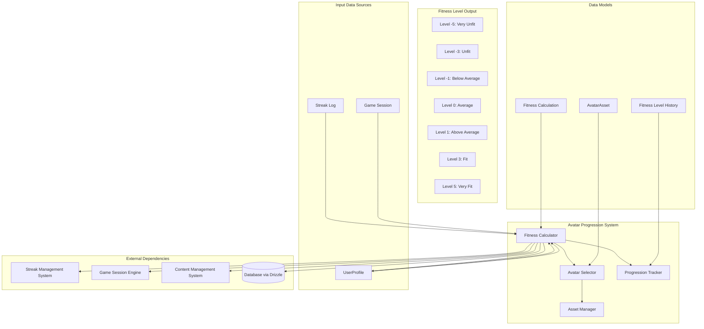
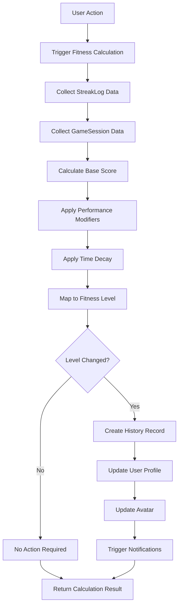
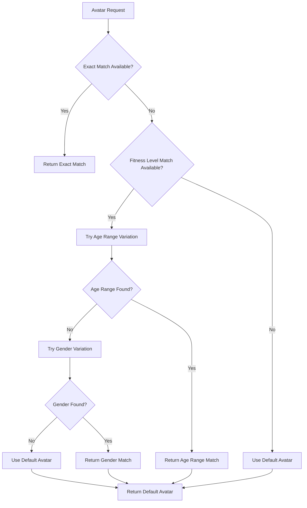
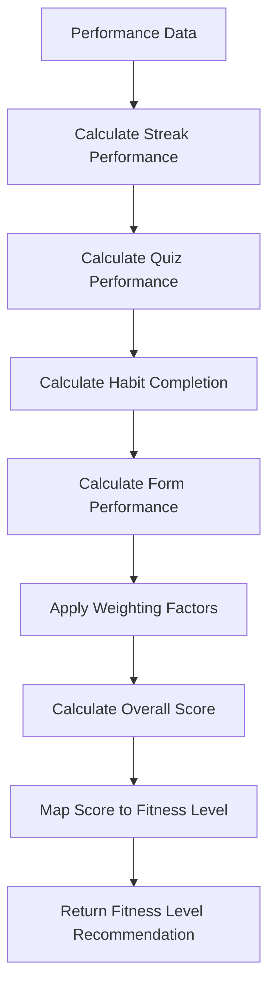

# Avatar Progression System Low-Level Design Document

## Executive Summary

The Avatar Progression System provides visual representation of user fitness state and progress through a simple algorithm-based progression system. This component calculates user fitness level based on StreakLog and GameSession history, outputting a fitness level from -5 to +5, then selects appropriate avatar representations accordingly.

## Design Context

### Requirements Reference
**Functional Requirements**: R5.3, R16.1, R16.2, R2.2, R12.2

**Non-Functional Requirements**: Real-time state evaluation, avatar asset management, performance-based progression, visual consistency

**User Journey Reference**: User Onboarding Journey, Daily Challenge Journey

**Dependencies**: Streak Management System, Game Session Engine, Content Management System, User Profile System

### Scope & Boundaries
**In Scope**: User fitness level calculation, avatar selection, progression visualization, avatar asset management

**Out of Scope**: Avatar image generation, user authentication, content generation, complex state management

**Assumptions**: Avatar assets are pre-generated, user progress data is accurate, fitness level algorithm is well-defined

## Detailed Component Design

### Component Architecture

#### Class/Module Diagram


#### Component Responsibilities
**FitnessCalculator**
- **Primary Responsibility**: Calculate user fitness level based on StreakLog and GameSession history
- **Secondary Responsibilities**: Data aggregation, algorithm execution, level determination
- **Dependencies**: Streak System, Game Engine, Content System, User Profile
- **Dependents**: AvatarSelector, ProgressionTracker

**AvatarSelector**
- **Primary Responsibility**: Select appropriate avatar based on calculated fitness level and user preferences
- **Secondary Responsibilities**: Avatar matching, fallback handling, preference management
- **Dependencies**: FitnessCalculator, Asset Manager, User Profile
- **Dependents**: UI Components, User Interface

**ProgressionTracker**
- **Primary Responsibility**: Track fitness level progression and maintain level history
- **Secondary Responsibilities**: Level change logging, progression analytics, milestone tracking
- **Dependencies**: FitnessCalculator, Database, User Profile
- **Dependents**: Analytics System, User Profile System

**AssetManager**
- **Primary Responsibility**: Manage avatar assets and ensure availability
- **Secondary Responsibilities**: Asset loading, caching, fallback handling
- **Dependencies**: Content Management System, Asset storage
- **Dependents**: AvatarSelector, UI Components

### Interface Specifications

#### Public APIs
**calculateFitnessLevel**: Fitness Level Calculation API
```typescript
Signature: calculateFitnessLevel(userId: string, context?: FitnessCalculationContext): Promise<FitnessLevelResult>
Purpose: Calculate user's current fitness level based on StreakLog and GameSession history
Preconditions: User authenticated, user exists, progress data available
Postconditions: Fitness level calculated, avatar updated if level changed
Error Conditions: User not found, calculation failure, avatar update failure
```

**getCurrentAvatar**: Current Avatar Retrieval API
```typescript
Signature: getCurrentAvatar(userId: string): Promise<AvatarResult>
Purpose: Get current avatar for user based on their fitness level and preferences
Preconditions: User authenticated, user exists, avatar assets available
Postconditions: Current avatar returned with fitness level information
Error Conditions: User not found, avatar not found, asset loading failure
```

**getFitnessLevel**: Fitness Level Retrieval API
```typescript
Signature: getFitnessLevel(userId: string): Promise<FitnessLevelResult>
Purpose: Get user's current fitness level without updating avatar
Preconditions: User exists, progress data available
Postconditions: Current fitness level returned with calculation details
Error Conditions: User not found, calculation failure
```

**getFitnessProgression**: Fitness Progression API
```typescript
Signature: getFitnessProgression(userId: string, options?: ProgressionQueryOptions): Promise<FitnessProgressionResult>
Purpose: Get user's fitness level progression history and analytics
Preconditions: User authenticated, user exists
Postconditions: Progression data returned with timeline and metrics
Error Conditions: User not found, access denied, data loading failure
```

## Data Design

### Data Models
**AvatarAsset** (Static Content)
```typescript
interface AvatarAsset {
  id: string;
  gender: 'male' | 'female';
  age_range: 'child' | 'teen' | 'young-adult' | 'middle-age' | 'senior';
  fitness_level_range: {
    min: number; // -5 to +5
    max: number; // -5 to +5
  };
  image_url: string;
  thumbnail_url?: string;
  animation_data?: AnimationData;
  created_at: string;
  updated_at: string;
}
```

**UserProfile** (Database Entity via Drizzle)
```typescript
// Drizzle schema
export const userProfiles = pgTable('user_profiles', {
  id: uuid('id').primaryKey().defaultRandom(),
  user_id: uuid('user_id').notNull().references(() => users.id),
  current_fitness_level: integer('current_fitness_level').notNull().default(0), // -5 to +5
  avatar_gender: text('avatar_gender'), // 'male' | 'female'
  avatar_age_range: text('avatar_age_range'), // 'child' | 'teen' | 'young-adult' | 'middle-age' | 'senior'
  current_streak_ids: jsonb('current_streak_ids'),
  longest_streaks: jsonb('longest_streaks'),
  last_activity_date: date('last_activity_date'),
  created_at: timestamp('created_at').notNull().defaultNow(),
  updated_at: timestamp('updated_at').notNull().defaultNow(),
});
```

**FitnessLevelHistory** (Database Entity via Drizzle)
```typescript
// Drizzle schema
export const fitnessLevelHistory = pgTable('fitness_level_history', {
  id: uuid('id').primaryKey().defaultRandom(),
  user_id: uuid('user_id').notNull().references(() => users.id),
  fitness_level: integer('fitness_level').notNull(), // -5 to +5
  calculated_at: timestamp('calculated_at').notNull().defaultNow(),
  created_at: timestamp('created_at').notNull().defaultNow(),
  updated_at: timestamp('updated_at').notNull().defaultNow(),
});
```

**FitnessCalculationContext** (Zod Schema)
```typescript
const FitnessCalculationContextSchema = z.object({
  calculation_type: z.enum(['automatic', 'manual', 'scheduled']),
  trigger_action: z.enum(['quiz_completed', 'streak_updated', 'habit_logged', 'form_assessment']),
  performance_data: z.record(z.any()),
  calculation_timestamp: z.date(),
  timezone: z.string(),
  metadata: z.record(z.any()).optional(),
});

type FitnessCalculationContext = z.infer<typeof FitnessCalculationContextSchema>;
```

**Business Rules**: 
- Fitness level ranges from -5 (very unfit) to +5 (very fit)
- Level changes create new FitnessLevelHistory entries
- Avatar selection considers user preferences and fitness level range
- Fitness level calculation happens automatically on relevant user actions
- Fallback avatars are provided when specific combinations are unavailable

**Relationships**: 
- UserProfile contains current_fitness_level
- AvatarAsset has fitness_level_range for level-based selection
- FitnessLevelHistory tracks all level changes for a user
- Fitness calculation considers multiple performance factors

**Indexing Strategy**: 
- Primary key on UserProfile.id
- Index on UserProfile.current_fitness_level for level-based queries
- Index on FitnessLevelHistory(user_id, calculated_at) for progression queries
- Composite index on AvatarAsset(fitness_level_range, gender, age_range) for avatar selection

### Data Access Patterns
**Fitness Level Calculation Pattern**
- **Query Pattern**: SELECT user data, calculate level, UPDATE profile if changed
- **Caching Strategy**: Current level cached in UserProfile, calculation results cached
- **Transaction Boundaries**: Single transaction for level calculation and update
- **Concurrency Handling**: User-level locking for level updates

**Avatar Selection Pattern**
- **Query Pattern**: SELECT avatar based on fitness level and preferences, fallback handling
- **Caching Strategy**: Avatar assets cached, selection results cached with TTL
- **Transaction Boundaries**: Read-only transactions for avatar selection
- **Concurrency Handling**: Read-only access, no concurrency issues

**Fitness Progression Pattern**
- **Query Pattern**: SELECT level history with performance metrics and timeline
- **Caching Strategy**: Progression data cached with TTL, analytics cached separately
- **Transaction Boundaries**: Read-only transactions for progression queries
- **Concurrency Handling**: Read-only access, no concurrency issues

## Algorithm Design

### Core Algorithms
**Fitness Level Calculation Algorithm**
```
Input: User ID, StreakLog data, GameSession data
Output: Fitness level from -5 to +5
Complexity: Time O(1), Space O(1)

Pseudocode:
1. Get user's StreakLog entries for last 30 days
2. Get user's GameSession data for last 30 days
3. Calculate base score from streak performance
4. Calculate bonus/penalty from quiz performance
5. Apply time decay factors
6. Map final score to fitness level range (-5 to +5)
7. Return fitness level with calculation details
```

**Avatar Selection Algorithm**
```
Input: User fitness level, gender, age range, avatar assets
Output: Selected avatar with fallback handling
Complexity: Time O(1), Space O(1)

Pseudocode:
1. Try to find exact match (fitness level range, gender, age_range)
2. If not found, try fitness level match with different age_range
3. If not found, try fitness level match with different gender
4. If not found, use default avatar for fitness level
5. Return selected avatar with fallback information
```

**Performance Assessment Algorithm**
```
Input: User performance data, assessment criteria
Output: Performance score and fitness level recommendation
Complexity: Time O(1), Space O(1)

Pseudocode:
1. Calculate streak performance metrics
2. Calculate quiz performance metrics
3. Apply weighting factors to different metrics
4. Calculate overall performance score
5. Map score to fitness level range
6. Return fitness level recommendation
```

**Business Logic Flows**
**Fitness Level Calculation Flow**


**Avatar Selection Flow**


**Performance Assessment Flow**


## Implementation Specifications

### Key Implementation Details
**Fitness Level Calculation**
- **Approach**: Algorithm-based calculation with configurable weights and thresholds
- **Libraries/Frameworks**: Custom calculation engine, performance metrics, validation system
- **Configuration**: Calculation weights, thresholds, time decay factors
- **Environment Variables**: FITNESS_CALCULATION_ENABLED, PERFORMANCE_WEIGHTING_FACTORS

**Avatar Selection**
- **Approach**: Priority-based selection with intelligent fallback handling
- **Libraries/Frameworks**: Asset management, fallback logic, preference handling
- **Configuration**: Avatar priorities, fallback rules, default avatars
- **Environment Variables**: AVATAR_FALLBACK_ENABLED, DEFAULT_AVATAR_STRATEGY

**Performance Assessment**
- **Approach**: Multi-factor performance calculation with configurable weights
- **Libraries/Frameworks**: Performance metrics, statistical analysis, weighting system
- **Configuration**: Performance thresholds, weighting factors, assessment criteria
- **Environment Variables**: PERFORMANCE_THRESHOLDS, ASSESSMENT_WEIGHTING

**Progression Tracking**
- **Approach**: Comprehensive level change logging with performance metrics
- **Libraries/Frameworks**: History tracking, analytics, performance monitoring
- **Configuration**: Tracking rules, analytics settings, performance monitoring
- **Environment Variables**: PROGRESSION_TRACKING_ENABLED, ANALYTICS_RETENTION_DAYS

### Core Data Operations
**Fitness Level Calculation Operation**
```typescript
async function calculateFitnessLevel(userId: string, context?: FitnessCalculationContext): Promise<FitnessLevelResult> {
  // Get user's current profile and progress data
  const userProfile = await db.query.userProfiles.findFirst({
    where: eq(userProfiles.user_id, userId),
  });
  
  if (!userProfile) {
    throw new Error(`User profile not found: ${userId}`);
  }
  
  // Get StreakLog data for last 30 days
  const thirtyDaysAgo = new Date();
  thirtyDaysAgo.setDate(thirtyDaysAgo.getDate() - 30);
  
  const streakLogs = await db.query.streakLogs.findMany({
    where: and(
      eq(streakLogs.user_id, userId),
      gte(streakLogs.date, thirtyDaysAgo)
    ),
  });
  
  // Get GameSession data for last 30 days
  const gameSessions = await db.query.gameSessions.findMany({
    where: and(
      eq(gameSessions.user_id, userId),
      gte(gameSessions.started_at, thirtyDaysAgo)
    ),
  });
  
  // Calculate fitness level using algorithm
  const fitnessLevel = await calculateFitnessLevelFromData(streakLogs, gameSessions, userProfile);
  
  // Check if level change is needed
  const currentLevel = userProfile.current_fitness_level;
  
  if (currentLevel !== fitnessLevel) {
    // Level change needed
    await updateFitnessLevel({
      userId,
      newLevel: fitnessLevel,
      reason: context?.trigger_action || 'performance',
      performanceMetrics: context?.performance_data,
    });
    
    return {
      levelChanged: true,
      previousLevel: currentLevel,
      newLevel: fitnessLevel,
      reason: context?.trigger_action || 'performance',
      calculatedAt: new Date(),
    };
  }
  
  return {
    levelChanged: false,
    currentLevel: currentLevel,
    calculatedAt: new Date(),
  };
}

**Fitness Level Calculation Algorithm**
```typescript
async function calculateFitnessLevelFromData(
  streakLogs: StreakLog[],
  gameSessions: GameSession[],
  userProfile: UserProfile
): Promise<number> {
  let fitnessScore = 0; // Start at 0 (average)
  
  // 1. Habit Pattern Analysis (40% weight)
  const habitScore = calculateHabitScore(streakLogs);
  fitnessScore += habitScore * 0.4;
  
  // 2. Quiz Performance Analysis (35% weight)
  const quizScore = calculateQuizScore(gameSessions);
  fitnessScore += quizScore * 0.35;
  
  // 3. Consistency Analysis (25% weight)
  const consistencyScore = calculateConsistencyScore(streakLogs, gameSessions);
  fitnessScore += consistencyScore * 0.25;
  
  // 4. Apply bounds and round to nearest integer
  const boundedScore = Math.max(-5, Math.min(5, Math.round(fitnessScore)));
  
  return boundedScore;
}

function calculateHabitScore(streakLogs: StreakLog[]): number {
  if (streakLogs.length === 0) return 0;
  
  let totalScore = 0;
  let totalDays = 0;
  
  for (const log of streakLogs) {
    const dayScore = calculateDayScore(log.entries);
    totalScore += dayScore;
    totalDays++;
  }
  
  return totalDays > 0 ? totalScore / totalDays : 0;
}

function calculateDayScore(entries: Record<string, boolean>): number {
  const habitWeights = {
    workout_completed: 0.3,
    ate_clean: 0.25,
    slept_well: 0.25,
    hydrated: 0.2
  };
  
  let dayScore = 0;
  let totalWeight = 0;
  
  for (const [habit, completed] of Object.entries(entries)) {
    if (habit in habitWeights) {
      dayScore += completed ? habitWeights[habit as keyof typeof habitWeights] : 0;
      totalWeight += habitWeights[habit as keyof typeof habitWeights];
    }
  }
  
  // Normalize to -2 to +2 range
  return totalWeight > 0 ? (dayScore / totalWeight - 0.5) * 4 : 0;
}

function calculateQuizScore(gameSessions: GameSession[]): number {
  if (gameSessions.length === 0) return 0;
  
  let totalScore = 0;
  let totalSessions = 0;
  
  for (const session of gameSessions) {
    if (session.all_correct_answers !== null) {
      const sessionScore = session.all_correct_answers ? 1 : -0.5;
      totalScore += sessionScore;
      totalSessions++;
    }
  }
  
  // Normalize to -2 to +2 range
  return totalSessions > 0 ? (totalScore / totalSessions) * 2 : 0;
}

function calculateConsistencyScore(streakLogs: StreakLog[], gameSessions: GameSession[]): number {
  if (streakLogs.length === 0 && gameSessions.length === 0) return 0;
  
  // Calculate streak consistency
  const habitConsistency = calculateHabitConsistency(streakLogs);
  const quizConsistency = calculateQuizConsistency(gameSessions);
  
  // Average the consistency scores
  const avgConsistency = (habitConsistency + quizConsistency) / 2;
  
  // Normalize to -2 to +2 range
  return avgConsistency * 2;
}

function calculateHabitConsistency(streakLogs: StreakLog[]): number {
  if (streakLogs.length < 7) return 0; // Need at least a week of data
  
  let consecutiveDays = 0;
  let maxConsecutive = 0;
  
  for (let i = 0; i < streakLogs.length; i++) {
    const log = streakLogs[i];
    const dayScore = calculateDayScore(log.entries);
    
    if (dayScore > 0.5) { // Good day
      consecutiveDays++;
      maxConsecutive = Math.max(maxConsecutive, consecutiveDays);
    } else {
      consecutiveDays = 0;
    }
  }
  
  // Normalize to 0 to 1 range based on max consecutive days
  return Math.min(1, maxConsecutive / 14); // 14 days = perfect consistency
}

function calculateQuizConsistency(gameSessions: GameSession[]): number {
  if (gameSessions.length < 3) return 0; // Need at least 3 sessions
  
  let consecutiveCorrect = 0;
  let maxConsecutive = 0;
  
  for (const session of gameSessions) {
    if (session.all_correct_answers) {
      consecutiveCorrect++;
      maxConsecutive = Math.max(maxConsecutive, consecutiveCorrect);
    } else {
      consecutiveCorrect = 0;
    }
  }
  
  // Normalize to 0 to 1 range based on max consecutive correct
  return Math.min(1, maxConsecutive / 7); // 7 days = perfect consistency
}
```
```

**Avatar Selection Operation**
```typescript
async function getCurrentAvatar(userId: string): Promise<AvatarResult> {
  // Get user profile and current fitness level
  const userProfile = await db.query.userProfiles.findFirst({
    where: eq(userProfiles.user_id, userId),
  });
  
  if (!userProfile) {
    throw new Error(`User profile not found: ${userId}`);
  }
  
  const { current_fitness_level, avatar_gender, avatar_age_range } = userProfile;
  
  // Try exact match first
  let avatar = await findAvatarAssetByFitnessLevel(current_fitness_level, avatar_gender, avatar_age_range);
  
  if (avatar) {
    return {
      avatar,
      matchType: 'exact',
      fitnessLevel: current_fitness_level,
      gender: avatar_gender,
      ageRange: avatar_age_range,
    };
  }
  
  // Try fitness level match with different age range
  if (avatar_age_range) {
    const alternativeAgeRanges = getAlternativeAgeRanges(avatar_age_range);
    
    for (const ageRange of alternativeAgeRanges) {
      avatar = await findAvatarAssetByFitnessLevel(current_fitness_level, avatar_gender, ageRange);
      if (avatar) {
        return {
          avatar,
          matchType: 'age_range_fallback',
          fitnessLevel: current_fitness_level,
          gender: avatar_gender,
          ageRange,
          originalAgeRange: avatar_age_range,
        };
      }
    }
  }
  
  // Try fitness level match with different gender
  if (avatar_gender) {
    const alternativeGender = avatar_gender === 'male' ? 'female' : 'male';
          avatar = await findAvatarAssetByFitnessLevel(current_fitness_level, alternativeGender, avatar_age_range);
    
    if (avatar) {
      return {
        avatar,
        matchType: 'gender_fallback',
        fitnessLevel: current_fitness_level,
        gender: alternativeGender,
        ageRange: avatar_age_range,
        originalGender: avatar_gender,
      };
    }
  }
  
  // Use default avatar for fitness level
  const defaultAvatar = await getDefaultAvatarForFitnessLevel(current_fitness_level);
  
  return {
    avatar: defaultAvatar,
    matchType: 'default',
    fitnessLevel: current_fitness_level,
    gender: null,
    ageRange: null,
  };
}
```

**Fitness Level Update Operation**
```typescript
async function updateFitnessLevel(input: UpdateFitnessLevelInput): Promise<UpdateFitnessLevelResult> {
  const { userId, newLevel, reason, performanceMetrics } = input;
  
  // Validate new level is within range
  if (newLevel < -5 || newLevel > 5) {
    throw new Error(`Invalid fitness level: ${newLevel}. Must be between -5 and 5.`);
  }
  
  // Get current user profile
  const userProfile = await db.query.userProfiles.findFirst({
    where: eq(userProfiles.user_id, userId),
  });
  
  if (!userProfile) {
    throw new Error(`User profile not found: ${userId}`);
  }
  
  const previousLevel = userProfile.current_fitness_level;
  
  // Create fitness level history record
  await db.insert(fitnessLevelHistory).values({
    user_id: userId,
    fitness_level: newLevel,
    previous_level: previousLevel,
    calculation_reason: reason,
    performance_metrics: performanceMetrics,
    calculated_at: new Date(),
  });
  
  // Update user profile
  await db.update(userProfiles)
    .set({
      current_fitness_level: newLevel,
      updated_at: new Date(),
    })
    .where(eq(userProfiles.user_id, userId));
  
  // Trigger avatar update
  await updateUserAvatar(userId, newLevel);
  
  return {
    success: true,
    userId,
    previousLevel: previousLevel,
    newLevel: newLevel,
    reason,
    updatedAt: new Date(),
  };
}
```

**Parameters**: User ID, streak data, game session data, avatar preferences, calculation context

**Performance**: O(1) for fitness level calculation, O(1) for avatar selection, O(1) for level updates

**Indexes Required**: Index on current_fitness_level, composite index on (fitness_level_range, gender, age_range), index on (user_id, calculated_at)

## Error Handling & Validation

### Error Scenarios
**Fitness Level Calculation Errors**
- **Trigger Conditions**: Invalid performance data, calculation failure, algorithm errors
- **Error Response**: Specific error messages with error codes and recovery suggestions
- **Recovery Strategy**: Retry with exponential backoff, fallback to last known level
- **Logging Requirements**: User ID, calculation context, error details, stack trace

**Avatar Selection Errors**
- **Trigger Conditions**: Missing avatar assets, asset loading failure, invalid fitness level references
- **Error Response**: Avatar error with fallback avatar provided
- **Recovery Strategy**: Fallback to default avatars, asset reload, error logging
- **Logging Requirements**: Avatar request details, fallback actions, asset availability

**Fitness Level Update Errors**
- **Trigger Conditions**: Invalid level transitions, database update failure, avatar update failure
- **Error Response**: Level update error with specific failure reason
- **Recovery Strategy**: Rollback to previous level, retry update, manual intervention
- **Logging Requirements**: Level change details, failure reason, recovery actions

**Performance Assessment Errors**
- **Trigger Conditions**: Invalid performance data, calculation errors, metric validation failure
- **Error Response**: Assessment error with fallback to previous assessment
- **Recovery Strategy**: Use cached assessment, recalculate with valid data, manual assessment
- **Logging Requirements**: Performance data details, calculation errors, fallback actions

### Business Rule Validation
**Fitness Level Range Validation**
- **Rule Description**: Fitness level must be within valid range (-5 to +5)
- **Validation Logic**: Check level value is integer between -5 and 5
- **Error Message**: "Invalid fitness level: {level}. Must be between -5 and 5."
- **System Behavior**: Level update rejected, user remains at current level

**Avatar Preference Validation**
- **Rule Description**: Avatar preferences must be valid and supported
- **Validation Logic**: Validate gender and age range combinations
- **Error Message**: "Invalid avatar preference: {preferenceDetails}"
- **System Behavior**: Use default preferences, log validation failure

**Performance Metric Validation**
- **Rule Description**: Performance metrics must be within valid ranges
- **Validation Logic**: Validate metric values and data integrity
- **Error Message**: "Invalid performance metric: {metricDetails}"
- **System Behavior**: Use default metrics, log validation failure

**Calculation Context Validation**
- **Rule Description**: Calculation context must have valid structure
- **Validation Logic**: Validate context structure and required fields
- **Error Message**: "Invalid calculation context: {contextDetails}"
- **System Behavior**: Calculation skipped, error logged

## Testing Specifications

### Integration Test Scenarios
**Fitness Level Calculation Integration**
- **Components Involved**: FitnessCalculator, Streak System, Game Engine, Database
- **Test Flow**: Trigger fitness calculation, verify data collection, check level updates
- **Mock Requirements**: Mock streak data, mock game session data, mock calculation algorithm
- **Assertion Points**: Calculation accuracy, data collection, level transitions

**Avatar Selection Integration**
- **Components Involved**: AvatarSelector, Asset Manager, Fitness Calculator, User Profile
- **Test Flow**: Request avatar, verify selection logic, check fallback handling
- **Mock Requirements**: Mock avatar assets, mock user preferences, mock fitness level data
- **Assertion Points**: Avatar selection accuracy, fallback handling, preference management

**Fitness Progression Integration**
- **Components Involved**: ProgressionTracker, Fitness Calculator, Database, Analytics
- **Test Flow**: Track level changes, verify history recording, check progression analytics
- **Mock Requirements**: Mock level changes, mock performance data, mock analytics system
- **Assertion Points**: Progression tracking, history recording, analytics accuracy

**Performance Assessment Integration**
- **Components Involved**: Fitness Calculator, Performance Metrics, Assessment Engine
- **Test Flow**: Calculate performance, verify assessment logic, check level mapping
- **Mock Requirements**: Mock performance data, mock assessment criteria, mock weighting factors
- **Assertion Points**: Performance calculation, assessment accuracy, level mapping

### Edge Cases & Boundary Tests
**Missing Avatar Assets**
- **Scenario**: Avatar assets missing for specific fitness level/gender/age combinations
- **Input Values**: Missing asset combinations, incomplete asset sets
- **Expected Behavior**: Graceful fallback to available assets, error logging
- **Validation**: Fallback handling, error reporting, asset availability

**Invalid Fitness Level Transitions**
- **Scenario**: Attempts to set invalid fitness levels
- **Input Values**: Invalid level values, out-of-range levels, corrupted level data
- **Expected Behavior**: Level update rejected, error reporting, level validation
- **Validation**: Level validation, error handling, data integrity

**Performance Data Corruption**
- **Scenario**: Corrupted or invalid performance data during fitness calculation
- **Input Values**: Invalid metrics, corrupted data, missing performance information
- **Expected Behavior**: Graceful error handling, fallback to valid data, error logging
- **Validation**: Data validation, error handling, fallback mechanisms

**Concurrent Level Updates**
- **Scenario**: Multiple simultaneous fitness level update attempts for the same user
- **Input Values**: Concurrent API calls, race conditions, simultaneous calculations
- **Expected Behavior**: Consistent level, no data corruption, proper locking
- **Validation**: Data consistency, race condition handling, error prevention

## Implementation Details

### Avatar Asset Selection Function
```typescript
async function findAvatarAssetByFitnessLevel(
  fitnessLevel: number,
  gender?: string,
  ageRange?: string
): Promise<AvatarAsset | null> {
  // Build query conditions
  const conditions = [];
  
  // Add fitness level range condition
  conditions.push(
    and(
      lte(avatarAssets.fitness_level_range_min, fitnessLevel),
      gte(avatarAssets.fitness_level_range_max, fitnessLevel)
    )
  );
  
  // Add gender condition if specified
  if (gender) {
    conditions.push(eq(avatarAssets.gender, gender));
  }
  
  // Add age range condition if specified
  if (ageRange) {
    conditions.push(eq(avatarAssets.age_range, ageRange));
  }
  
  // Find matching avatar asset
  const avatar = await db.query.avatarAssets.findFirst({
    where: and(...conditions),
    orderBy: [
      // Prioritize exact fitness level match
      sql`ABS(${avatarAssets.fitness_level_range_min} + ${avatarAssets.fitness_level_range_max}) / 2 - ${fitnessLevel})`,
      // Then by gender/age range specificity
      desc(avatarAssets.gender),
      desc(avatarAssets.age_range)
    ]
  });
  
  return avatar || null;
}
```
