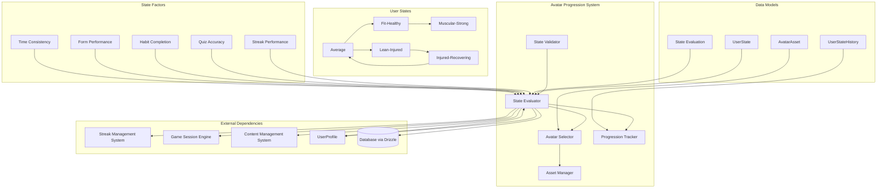
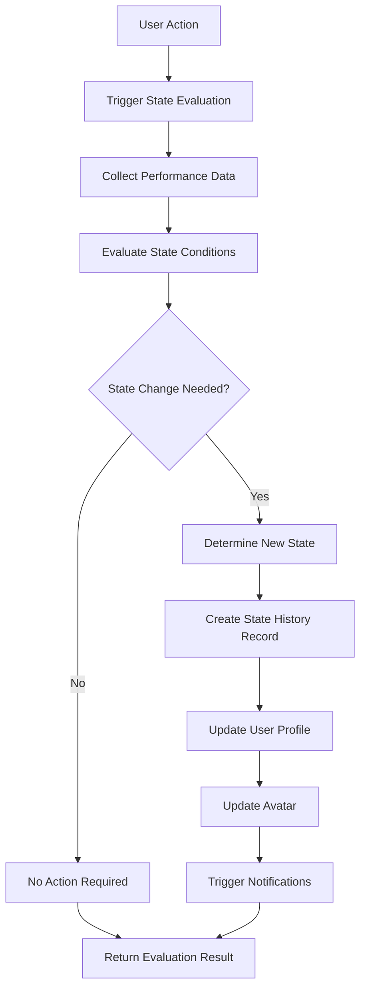
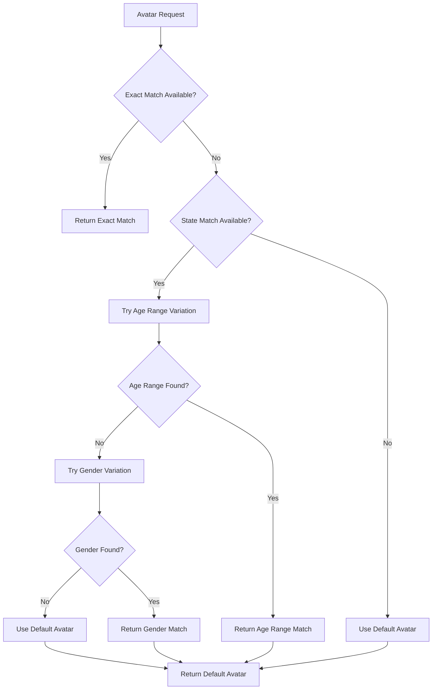
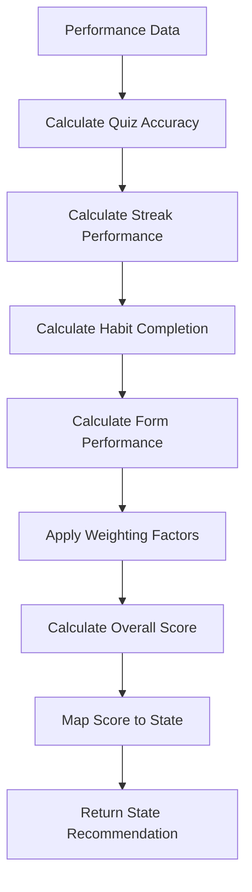

# Avatar Progression System Low-Level Design Document

## Executive Summary

The Avatar Progression System provides visual representation of user fitness state and progress through rule-based state evaluation and visual asset management. This component automatically evaluates user state changes based on performance metrics, streaks, and quiz results, then updates avatar representations accordingly.

## Design Context

### Requirements Reference
**Functional Requirements**: R5.3, R16.1, R16.2, R2.2, R12.2

**Non-Functional Requirements**: Real-time state evaluation, avatar asset management, performance-based progression, visual consistency

**User Journey Reference**: Achievement & Progress Journey, User Onboarding Journey, Daily Challenge Journey

**Dependencies**: Streak Management System, Game Session Engine, Content Management System, User Profile System

### Scope & Boundaries
**In Scope**: User state evaluation, avatar selection, progression visualization, state unlock conditions, avatar asset management

**Out of Scope**: Avatar image generation, user authentication, content generation, achievement system

**Assumptions**: Avatar assets are pre-generated, user progress data is accurate, state definitions are available

## Detailed Component Design

### Component Architecture

#### Class/Module Diagram


#### Component Responsibilities
**StateEvaluator**
- **Primary Responsibility**: Evaluate user state based on performance metrics and unlock conditions
- **Secondary Responsibilities**: State calculation, condition validation, state transitions
- **Dependencies**: Streak System, Game Engine, Content System, User Profile
- **Dependents**: AvatarSelector, ProgressionTracker

**AvatarSelector**
- **Primary Responsibility**: Select appropriate avatar based on user state and preferences
- **Secondary Responsibilities**: Avatar matching, fallback handling, preference management
- **Dependencies**: StateEvaluator, Asset Manager, User Profile
- **Dependents**: UI Components, User Interface

**ProgressionTracker**
- **Primary Responsibility**: Track state progression and maintain state history
- **Secondary Responsibilities**: State change logging, progression analytics, milestone tracking
- **Dependencies**: StateEvaluator, Database, User Profile
- **Dependents**: Analytics System, User Profile System

**AssetManager**
- **Primary Responsibility**: Manage avatar assets and ensure availability
- **Secondary Responsibilities**: Asset loading, caching, fallback handling
- **Dependencies**: Content Management System, Asset storage
- **Dependents**: AvatarSelector, UI Components

**StateValidator**
- **Primary Responsibility**: Validate state definitions and unlock conditions
- **Secondary Responsibilities**: State rule validation, condition validation, data integrity
- **Dependencies**: State definitions, Unlock condition schemas
- **Dependents**: StateEvaluator, ProgressionTracker

### Interface Specifications

#### Public APIs
**evaluateUserState**: State Evaluation API
```typescript
Signature: evaluateUserState(userId: string, context?: StateEvaluationContext): Promise<StateEvaluationResult>
Purpose: Evaluate and update user's current state based on performance metrics
Preconditions: User authenticated, user exists, state definitions available
Postconditions: User state evaluated, avatar updated if state changed
Error Conditions: User not found, state evaluation failure, avatar update failure
```

**getCurrentAvatar**: Current Avatar Retrieval API
```typescript
Signature: getCurrentAvatar(userId: string): Promise<AvatarResult>
Purpose: Get current avatar for user based on their state and preferences
Preconditions: User authenticated, user exists, avatar assets available
Postconditions: Current avatar returned with state information
Error Conditions: User not found, avatar not found, asset loading failure
```

**updateUserState**: State Update API
```typescript
Signature: updateUserState(input: UpdateUserStateInput): Promise<UpdateUserStateResult>
Purpose: Manually update user state (admin/override functionality)
Preconditions: User exists, new state valid, admin privileges
Postconditions: User state updated, avatar changed, history recorded
Error Conditions: Invalid state, insufficient privileges, update failure
```

**getStateProgression**: State Progression API
```typescript
Signature: getStateProgression(userId: string, options?: ProgressionQueryOptions): Promise<StateProgressionResult>
Purpose: Get user's state progression history and analytics
Preconditions: User authenticated, user exists
Postconditions: Progression data returned with timeline and metrics
Error Conditions: User not found, access denied, data loading failure
```

**validateStateDefinition**: State Definition Validation API
```typescript
Signature: validateStateDefinition(stateId: string): Promise<StateValidationResult>
Purpose: Validate state definition and unlock conditions
Preconditions: State exists, validation rules configured
Postconditions: Validation result with any detected issues
Error Conditions: State not found, validation rule failure, system error
```

## Data Design

### Data Models
**UserState** (Static Content)
```typescript
interface UserState {
  id: string;
  unlock_condition: UnlockCondition;
  eval_order: number;
  display_name: string;
  description: string;
  visual_characteristics: VisualCharacteristics;
  created_at: string;
  updated_at: string;
}
```

**AvatarAsset** (Static Content)
```typescript
interface AvatarAsset {
  id: string;
  state_id: string; // References UserState.id
  gender: 'male' | 'female';
  age_range: 'child' | 'teen' | 'young-adult' | 'middle-age' | 'senior';
  image_url: string;
  thumbnail_url?: string;
  animation_data?: AnimationData;
  created_at: string;
  updated_at: string;
}
```

**UserProfile** (Database Entity via Drizzle)
```typescript
// Drizzle schema
export const userProfiles = pgTable('user_profiles', {
  id: uuid('id').primaryKey().defaultRandom(),
  user_id: uuid('user_id').notNull().references(() => users.id),
  current_state: text('current_state').references(() => userStates.id),
  avatar_gender: text('avatar_gender'), // 'male' | 'female'
  avatar_age_range: text('avatar_age_range'), // 'child' | 'teen' | 'young-adult' | 'middle-age' | 'senior'
  current_streak_ids: jsonb('current_streak_ids'),
  longest_streaks: jsonb('longest_streaks'),
  last_activity_date: date('last_activity_date'),
  created_at: timestamp('created_at').notNull().defaultNow(),
  updated_at: timestamp('updated_at').notNull().defaultNow(),
});
```

**UserStateHistory** (Database Entity via Drizzle)
```typescript
// Drizzle schema
export const userStateHistory = pgTable('user_state_history', {
  id: uuid('id').primaryKey().defaultRandom(),
  user_id: uuid('user_id').notNull().references(() => users.id),
  state_id: text('state_id').notNull(), // References static content
  previous_state_id: text('previous_state_id'), // References static content
  unlocked_at: timestamp('unlocked_at').notNull().defaultNow(),
  unlock_reason: text('unlock_reason'), // 'performance', 'streak', 'manual', etc.
  performance_metrics: jsonb('performance_metrics'), // Data that triggered state change
  created_at: timestamp('created_at').notNull().defaultNow(),
  updated_at: timestamp('updated_at').notNull().defaultNow(),
});
```

**StateEvaluationContext** (Zod Schema)
```typescript
const StateEvaluationContextSchema = z.object({
  evaluation_type: z.enum(['automatic', 'manual', 'scheduled']),
  trigger_action: z.enum(['quiz_completed', 'streak_updated', 'habit_logged', 'form_assessment']),
  performance_data: z.record(z.any()),
  evaluation_timestamp: z.date(),
  timezone: z.string(),
  metadata: z.record(z.any()).optional(),
});

type StateEvaluationContext = z.infer<typeof StateEvaluationContextSchema>;
```

**UpdateUserStateInput** (Zod Schema)
```typescript
const UpdateUserStateInputSchema = z.object({
  userId: z.string().uuid(),
  newStateId: z.string(),
  reason: z.enum(['performance', 'streak', 'manual', 'admin_override']),
  performanceMetrics: z.record(z.any()).optional(),
  adminOverride: z.boolean().default(false),
});

type UpdateUserStateInput = z.infer<typeof UpdateUserStateInputSchema>;
```

**Business Rules**: 
- User states are evaluated in order of eval_order field
- State changes create new UserStateHistory entries
- Avatar selection considers user preferences and current state
- State evaluation happens automatically on relevant user actions
- Fallback avatars are provided when specific combinations are unavailable

**Relationships**: 
- UserProfile contains current_state reference to UserState
- AvatarAsset references UserState for state-specific avatars
- UserStateHistory tracks all state changes for a user
- State evaluation considers multiple performance factors

**Indexing Strategy**: 
- Primary key on UserProfile.id
- Index on UserProfile.current_state for state-based queries
- Index on UserStateHistory(user_id, unlocked_at) for progression queries
- Composite index on AvatarAsset(state_id, gender, age_range) for avatar selection

### Data Access Patterns
**State Evaluation Pattern**
- **Query Pattern**: SELECT user data, evaluate conditions, UPDATE state if changed
- **Caching Strategy**: Current state cached in UserProfile, state definitions cached
- **Transaction Boundaries**: Single transaction for state evaluation and update
- **Concurrency Handling**: User-level locking for state updates

**Avatar Selection Pattern**
- **Query Pattern**: SELECT avatar based on state and preferences, fallback handling
- **Caching Strategy**: Avatar assets cached, selection results cached with TTL
- **Transaction Boundaries**: Read-only transactions for avatar selection
- **Concurrency Handling**: Read-only access, no concurrency issues

**State Progression Pattern**
- **Query Pattern**: SELECT state history with performance metrics and timeline
- **Caching Strategy**: Progression data cached with TTL, analytics cached separately
- **Transaction Boundaries**: Read-only transactions for progression queries
- **Concurrency Handling**: Read-only access, no concurrency issues

## Algorithm Design

### Core Algorithms
**State Evaluation Algorithm**
```
Input: User ID, performance metrics, state definitions
Output: New user state and transition information
Complexity: Time O(n), Space O(1) where n is number of states

Pseudocode:
1. Get current user state and performance data
2. Sort states by eval_order
3. For each state, evaluate unlock conditions
4. Select highest applicable state
5. If state changed, create history record and update profile
6. Return state evaluation result
```

**Avatar Selection Algorithm**
```
Input: User state, gender, age range, avatar assets
Output: Selected avatar with fallback handling
Complexity: Time O(1), Space O(1)

Pseudocode:
1. Try to find exact match (state, gender, age_range)
2. If not found, try state match with different age_range
3. If not found, try state match with different gender
4. If not found, use default avatar for state
5. Return selected avatar with fallback information
```

**Performance Assessment Algorithm**
```
Input: User performance data, assessment criteria
Output: Performance score and state recommendation
Complexity: Time O(1), Space O(1)

Pseudocode:
1. Calculate performance metrics for each category
2. Apply weighting factors to different metrics
3. Calculate overall performance score
4. Map score to state recommendations
5. Return performance assessment result
```

**Business Logic Flows**
**State Evaluation Flow**


**Avatar Selection Flow**


**Performance Assessment Flow**


## Implementation Specifications

### Key Implementation Details
**State Evaluation**
- **Approach**: Rule-based evaluation with configurable unlock conditions
- **Libraries/Frameworks**: Custom rule engine, performance calculation, validation system
- **Configuration**: State rules, evaluation criteria, weighting factors
- **Environment Variables**: STATE_EVALUATION_ENABLED, PERFORMANCE_WEIGHTING_FACTORS

**Avatar Selection**
- **Approach**: Priority-based selection with intelligent fallback handling
- **Libraries/Frameworks**: Asset management, fallback logic, preference handling
- **Configuration**: Avatar priorities, fallback rules, default avatars
- **Environment Variables**: AVATAR_FALLBACK_ENABLED, DEFAULT_AVATAR_STRATEGY

**Performance Assessment**
- **Approach**: Multi-factor performance calculation with configurable weights
- **Libraries/Frameworks**: Performance metrics, statistical analysis, weighting system
- **Configuration**: Performance thresholds, weighting factors, assessment criteria
- **Environment Variables**: PERFORMANCE_THRESHOLDS, ASSESSMENT_WEIGHTING

**Progression Tracking**
- **Approach**: Comprehensive state change logging with performance metrics
- **Libraries/Frameworks**: History tracking, analytics, performance monitoring
- **Configuration**: Tracking rules, analytics settings, performance monitoring
- **Environment Variables**: PROGRESSION_TRACKING_ENABLED, ANALYTICS_RETENTION_DAYS

### Core Data Operations
**State Evaluation Operation**
```typescript
async function evaluateUserState(userId: string, context?: StateEvaluationContext): Promise<StateEvaluationResult> {
  // Get current user state and performance data
  const userProfile = await db.query.userProfiles.findFirst({
    where: eq(userProfiles.user_id, userId),
  });
  
  if (!userProfile) {
    throw new Error(`User profile not found: ${userId}`);
  }
  
  // Get all available states sorted by eval_order
  const availableStates = await getAvailableStates();
  const sortedStates = availableStates.sort((a, b) => a.eval_order - b.eval_order);
  
  // Evaluate each state's unlock conditions
  let highestApplicableState: UserState | null = null;
  
  for (const state of sortedStates) {
    const conditionMet = await evaluateStateUnlockCondition(state.unlock_condition, userId, context);
    
    if (conditionMet) {
      highestApplicableState = state;
    } else {
      // Stop at first unmet condition (states are ordered by eval_order)
      break;
    }
  }
  
  // Check if state change is needed
  const currentStateId = userProfile.current_state;
  const newStateId = highestApplicableState?.id || 'average'; // Default to average
  
  if (currentStateId !== newStateId) {
    // State change needed
    await updateUserState({
      userId,
      newStateId,
      reason: context?.trigger_action || 'performance',
      performanceMetrics: context?.performance_data,
    });
    
    return {
      stateChanged: true,
      previousState: currentStateId,
      newState: newStateId,
      reason: context?.trigger_action || 'performance',
      evaluatedAt: new Date(),
    };
  }
  
  return {
    stateChanged: false,
    currentState: currentStateId,
    evaluatedAt: new Date(),
  };
}
```

**Avatar Selection Operation**
```typescript
async function getCurrentAvatar(userId: string): Promise<AvatarResult> {
  // Get user profile and current state
  const userProfile = await db.query.userProfiles.findFirst({
    where: eq(userProfiles.user_id, userId),
  });
  
  if (!userProfile) {
    throw new Error(`User profile not found: ${userId}`);
  }
  
  const { current_state, avatar_gender, avatar_age_range } = userProfile;
  
  // Try exact match first
  let avatar = await findAvatarAsset(current_state, avatar_gender, avatar_age_range);
  
  if (avatar) {
    return {
      avatar,
      matchType: 'exact',
      stateId: current_state,
      gender: avatar_gender,
      ageRange: avatar_age_range,
    };
  }
  
  // Try state match with different age range
  if (avatar_age_range) {
    const alternativeAgeRanges = getAlternativeAgeRanges(avatar_age_range);
    
    for (const ageRange of alternativeAgeRanges) {
      avatar = await findAvatarAsset(current_state, avatar_gender, ageRange);
      if (avatar) {
        return {
          avatar,
          matchType: 'age_range_fallback',
          stateId: current_state,
          gender: avatar_gender,
          ageRange,
          originalAgeRange: avatar_age_range,
        };
      }
    }
  }
  
  // Try state match with different gender
  if (avatar_gender) {
    const alternativeGender = avatar_gender === 'male' ? 'female' : 'male';
    avatar = await findAvatarAsset(current_state, alternativeGender, avatar_age_range);
    
    if (avatar) {
      return {
        avatar,
        matchType: 'gender_fallback',
        stateId: current_state,
        gender: alternativeGender,
        ageRange: avatar_age_range,
        originalGender: avatar_gender,
      };
    }
  }
  
  // Use default avatar for state
  const defaultAvatar = await getDefaultAvatarForState(current_state);
  
  return {
    avatar: defaultAvatar,
    matchType: 'default',
    stateId: current_state,
    gender: null,
    ageRange: null,
  };
}
```

**State Update Operation**
```typescript
async function updateUserState(input: UpdateUserStateInput): Promise<UpdateUserStateResult> {
  const { userId, newStateId, reason, performanceMetrics, adminOverride } = input;
  
  // Validate new state exists
  const newState = await getState(newStateId);
  if (!newState) {
    throw new Error(`State not found: ${newStateId}`);
  }
  
  // Get current user profile
  const userProfile = await db.query.userProfiles.findFirst({
    where: eq(userProfiles.user_id, userId),
  });
  
  if (!userProfile) {
    throw new Error(`User profile not found: ${userId}`);
  }
  
  const previousStateId = userProfile.current_state;
  
  // Create state history record
  await db.insert(userStateHistory).values({
    user_id: userId,
    state_id: newStateId,
    previous_state_id: previousStateId,
    unlock_reason: reason,
    performance_metrics: performanceMetrics,
    unlocked_at: new Date(),
  });
  
  // Update user profile
  await db.update(userProfiles)
    .set({
      current_state: newStateId,
      updated_at: new Date(),
    })
    .where(eq(userProfiles.user_id, userId));
  
  // Trigger avatar update
  await updateUserAvatar(userId, newStateId);
  
  return {
    success: true,
    userId,
    previousState: previousStateId,
    newState: newStateId,
    reason,
    updatedAt: new Date(),
  };
}
```

**Parameters**: User ID, state data, performance metrics, avatar preferences, evaluation context

**Performance**: O(n) for state evaluation, O(1) for avatar selection, O(1) for state updates

**Indexes Required**: Index on current_state, composite index on (state_id, gender, age_range), index on (user_id, unlocked_at)

## Error Handling & Validation

### Error Scenarios
**State Evaluation Errors**
- **Trigger Conditions**: Invalid performance data, state definition errors, evaluation failure
- **Error Response**: Specific error messages with error codes and recovery suggestions
- **Recovery Strategy**: Retry with exponential backoff, fallback to last known state
- **Logging Requirements**: User ID, evaluation context, error details, stack trace

**Avatar Selection Errors**
- **Trigger Conditions**: Missing avatar assets, asset loading failure, invalid state references
- **Error Response**: Avatar error with fallback avatar provided
- **Recovery Strategy**: Fallback to default avatars, asset reload, error logging
- **Logging Requirements**: Avatar request details, fallback actions, asset availability

**State Update Errors**
- **Trigger Conditions**: Invalid state transitions, database update failure, avatar update failure
- **Error Response**: State update error with specific failure reason
- **Recovery Strategy**: Rollback to previous state, retry update, manual intervention
- **Logging Requirements**: State change details, failure reason, recovery actions

**Performance Assessment Errors**
- **Trigger Conditions**: Invalid performance data, calculation errors, metric validation failure
- **Error Response**: Assessment error with fallback to previous assessment
- **Recovery Strategy**: Use cached assessment, recalculate with valid data, manual assessment
- **Logging Requirements**: Performance data details, calculation errors, fallback actions

### Business Rule Validation
**State Transition Validation**
- **Rule Description**: State transitions must follow valid progression rules
- **Validation Logic**: Check state transition validity and progression order
- **Error Message**: "Invalid state transition from {currentState} to {targetState}"
- **System Behavior**: State transition rejected, user remains in current state

**Avatar Preference Validation**
- **Rule Description**: Avatar preferences must be valid and supported
- **Validation Logic**: Validate gender and age range combinations
- **Error Message**: "Invalid avatar preference: {preferenceDetails}"
- **System Behavior**: Use default preferences, log validation failure

**Performance Metric Validation**
- **Rule Description**: Performance metrics must be within valid ranges
- **Validation Logic**: Validate metric values and data integrity
- **Error Message**: "Invalid performance metric: {metricDetails}"
- **System Behavior**: Use default metrics, log validation failure

**State Definition Validation**
- **Rule Description**: State definitions must have valid unlock conditions
- **Validation Logic**: Validate unlock condition structure and logic
- **Error Message**: "Invalid state definition: {definitionDetails}"
- **System Behavior**: State evaluation skipped, error logged

## Testing Specifications

### Integration Test Scenarios
**State Evaluation Integration**
- **Components Involved**: StateEvaluator, Streak System, Game Engine, Database
- **Test Flow**: Trigger state evaluation, verify condition checking, check state updates
- **Mock Requirements**: Mock performance data, mock state definitions, mock unlock conditions
- **Assertion Points**: State evaluation accuracy, condition checking, state transitions

**Avatar Selection Integration**
- **Components Involved**: AvatarSelector, Asset Manager, State Evaluator, User Profile
- **Test Flow**: Request avatar, verify selection logic, check fallback handling
- **Mock Requirements**: Mock avatar assets, mock user preferences, mock state data
- **Assertion Points**: Avatar selection accuracy, fallback handling, preference management

**State Progression Integration**
- **Components Involved**: ProgressionTracker, State Evaluator, Database, Analytics
- **Test Flow**: Track state changes, verify history recording, check progression analytics
- **Mock Requirements**: Mock state changes, mock performance data, mock analytics system
- **Assertion Points**: Progression tracking, history recording, analytics accuracy

**Performance Assessment Integration**
- **Components Involved**: State Evaluator, Performance Metrics, Assessment Engine
- **Test Flow**: Calculate performance, verify assessment logic, check state mapping
- **Mock Requirements**: Mock performance data, mock assessment criteria, mock weighting factors
- **Assertion Points**: Performance calculation, assessment accuracy, state mapping

### Edge Cases & Boundary Tests
**Missing Avatar Assets**
- **Scenario**: Avatar assets missing for specific state/gender/age combinations
- **Input Values**: Missing asset combinations, incomplete asset sets
- **Expected Behavior**: Graceful fallback to available assets, error logging
- **Validation**: Fallback handling, error reporting, asset availability

**Invalid State Transitions**
- **Scenario**: Attempts to transition to invalid or non-existent states
- **Input Values**: Invalid state IDs, invalid transition paths, corrupted state data
- **Expected Behavior**: State transition rejected, error reporting, state validation
- **Validation**: Transition validation, error handling, state integrity

**Performance Data Corruption**
- **Scenario**: Corrupted or invalid performance data during state evaluation
- **Input Values**: Invalid metrics, corrupted data, missing performance information
- **Expected Behavior**: Graceful error handling, fallback to valid data, error logging
- **Validation**: Data validation, error handling, fallback mechanisms

**Concurrent State Updates**
- **Scenario**: Multiple simultaneous state update attempts for the same user
- **Input Values**: Concurrent API calls, race conditions, simultaneous evaluations
- **Expected Behavior**: Consistent state, no data corruption, proper locking
- **Validation**: Data consistency, race condition handling, error prevention
