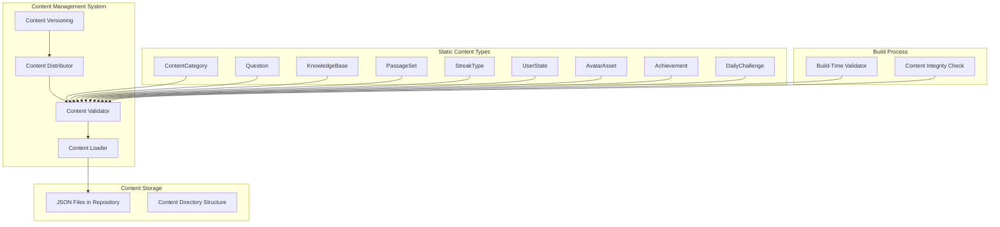
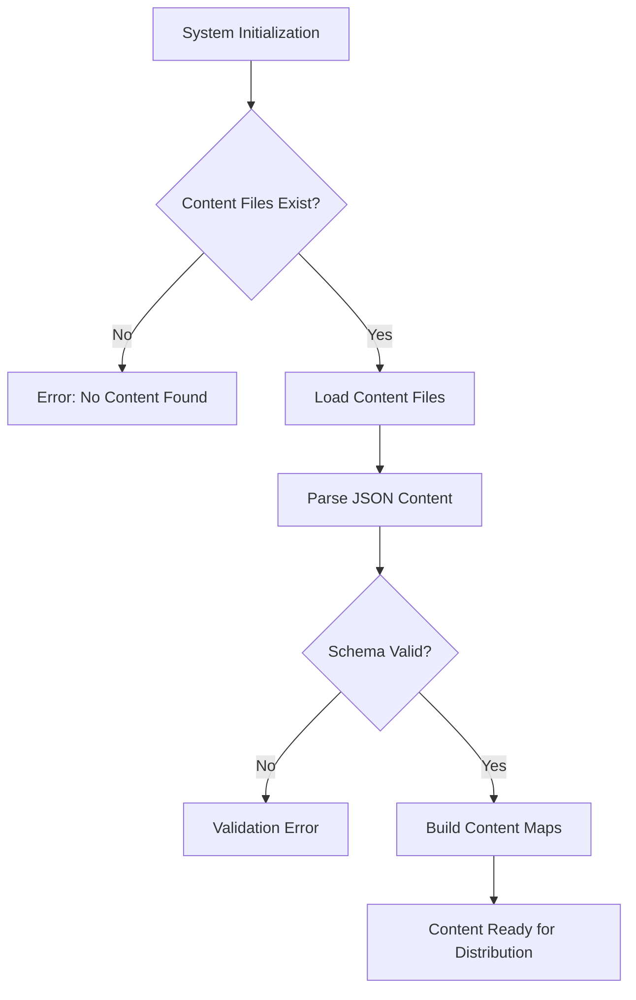
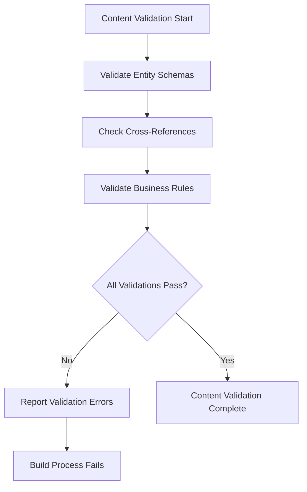

# Content Management System Low-Level Design Document

## Executive Summary

The Content Management System manages all pre-generated fitness knowledge content including questions, passages, knowledge base articles, achievements, user states, and avatar assets. This component is responsible for content validation, versioning, and distribution to the frontend through static JSON files stored in the repository.

## Design Context

### Requirements Reference
**Functional Requirements**: R1.1, R1.2, R1.3, R1.4, R2.2, R7.1, R16.1, R17.1

**Non-Functional Requirements**: Content validation at build time, fast content loading, offline content access, content integrity assurance

**User Journey Reference**: All user journeys depend on this system for content delivery

**Dependencies**: None (this is a foundational component that other components depend on)

### Scope & Boundaries
**In Scope**: Static content management, content validation, content distribution, content versioning, build-time content checks. Use Claude/Gemini to generate textual content via API/Manual process. Include descriptive placeholder prompts for Images.

**Out of Scope**: Runtime content generation, user-generated content, content moderation, content analytics

**Assumptions**: All content is pre-generated offline using AI tools and reviewed by humans before commit

## Detailed Component Design

### Component Architecture

#### Class/Module Diagram


#### Component Responsibilities
**ContentLoader**
- **Primary Responsibility**: Load and parse static content JSON files
- **Secondary Responsibilities**: Handle content file discovery, content caching
- **Dependencies**: File system access, JSON parsing
- **Dependents**: ContentValidator, ContentDistributor

**ContentValidator**
- **Primary Responsibility**: Validate content integrity and relationships
- **Secondary Responsibilities**: Schema validation, cross-reference validation, business rule validation
- **Dependencies**: ContentLoader, validation schemas
- **Dependents**: BuildValidator, ContentDistributor

**ContentDistributor**
- **Primary Responsibility**: Distribute validated content to consuming components
- **Secondary Responsibilities**: Content caching, content versioning, content updates
- **Dependencies**: ContentValidator, content consumers
- **Dependents**: All game components that consume content

**ContentVersioning**
- **Primary Responsibility**: Manage content versions and updates
- **Secondary Responsibilities**: Content migration, backward compatibility, content rollback
- **Dependencies**: Git version control, content metadata
- **Dependents**: ContentDistributor, build system

### Interface Specifications

#### Public APIs
**loadContent**: Content Loading API
```
Signature: loadContent<T extends ContentType>(type: T, options?: LoadOptions): Promise<ContentMap<T>>
Purpose: Load and parse static content of specified type
Preconditions: Content files exist and are accessible
Postconditions: Content loaded and parsed into typed structures
Error Conditions: File not found, invalid JSON, schema validation failure
```

**validateContent**: Content Validation API
```
Signature: validateContent(content: ContentMap): ValidationResult
Purpose: Validate content integrity and relationships
Preconditions: Content loaded and parsed
Postconditions: Validation result with errors/warnings if any
Error Conditions: Schema violations, missing references, business rule violations
```

**getContentByCategory**: Category-Based Content Retrieval
```
Signature: getContentByCategory(categoryId: string): Promise<CategoryContent>
Purpose: Retrieve all content for a specific category
Preconditions: Category exists and has associated content
Postconditions: Category content returned with questions, knowledge base, passages
Error Conditions: Category not found, content loading failure
```

**getDailyChallenge**: Daily Challenge Retrieval
```
Signature: getDailyChallenge(day: number): Promise<DailyChallenge | null>
Purpose: Retrieve daily challenge for specific day
Preconditions: Day is valid and challenge exists
Postconditions: Daily challenge returned with complete structure
Error Conditions: Challenge not found, invalid day number
```

## Data Design

### Data Models
**ContentCategory** (Static Content)
```typescript
interface ContentCategory {
  id: string;
  name: string;
  description: string;
  icon_name: string;
  is_active: boolean;
  sort_order: number;
  created_at: string;
}
```

**Question** (Static Content)
```typescript
interface Question {
  id: string;
  content_category_id: string;
  knowledge_base_id: string;
  question_text: string;
  question_type: 'multiple_choice' | 'passage_based' | 'true_false';
  options: string[];
  correct_answer_index: number;
  explanation: string;
  hints: string[];
  difficulty_level: number;
  image_url?: string;
  passage_set_id?: string;
  is_standalone: boolean;
  is_active: boolean;
  created_at: string;
  updated_at: string;
  tags: string[];
}
```

**KnowledgeBase** (Static Content)
```typescript
interface KnowledgeBase {
  id: string;
  content_category_id: string;
  title: string;
  description: string;
  tags: string[];
  related_knowledge_base_ids: string[];
  learn_more_links: LearnMoreLink[];
  is_active: boolean;
  sort_order: number;
  created_at: string;
  updated_at: string;
}
```

**PassageSet** (Static Content)
```typescript
interface PassageSet {
  id: string;
  content_category_id: string;
  title: string;
  passage_text: string;
  difficulty_level: number;
  estimated_read_time_minutes: number;
  question_count: number;
  is_active: boolean;
  created_at: string;
  updated_at: string;
  tags: string[];
}
```

**StreakType** (Static Content)
```typescript
interface StreakType {
  id: string;
  title: string;
  description: string;
  sort_order: number;
  created_at: string;
}
```

**UserState** (Static Content)
```typescript
interface UserState {
  id: string;
  unlock_condition: UnlockCondition;
  eval_order: number;
  created_at: string;
  updated_at: string;
}
```

**AvatarAsset** (Static Content)
```typescript
interface AvatarAsset {
  id: string;
  state_id: string;
  gender: string;
  age_range: string;
  image_url: string;
  created_at: string;
  updated_at: string;
}
```

**Achievement** (Static Content)
```typescript
interface Achievement {
  id: string;
  name: string;
  description: string;
  icon_name: string;
  unlock_condition: UnlockCondition;
  is_hidden: boolean;
  category?: string;
  created_at: string;
}
```

**DailyChallenge** (Static Content)
```typescript
interface DailyChallenge {
  id: string;
  content_category_id: string;
  day: number;
  challenge_structure: ChallengeStructure[];
  total_questions: number;
  theme?: string;
  created_at: string;
  updated_at: string;
}
```

**Business Rules**: 
- All content must have valid IDs and required fields
- Cross-references must point to existing entities
- Content relationships must maintain referential integrity
- Content must pass schema validation before distribution

**Relationships**: 
- Questions reference ContentCategory, KnowledgeBase, and optionally PassageSet
- KnowledgeBase references ContentCategory and related KnowledgeBase entities
- PassageSet references ContentCategory and associated Questions
- AvatarAsset references UserState
- DailyChallenge references ContentCategory and includes Question/PassageSet references

**Indexing Strategy**: 
- Content loaded into memory with Map-based indexing by ID
- Category-based indexing for efficient content retrieval
- Tag-based indexing for content discovery

### Data Access Patterns
**Content Loading Pattern**
- **Query Pattern**: Load all content files on system initialization
- **Caching Strategy**: In-memory caching with Map structures for fast access
- **Transaction Boundaries**: No transactions (read-only static content)
- **Concurrency Handling**: Read-only access, no concurrency issues

**Category-Based Retrieval Pattern**
- **Query Pattern**: Retrieve all content for a specific category
- **Caching Strategy**: Category-based content grouping in memory
- **Transaction Boundaries**: No transactions
- **Concurrency Handling**: Read-only access

**Content Validation Pattern**
- **Query Pattern**: Validate all content during build process
- **Caching Strategy**: Validation results cached during build
- **Transaction Boundaries**: No transactions
- **Concurrency Handling**: Single-threaded validation during build

## Algorithm Design

### Core Algorithms
**Content Loading Algorithm**
```
Input: Content file paths, content types
Output: Loaded and parsed content maps
Complexity: Time O(n), Space O(n) where n is total content size

Pseudocode:
1. Discover content files in repository
2. Parse each JSON file into typed structures
3. Validate basic schema compliance
4. Build in-memory content maps
5. Return content maps for distribution
```

**Content Validation Algorithm**
```
Input: Loaded content maps
Output: Validation results with errors/warnings
Complexity: Time O(n²), Space O(n) where n is content entities

Pseudocode:
1. Validate individual entity schemas
2. Check cross-reference integrity
3. Validate business rules
4. Aggregate validation results
5. Return validation summary
```

**Content Retrieval Algorithm**
```
Input: Content type, filter criteria
Output: Filtered content results
Complexity: Time O(1), Space O(k) where k is result size

Pseudocode:
1. Access appropriate content map
2. Apply filter criteria
3. Return filtered results
4. Cache results if needed
```

**Business Logic Flows**
**Content Loading Flow**


**Content Validation Flow**


## Implementation Specifications

### Key Implementation Details
**Content Loading**
- **Approach**: Synchronous file loading with async parsing
- **Libraries/Frameworks**: Node.js fs module, JSON.parse
- **Configuration**: Content directory paths, file naming conventions
- **Environment Variables**: CONTENT_DIR, CONTENT_VALIDATION_LEVEL

**Content Validation**
- **Approach**: Zod schema validation with custom business rule validation
- **Libraries/Frameworks**: Zod for schema validation, custom validation logic
- **Configuration**: Validation rules, error reporting levels
- **Environment Variables**: VALIDATION_STRICT_MODE, VALIDATION_ERROR_THRESHOLD

**Content Distribution**
- **Approach**: In-memory content maps with lazy loading
- **Libraries/Frameworks**: Map data structures, content caching
- **Configuration**: Cache sizes, content update strategies
- **Environment Variables**: CONTENT_CACHE_SIZE, CONTENT_UPDATE_INTERVAL

### Core Data Operations
**Content Loading Operation**
```typescript
async function loadContentFiles(): Promise<ContentMaps> {
  const contentDir = process.env.CONTENT_DIR || './content';
  const contentMaps = new Map();
  
  for (const contentType of CONTENT_TYPES) {
    const filePath = path.join(contentDir, `${contentType}.json`);
    const content = await fs.readFile(filePath, 'utf-8');
    const parsed = JSON.parse(content);
    contentMaps.set(contentType, parsed);
  }
  
  return contentMaps;
}
```

**Content Validation Operation**
```typescript
function validateContent(contentMaps: ContentMaps): ValidationResult {
  const errors: ValidationError[] = [];
  
  // Validate schemas
  for (const [type, content] of contentMaps) {
    const schema = SCHEMAS[type];
    const result = schema.safeParse(content);
    if (!result.success) {
      errors.push(...result.error.errors);
    }
  }
  
  // Validate cross-references
  validateCrossReferences(contentMaps, errors);
  
  return { isValid: errors.length === 0, errors };
}
```

**Parameters**: Content file paths, validation schemas, business rules

**Performance**: O(n) loading time, O(n²) validation time, O(1) retrieval time

**Indexes Required**: In-memory Map indexes by ID and category

## Error Handling & Validation

### Error Scenarios
**Content Loading Errors**
- **Trigger Conditions**: Missing content files, corrupted JSON, file system errors
- **Error Response**: Detailed error messages with file paths and line numbers
- **Recovery Strategy**: Fail fast with clear error reporting
- **Logging Requirements**: File paths, error details, stack traces

**Content Validation Errors**
- **Trigger Conditions**: Schema violations, missing references, business rule violations
- **Error Response**: Validation error summary with specific entity and field details
- **Recovery Strategy**: Prevent system startup until validation passes
- **Logging Requirements**: Entity IDs, field names, validation rule violations

**Content Distribution Errors**
- **Trigger Conditions**: Content not loaded, invalid content type, memory issues
- **Error Response**: Graceful fallback with error logging
- **Recovery Strategy**: Retry content loading, fallback to cached content
- **Logging Requirements**: Content type, error context, fallback actions

### Business Rule Validation
**Cross-Reference Validation**
- **Rule Description**: All entity references must point to existing entities
- **Validation Logic**: Check each reference field against entity existence
- **Error Message**: "Reference '{field}' in {entityType} '{id}' points to non-existent {targetType} '{targetId}'"
- **System Behavior**: Validation fails, system startup blocked

**Content Integrity Validation**
- **Rule Description**: Content must maintain referential integrity
- **Validation Logic**: Validate all foreign key relationships
- **Error Message**: "Content integrity violation: {details}"
- **System Behavior**: Validation fails, system startup blocked

**Business Logic Validation**
- **Rule Description**: Content must comply with business rules
- **Validation Logic**: Apply business rule validation functions
- **Error Message**: "Business rule violation: {rule} failed for {entity}"
- **System Behavior**: Validation fails, system startup blocked

## Testing Specifications

### Integration Test Scenarios
**Content Loading Integration**
- **Components Involved**: ContentLoader, FileSystem, JSON Parser
- **Test Flow**: Load content files, parse JSON, validate basic structure
- **Mock Requirements**: Mock file system, mock content files
- **Assertion Points**: Content loaded, parsed correctly, basic validation passed

**Content Validation Integration**
- **Components Involved**: ContentValidator, ContentLoader, Validation Schemas
- **Test Flow**: Load content, run validation, check results
- **Mock Requirements**: Mock content with various validation scenarios
- **Assertion Points**: Validation results, error reporting, business rule compliance

**Content Distribution Integration**
- **Components Involved**: ContentDistributor, ContentValidator, Content Consumers
- **Test Flow**: Validate content, distribute to consumers, verify access
- **Mock Requirements**: Mock content consumers, mock validation results
- **Assertion Points**: Content accessible, proper typing, performance characteristics

### Edge Cases & Boundary Tests
**Empty Content Files**
- **Scenario**: Content files exist but are empty
- **Input Values**: Empty JSON files, malformed JSON
- **Expected Behavior**: Clear error messages, system startup blocked
- **Validation**: Error reporting, graceful failure handling

**Large Content Files**
- **Scenario**: Very large content files that may cause memory issues
- **Input Values**: Large JSON files (>10MB), many entities (>10000)
- **Expected Behavior**: Memory-efficient loading, performance within acceptable limits
- **Validation**: Memory usage, loading time, performance metrics

**Invalid Content References**
- **Scenario**: Content with broken cross-references
- **Input Values**: Missing entity IDs, circular references, invalid foreign keys
- **Expected Behavior**: Validation errors reported, system startup blocked
- **Validation**: Error detection, error reporting, validation completeness

**Content Type Mismatches**
- **Scenario**: Content that doesn't match expected schemas
- **Input Values**: Wrong data types, missing required fields, extra fields
- **Expected Behavior**: Schema validation errors, clear field-level error reporting
- **Validation**: Schema compliance, error specificity, validation coverage
