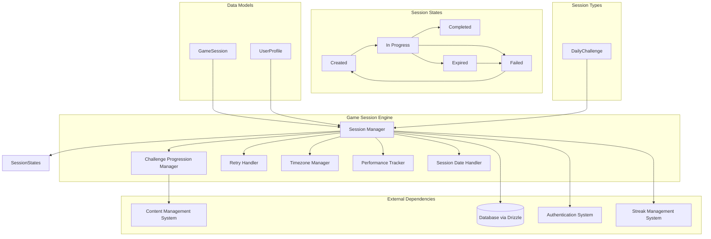
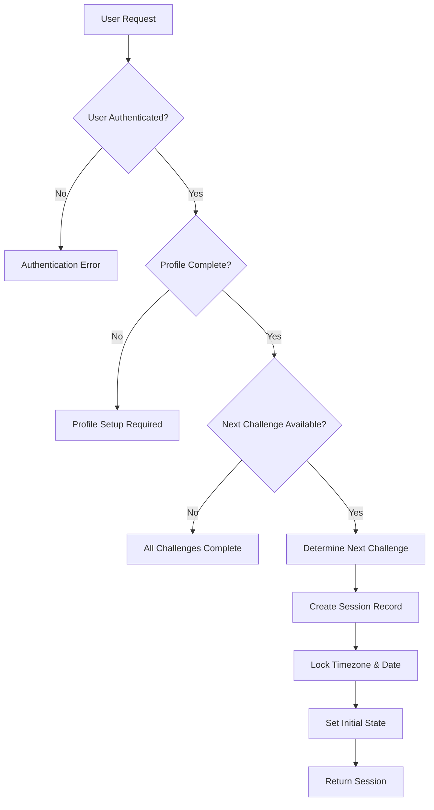
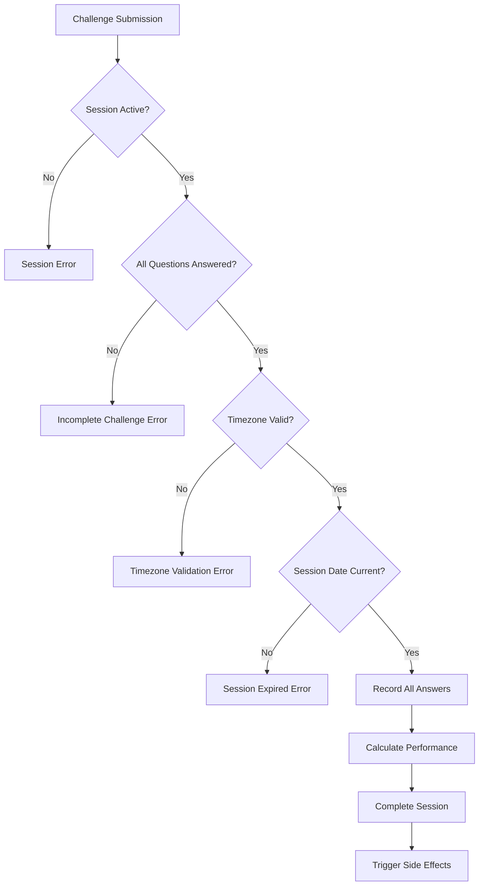
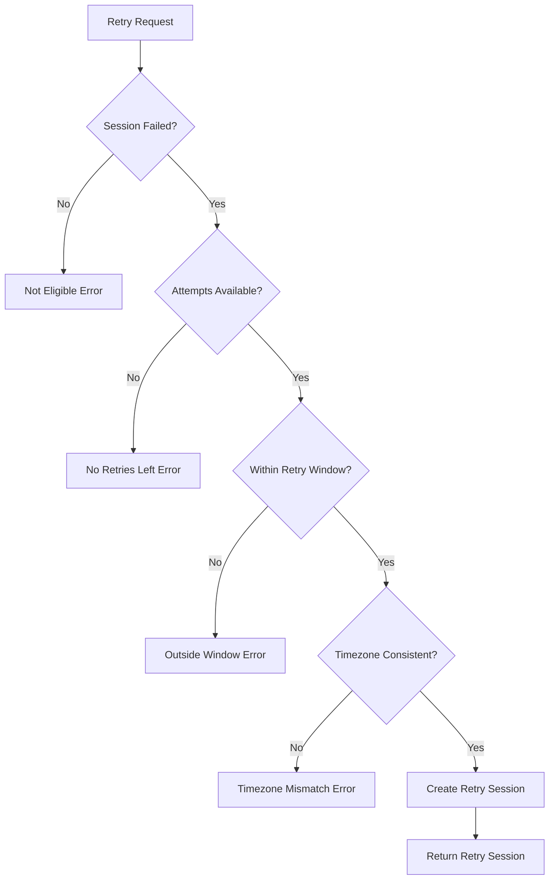
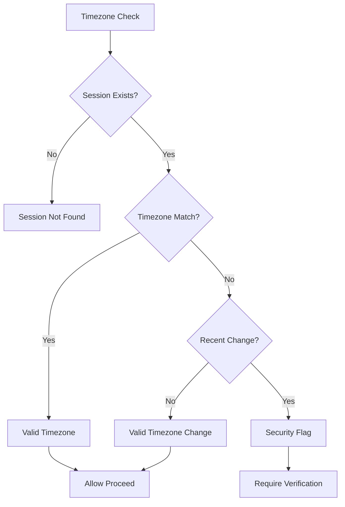

# Game Session Engine Low-Level Design Document

## Executive Summary

The Game Session Engine orchestrates daily challenges and tracks user progress through game sessions. This component manages session state, challenge progression, timezone handling, retry logic, and session persistence using a state machine pattern with persistent session storage. The engine enforces strict timezone locking to prevent manipulation and ensures fair play across different user timezones. Practice sessions are handled separately as ephemeral experiences without persistent storage.

## Design Context

### Requirements Reference
**Functional Requirements**: R3.1, R3.2, R3.3, R3.4, R12.1, R15.1

**Non-Functional Requirements**: Session state consistency, timezone manipulation prevention, retry logic enforcement, performance under load, timezone security

**User Journey Reference**: Daily Challenge Journey

**Dependencies**: Content Management System, Database Layer (Drizzle), Authentication System, Streak Management System

### Scope & Boundaries
**In Scope**: Daily challenge session lifecycle management, challenge progression, retry logic, timezone locking, session persistence, performance tracking, session date handling

**Out of Scope**: Content generation, user authentication, achievement system, streak management, practice sessions (handled separately)

**Assumptions**: Content is available, user is authenticated, database is accessible, timezone data is valid

## Detailed Component Design

### Component Architecture

#### Class/Module Diagram


#### Component Responsibilities
**SessionManager**
- **Primary Responsibility**: Manage daily challenge session lifecycle and state transitions
- **Secondary Responsibilities**: Session creation, validation, cleanup, timezone enforcement
- **Dependencies**: Database, Content Management System, Authentication, Streak System
- **Dependents**: All game components that need session state

**ChallengeProgressionManager**
- **Primary Responsibility**: Manage daily challenge progression and next challenge determination
- **Secondary Responsibilities**: Challenge selection, progression logic, completion tracking
- **Dependencies**: Content Management System, User Profile, Session State
- **Dependents**: SessionManager, UI Components

**RetryHandler**
- **Primary Responsibility**: Manage retry logic and attempt counting
- **Secondary Responsibilities**: Retry validation, attempt limit enforcement, timezone validation
- **Dependencies**: Session State, Timezone Manager, Session Date Handler
- **Dependents**: SessionManager

**TimezoneManager**
- **Primary Responsibility**: Handle timezone locking and session timezone management
- **Secondary Responsibilities**: Timezone validation, session timezone enforcement, DST handling
- **Dependencies**: User Profile, Session State, Session Date Handler
- **Dependents**: SessionManager, RetryHandler

**PerformanceTracker**
- **Primary Responsibility**: Track session performance metrics
- **Secondary Responsibilities**: Timing data, accuracy tracking, analytics
- **Dependencies**: Session State, Challenge Completion
- **Dependents**: SessionManager, Analytics System

**SessionDateHandler**
- **Primary Responsibility**: Manage session date boundaries and timezone calculations
- **Secondary Responsibilities**: Date validation, timezone conversion, boundary enforcement
- **Dependencies**: Session timezone, server time, date utilities
- **Dependents**: SessionManager, RetryHandler, TimezoneManager

### Interface Specifications

#### Public APIs
**createDailyChallengeSession**: Daily Challenge Session Creation API
```typescript
// No parameters needed - everything inferred from user state and auth
Signature: createDailyChallengeSession(): Promise<GameSession>
Purpose: Create a new daily challenge session with automatic progression
Preconditions: User authenticated, next challenge available, user profile complete
Postconditions: Session created with next challenge, timezone locked, session date set
Error Conditions: Authentication failure, no challenges available, profile incomplete
```

**submitDailyChallenge**: Challenge Submission API
```typescript
const SubmitDailyChallengeInputSchema = z.object({
  sessionId: z.string().uuid(),
  answers: z.array(z.object({
    questionId: z.string(),
    answerIndex: z.number().int().min(0),
    hintUsed: z.boolean().default(false),
  })),
});

type SubmitDailyChallengeInput = z.infer<typeof SubmitDailyChallengeInputSchema>;

Signature: submitDailyChallenge(input: SubmitDailyChallengeInput): Promise<ChallengeResult>
Purpose: Submit all challenge answers as a batch and complete the session
Preconditions: Session active, all questions answered, session not expired
Postconditions: Session completed, performance calculated, side effects triggered
Error Conditions: Session not active, incomplete answers, session expired, timezone validation failed
```

**retrySession**: Session Retry API
```typescript
const RetrySessionInputSchema = z.object({
  sessionId: z.string().uuid(),
});

type RetrySessionInput = z.infer<typeof RetrySessionInputSchema>;

Signature: retrySession(input: RetrySessionInput): Promise<GameSession>
Purpose: Create retry attempt for failed session
Preconditions: Session failed, retry attempts available, within retry window, session date valid
Postconditions: New retry session created with incremented attempt count
Error Conditions: No retries available, outside retry window, session not failed, expired session
```

**getSessionState**: Session State Retrieval API
```typescript
const GetSessionStateInputSchema = z.object({
  sessionId: z.string().uuid(),
});

type GetSessionStateInput = z.infer<typeof GetSessionStateInputSchema>;

Signature: getSessionState(input: GetSessionStateInput): Promise<SessionState>
Purpose: Get current state and progress of a session
Preconditions: Session exists and user has access
Postconditions: Current session state returned
Error Conditions: Session not found, access denied
```

**validateSessionTimezone**: Timezone Validation API
```typescript
const ValidateTimezoneInputSchema = z.object({
  sessionId: z.string().uuid(),
  currentUserTimezone: z.string(),
});

type ValidateTimezoneInput = z.infer<typeof ValidateTimezoneInputSchema>;

Signature: validateSessionTimezone(input: ValidateTimezoneInput): Promise<TimezoneValidationResult>
Purpose: Validate that session timezone matches and prevent manipulation
Preconditions: Session exists and user has access
Postconditions: Timezone validation result returned
Error Conditions: Session not found, access denied, timezone mismatch
```

## Data Design

### Data Models
**GameSession** (Database Entity via Drizzle)
```typescript
// Drizzle schema
export const gameSessions = pgTable('game_sessions', {
  id: uuid('id').primaryKey().defaultRandom(),
  user_id: uuid('user_id').notNull().references(() => users.id),
  challenge_id: uuid('challenge_id').notNull().references(() => dailyChallenges.id),
  session_timezone: text('session_timezone').notNull(), // e.g., "UTC-7"
  session_date_utc: date('session_date_utc').notNull(), // UTC date when session was first started
  started_at: timestamp('started_at').notNull().defaultNow(),
  completed_at: timestamp('completed_at'),
  in_progress: boolean('in_progress').default(true), // true by default, null when session complete, or day is over.
  user_answers: jsonb('user_answers').$type<Array<{
    question_id: string;
    answer_index: number;
    is_correct: boolean;
    hint_used: boolean;
  }>>(),
  all_correct_answers: boolean('all_correct_answers'), // Whether all questions were answered correctly.
  time_spent_seconds: integer('time_spent_seconds'),
  attempt_count: integer('attempt_count').notNull().default(1), // Max 3 attempts
  created_at: timestamp('created_at').notNull().defaultNow(),
  updated_at: timestamp('updated_at').notNull().defaultNow(),
});
```

**SessionState** (TypeScript Interface)
```typescript
interface SessionState {
  sessionId: string;
  currentState: 'created' | 'in_progress' | 'completed' | 'failed' | 'expired';
  totalQuestions: number;
  correctAnswers: number;
  timeSpent: number;
  progress: number; // 0-100 percentage
  canRetry: boolean;
  retryAttemptsRemaining: number;
  sessionTimezone: string;
  sessionDateUtc: string; // YYYY-MM-DD format
  lastActivity: Date;
  isExpired: boolean;
  timezoneValidation: {
    isValid: boolean;
    message?: string;
  };
}
```

**TimezoneValidationResult** (TypeScript Interface)
```typescript
interface TimezoneValidationResult {
  isValid: boolean;
  sessionTimezone: string;
  currentUserTimezone: string;
  message: string;
  canProceed: boolean;
  securityFlag: boolean;
}
```

**ChallengeResult** (TypeScript Interface)
```typescript
interface ChallengeResult {
  isComplete: boolean;
  allCorrect: boolean;
  correctAnswers: number;
  totalQuestions: number;
  timeSpent: number;
  performance: number; // 0-100 percentage
  sessionState: SessionState;
  timezoneValidation: TimezoneValidationResult;
}
```

**Business Rules**: 
- Session timezone is locked at creation and cannot be changed
- Session date is set in UTC when first created and remains constant
- Retry attempts are limited to 3 total per daily challenge
- Session state transitions follow strict rules
- Daily challenges are submitted as a complete batch, not question by question
- Session expiration is based on session date, not current time
- Challenge progression is automatic based on user's previous completion

**Relationships**: 
- GameSession belongs to User and DailyChallenge
- Session timezone and date are immutable after creation
- Session state transitions respect timezone and date boundaries

**Indexing Strategy**: 
- Primary key on GameSession.id
- Index on GameSession.user_id for user session queries
- Index on GameSession.session_timezone for timezone-based queries
- Index on GameSession.session_date_utc for date-based queries
- Composite index on (user_id, session_date_utc) for daily challenge queries

### Data Access Patterns
**Session Creation Pattern**
- **Query Pattern**: INSERT into gameSessions with automatic challenge progression
- **Caching Strategy**: No caching for session creation
- **Transaction Boundaries**: Single transaction for session creation
- **Concurrency Handling**: User can only have one active session per type per day

**Challenge Submission Pattern**
- **Query Pattern**: UPDATE gameSessions with all answers and completion status
- **Caching Strategy**: Session state cached in memory during active session
- **Transaction Boundaries**: Single transaction for challenge submission
- **Concurrency Handling**: Optimistic locking on session state and timezone

**Retry Logic Pattern**
- **Query Pattern**: INSERT new GameSession with incremented attempt_count
- **Caching Strategy**: No caching for retry creation
- **Transaction Boundaries**: Single transaction for retry session creation
- **Concurrency Handling**: Retry validation and creation in single transaction

**Timezone Validation Pattern**
- **Query Pattern**: SELECT session_timezone and session_date_utc for validation
- **Caching Strategy**: Timezone data cached for active sessions
- **Transaction Boundaries**: Read-only transaction for validation
- **Concurrency Handling**: No locking required for read operations

## Algorithm Design

### Core Algorithms
**Session State Machine Algorithm**
```
Input: Current state, action, session data, timezone validation
Output: New state and side effects
Complexity: Time O(1), Space O(1)

Pseudocode:
1. Validate timezone and session date
2. Validate state transition is allowed
3. Execute state-specific logic
4. Update session state in database
5. Trigger side effects (achievements, streaks)
6. Return new state with timezone validation
```

**Challenge Progression Algorithm**
```
Input: User profile, available challenges
Output: Next challenge to provide
Complexity: Time O(1), Space O(1)

Pseudocode:
1. Get user's latest completed challenge day
2. Find next available challenge (day + 1)
3. Validate challenge exists and is available
4. Return challenge or completion status
```

**Retry Logic Algorithm**
```
Input: Failed session, user request, timezone validation
Output: New retry session or error
Complexity: Time O(1), Space O(1)

Pseudocode:
1. Validate retry eligibility
2. Check attempt count limit (max 3)
3. Validate retry window (same session date)
4. Validate timezone consistency
5. Create new retry session with incremented attempt_count
6. Return retry session
```

**Timezone Validation Algorithm**
```
Input: Session timezone, current user timezone, session date
Output: Validation result and security assessment
Complexity: Time O(1), Space O(1)

Pseudocode:
1. Compare session timezone with current user timezone
2. Check for suspicious timezone changes
3. Validate session date is still current
4. Assess security risk level
5. Return validation result with security flags
```

**Business Logic Flows**
**Session Creation Flow**


**Challenge Submission Flow**


**Retry Logic Flow**


**Timezone Validation Flow**


## Implementation Specifications

### Key Implementation Details
**Session Management**
- **Approach**: State machine pattern with database persistence and timezone locking
- **Libraries/Frameworks**: Drizzle ORM, state machine library, date-fns
- **Configuration**: Session timeouts, retry limits, state transition rules, timezone validation
- **Environment Variables**: SESSION_TIMEOUT_MINUTES, MAX_RETRY_ATTEMPTS, TIMEZONE_VALIDATION_STRICT

**Challenge Progression**
- **Approach**: Automatic progression based on user's previous challenge completion
- **Libraries/Frameworks**: Content Management System integration, progression logic
- **Configuration**: Challenge availability rules, progression logic, completion tracking
- **Environment Variables**: CHALLENGE_PROGRESSION_STRICT, MAX_CHALLENGES_PER_USER

**Timezone Management**
- **Approach**: Session-level timezone locking with validation and security monitoring
- **Libraries/Frameworks**: Date-fns, timezone validation, security monitoring
- **Configuration**: Timezone validation rules, default timezone, security thresholds
- **Environment Variables**: DEFAULT_TIMEZONE, TIMEZONE_VALIDATION_STRICT, SECURITY_FLAG_THRESHOLD

**Performance Tracking**
- **Approach**: Batch performance calculation on challenge completion
- **Libraries/Frameworks**: Performance calculation, database timestamps, timezone conversion
- **Configuration**: Metrics calculation rules, storage limits, timezone handling
- **Environment Variables**: METRICS_CALCULATION_STRICT, METRICS_RETENTION_DAYS

**Session Date Handling**
- **Approach**: UTC date storage with timezone-aware boundary calculations
- **Libraries/Frameworks**: Date-fns, timezone conversion utilities
- **Configuration**: Date boundary rules, timezone conversion accuracy
- **Environment Variables**: DATE_BOUNDARY_STRICT, TIMEZONE_CONVERSION_ACCURACY

### Core Data Operations
**Session Creation Operation**
```typescript
async function createDailyChallengeSession(): Promise<GameSession> {
  // Get user from auth context
  const userId = getCurrentUserId();
  
  // Get user profile and determine next challenge
  const userProfile = await getUserProfile(userId);
  const nextChallenge = await getNextAvailableChallenge(userId);
  
  if (!nextChallenge) {
    throw new Error('No more challenges available');
  }
  
  // Get user timezone or use default
  const userTimezone = userProfile.timezone || 'UTC-7';
  
  // Get current UTC date
  const sessionDateUtc = new Date().toISOString().split('T')[0];
  
  const session = await db.insert(gameSessions).values({
    user_id: userId,
    challenge_id: nextChallenge.id,
    session_timezone: userTimezone,
    session_date_utc: sessionDateUtc,
    started_at: new Date(),
    in_progress: true,
    attempt_count: 1,
  }).returning();
  
  // Update UserProfile.latest_game_session as per requirements R3.2
  await db.update(userProfiles)
    .set({
      latest_game_session: session[0].id,
      updated_at: new Date(),
    })
    .where(eq(userProfiles.user_id, userId));
  
  return session[0];
}
```

**Challenge Submission Operation**
```typescript
async function submitDailyChallenge(input: SubmitDailyChallengeInput): Promise<ChallengeResult> {
  const session = await db.query.gameSessions.findFirst({
    where: eq(gameSessions.id, input.sessionId),
  });
  
  if (!session || session.in_progress !== true) {
    throw new Error('Session not active');
  }
  
  // Validate timezone and session date
  const timezoneValidation = await validateSessionTimezone({
    sessionId: input.sessionId,
    currentUserTimezone: getCurrentUserTimezone(),
  });
  
  if (!timezoneValidation.isValid) {
    throw new Error(`Timezone validation failed: ${timezoneValidation.message}`);
  }
  
  // Check if session date is still current
  const currentUtcDate = new Date().toISOString().split('T')[0];
  if (session.session_date_utc !== currentUtcDate) {
    throw new Error('Session has expired for the current day');
  }
  
  // Validate all questions are answered
  const expectedQuestionCount = await getChallengeQuestionCount(session.challenge_id);
  if (input.answers.length !== expectedQuestionCount) {
    throw new Error('All questions must be answered before submission');
  }
  
  // Process all answers
  const processedAnswers = await Promise.all(
    input.answers.map(async (answer) => ({
      question_id: answer.questionId,
      answer_index: answer.answerIndex,
      is_correct: await validateAnswer(answer.questionId, answer.answerIndex),
      hint_used: answer.hintUsed,
    }))
  );
  
  const correctAnswersCount = processedAnswers.filter(a => a.is_correct).length;
  const allCorrect = correctAnswersCount === expectedQuestionCount;
  
  // Complete session
  await db.update(gameSessions)
    .set({
      user_answers: processedAnswers,
      all_correct_answers: allCorrect,
      in_progress: null,
      completed_at: new Date(),
      time_spent_seconds: Math.floor((Date.now() - session.started_at.getTime()) / 1000),
    })
    .where(eq(gameSessions.id, input.sessionId));
  
  return {
    isComplete: true,
    allCorrect,
    correctAnswers: correctAnswersCount,
    totalQuestions: expectedQuestionCount,
    timeSpent: Math.floor((Date.now() - session.started_at.getTime()) / 1000),
    performance: (correctAnswersCount / expectedQuestionCount) * 100,
    sessionState: await getSessionState(input.sessionId),
    timezoneValidation,
  };
}
```

**Retry Session Operation**
```typescript
async function retrySession(input: RetrySessionInput): Promise<GameSession> {
  const session = await db.query.gameSessions.findFirst({
    where: eq(gameSessions.id, input.sessionId),
  });
  
  if (!session) {
    throw new Error('Session not found');
  }
  
  if (session.attempt_count >= 3) {
    throw new Error('Maximum retry attempts reached');
  }
  
  // Validate session date is still current
  const currentUtcDate = new Date().toISOString().split('T')[0];
  if (session.session_date_utc !== currentUtcDate) {
    throw new Error('Retry window has expired for this session');
  }
  
  // Validate timezone consistency
  const timezoneValidation = await validateSessionTimezone({
    sessionId: input.sessionId,
    currentUserTimezone: getCurrentUserTimezone(),
  });
  
  if (!timezoneValidation.isValid) {
    throw new Error(`Timezone validation failed: ${timezoneValidation.message}`);
  }
  
  // RESET the existing session (as per requirements)
  const updatedSession = await db.update(gameSessions)
    .set({
      in_progress: true,
      started_at: new Date(),
      completed_at: null,
      user_answers: null,
      all_correct_answers: null,
      attempt_count: session.attempt_count + 1,
    })
    .where(eq(gameSessions.id, input.sessionId))
    .returning();
  
  return updatedSession[0];
}
```

**Parameters**: Session data, challenge data, user input, timezone information, date boundaries

**Performance**: O(1) for state transitions, O(1) for challenge progression, O(n) for session queries, O(1) for timezone validation

**Indexes Required**: Primary key on id, index on user_id, index on session_timezone, index on session_date_utc, composite index on (user_id, session_date_utc)

## Error Handling & Validation

### Error Scenarios
**Session Creation Errors**
- **Trigger Conditions**: Invalid user, missing content, database connection failure, no challenges available
- **Error Response**: Specific error messages with error codes and challenge availability information
- **Recovery Strategy**: Retry with exponential backoff, fallback to error state, challenge progression check
- **Logging Requirements**: User ID, error context, stack trace, challenge availability

**Challenge Submission Errors**
- **Trigger Conditions**: Incomplete answers, invalid session state, timezone mismatch, expired session
- **Error Response**: Clear error message with completion requirements and timezone information
- **Recovery Strategy**: Answer completion, session validation, timezone correction
- **Logging Requirements**: Session ID, answer completeness, error details, timezone context

**Retry Logic Errors**
- **Trigger Conditions**: No retries available, outside retry window, invalid session state, timezone mismatch
- **Error Response**: Clear retry eligibility information with timezone and date constraints
- **Recovery Strategy**: Wait for retry window, create new session, timezone validation
- **Logging Requirements**: Session ID, retry attempt, eligibility check, timezone data

**Timezone Validation Errors**
- **Trigger Conditions**: Timezone mismatch, suspicious timezone changes, expired session date
- **Error Response**: Clear timezone validation error with security implications
- **Recovery Strategy**: Timezone correction, security verification, session validation
- **Logging Requirements**: Session ID, timezone data, security flags, user behavior patterns

### Business Rule Validation
**Session State Transition Validation**
- **Rule Description**: Only valid state transitions are allowed with timezone and date validation
- **Validation Logic**: Check state machine rules for transition validity, validate timezone consistency, check session date
- **Error Message**: "Invalid state transition from {currentState} to {targetState}: {reason}"
- **System Behavior**: Transition rejected, session remains in current state, security flag if suspicious

**Challenge Completion Validation**
- **Rule Description**: All questions must be answered before challenge submission
- **Validation Logic**: Check answer count matches expected question count, validate answer format
- **Error Message**: "Challenge incomplete: {answeredCount}/{expectedCount} questions answered"
- **System Behavior**: Submission rejected, user informed of completion requirements

**Retry Attempt Validation**
- **Rule Description**: Retry attempts are limited, time-windowed, and timezone-consistent
- **Validation Logic**: Check attempt count, time window constraints, timezone consistency, session date validity
- **Error Message**: "Retry not available: {reason}"
- **System Behavior**: Retry rejected, user informed of constraints, security monitoring if suspicious

**Timezone Locking Validation**
- **Rule Description**: Session timezone cannot be changed after creation and must remain consistent
- **Validation Logic**: Ensure session_timezone remains constant, validate against current user timezone
- **Error Message**: "Session timezone cannot be modified: {currentTimezone} locked"
- **System Behavior**: Timezone change rejected, original timezone maintained, security alert if manipulation detected

**Session Date Validation**
- **Rule Description**: Session date is locked at creation and determines validity boundaries
- **Validation Logic**: Check session_date_utc against current UTC date, validate timezone boundaries
- **Error Message**: "Session expired: {sessionDate} is no longer current"
- **System Behavior**: Session marked as expired, no further actions allowed, new session required

## Testing Specifications

### Integration Test Scenarios
**Session Lifecycle Integration**
- **Components Involved**: SessionManager, Database, Content System, TimezoneManager
- **Test Flow**: Create session, submit challenge, complete session, validate timezone locking
- **Mock Requirements**: Mock database, mock content system, mock timezone utilities
- **Assertion Points**: Session state changes, database updates, content loading, timezone consistency

**Retry Logic Integration**
- **Components Involved**: RetryHandler, SessionManager, TimezoneManager, SessionDateHandler
- **Test Flow**: Fail session, attempt retry, validate retry constraints, check timezone and date
- **Mock Requirements**: Mock failed session, mock timezone data, mock date utilities
- **Assertion Points**: Retry eligibility, attempt counting, timezone locking, date validation

**Performance Tracking Integration**
- **Components Involved**: PerformanceTracker, SessionManager, Database, TimezoneManager
- **Test Flow**: Track timing, record metrics, validate storage, check timezone awareness
- **Mock Requirements**: Mock timing data, mock performance metrics, mock timezone conversion
- **Assertion Points**: Metric accuracy, storage persistence, performance impact, timezone handling

**Timezone Security Integration**
- **Components Involved**: TimezoneManager, SessionManager, Security Monitoring
- **Test Flow**: Attempt timezone manipulation, validate security responses, check audit trails
- **Mock Requirements**: Mock security monitoring, mock timezone validation, mock audit system
- **Assertion Points**: Security flagging, audit trail creation, manipulation prevention, user guidance

### Edge Cases & Boundary Tests
**Concurrent Session Access**
- **Scenario**: Multiple requests accessing same session simultaneously with timezone validation
- **Input Values**: Concurrent API calls, race conditions, timezone changes
- **Expected Behavior**: Consistent state, no data corruption, timezone validation maintained
- **Validation**: State consistency, data integrity, error handling, timezone security

**Session Timeout Handling**
- **Scenario**: Sessions that exceed timeout limits with timezone considerations
- **Input Values**: Long-running sessions, timeout configurations, timezone boundaries
- **Expected Behavior**: Proper timeout handling, state cleanup, timezone validation
- **Validation**: Timeout enforcement, cleanup procedures, error reporting, timezone consistency

**Invalid State Recovery**
- **Scenario**: Sessions in corrupted or invalid states with timezone data
- **Input Values**: Invalid session data, corrupted state, timezone inconsistencies
- **Expected Behavior**: Graceful error handling, recovery options, timezone correction
- **Validation**: Error detection, recovery procedures, user experience, timezone validation

**Timezone Edge Cases**
- **Scenario**: Sessions across timezone boundaries, DST changes, and manipulation attempts
- **Input Values**: DST transitions, timezone changes, boundary conditions, manipulation attempts
- **Expected Behavior**: Consistent timezone handling, no manipulation, security monitoring
- **Validation**: Timezone locking, DST handling, security enforcement, audit trail creation

**Date Boundary Edge Cases**
- **Scenario**: Sessions created near midnight UTC with timezone considerations
- **Input Values**: UTC date boundaries, timezone offsets, session timing
- **Expected Behavior**: Correct date handling, timezone-aware boundaries, no date manipulation
- **Validation**: Date accuracy, boundary enforcement, timezone conversion, manipulation prevention
