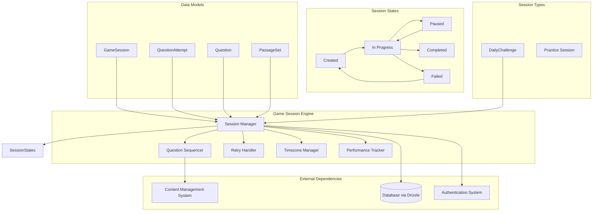
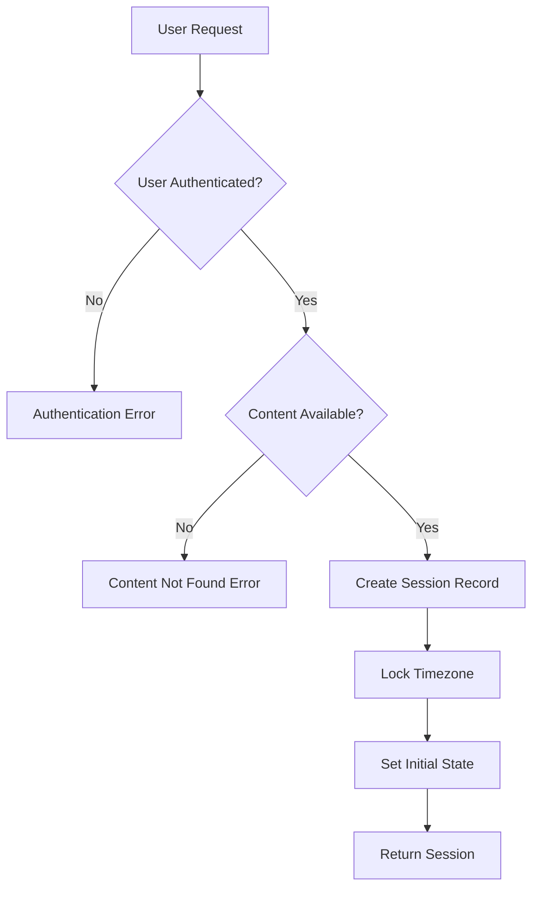
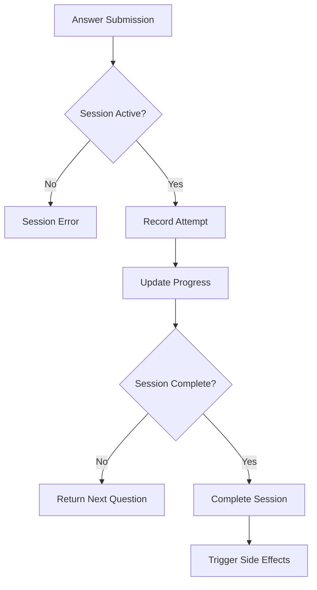
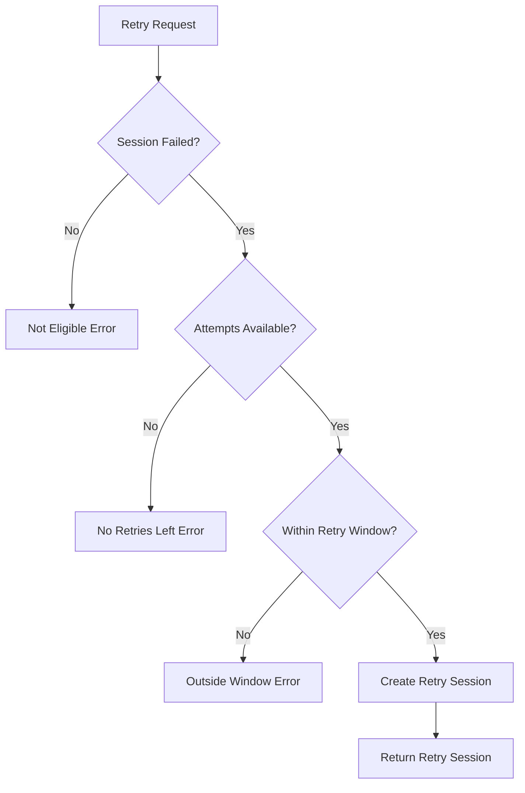

# Game Session Engine Low-Level Design Document

## Executive Summary

The Game Session Engine orchestrates daily challenges, practice sessions, and tracks user progress through game sessions. This component manages session state, question sequencing, timezone handling, retry logic, and session persistence using a state machine pattern with persistent session storage.

## Design Context

### Requirements Reference
**Functional Requirements**: R3.1, R3.2, R3.3, R3.4, R4.1, R4.2, R12.1, R15.1

**Non-Functional Requirements**: Session state consistency, timezone manipulation prevention, retry logic enforcement, performance under load

**User Journey Reference**: Daily Challenge Journey, Practice Session Journey

**Dependencies**: Content Management System, Database Layer (Drizzle), Authentication System

### Scope & Boundaries
**In Scope**: Session lifecycle management, question progression, retry logic, timezone locking, session persistence, performance tracking

**Out of Scope**: Content generation, user authentication, achievement system, streak management

**Assumptions**: Content is available, user is authenticated, database is accessible

## Detailed Component Design

### Component Architecture

#### Class/Module Diagram


#### Component Responsibilities
**SessionManager**
- **Primary Responsibility**: Manage session lifecycle and state transitions
- **Secondary Responsibilities**: Session creation, validation, cleanup
- **Dependencies**: Database, Content Management System, Authentication
- **Dependents**: All game components that need session state

**QuestionSequencer**
- **Primary Responsibility**: Manage question progression and sequencing
- **Secondary Responsibilities**: Question selection, passage handling, progress tracking
- **Dependencies**: Content Management System, Session State
- **Dependents**: SessionManager, UI Components

**RetryHandler**
- **Primary Responsibility**: Manage retry logic and attempt counting
- **Secondary Responsibilities**: Retry validation, attempt limit enforcement
- **Dependencies**: Session State, Timezone Manager
- **Dependents**: SessionManager

**TimezoneManager**
- **Primary Responsibility**: Handle timezone locking and session timezone management
- **Secondary Responsibilities**: Timezone validation, session timezone enforcement
- **Dependencies**: User Profile, Session State
- **Dependents**: SessionManager, RetryHandler

**PerformanceTracker**
- **Primary Responsibility**: Track session performance metrics
- **Secondary Responsibilities**: Timing data, accuracy tracking, analytics
- **Dependencies**: Session State, Question Attempts
- **Dependents**: SessionManager, Analytics System

### Interface Specifications

#### Public APIs
**createSession**: Session Creation API
```typescript
Signature: createSession(input: CreateSessionInput): Promise<GameSession>
Purpose: Create a new game session for daily challenge or practice
Preconditions: User authenticated, content available, valid session type
Postconditions: Session created with initial state and timezone locked
Error Conditions: Authentication failure, content not found, invalid session type
```

**startSession**: Session Start API
```typescript
Signature: startSession(sessionId: string): Promise<SessionState>
Purpose: Start an existing session and begin question progression
Preconditions: Session exists and is in Created state
Postconditions: Session moved to InProgress state with first question
Error Conditions: Session not found, invalid state transition, content loading failure
```

**submitAnswer**: Answer Submission API
```typescript
Signature: submitAnswer(input: SubmitAnswerInput): Promise<AnswerResult>
Purpose: Submit answer for current question and progress session
Preconditions: Session active, question available, valid answer format
Postconditions: Answer recorded, session progressed to next question or completed
Error Conditions: Session not active, invalid answer, question not found
```

**retrySession**: Session Retry API
```typescript
Signature: retrySession(sessionId: string): Promise<GameSession>
Purpose: Create retry attempt for failed session
Preconditions: Session failed, retry attempts available, within retry window
Postconditions: New retry session created with incremented attempt count
Error Conditions: No retries available, outside retry window, session not failed
```

**getSessionState**: Session State Retrieval API
```typescript
Signature: getSessionState(sessionId: string): Promise<SessionState>
Purpose: Get current state and progress of a session
Preconditions: Session exists and user has access
Postconditions: Current session state returned
Error Conditions: Session not found, access denied
```

## Data Design

### Data Models
**GameSession** (Database Entity via Drizzle)
```typescript
// Drizzle schema
export const gameSessions = pgTable('game_sessions', {
  id: uuid('id').primaryKey().defaultRandom(),
  user_id: uuid('user_id').notNull().references(() => users.id),
  challenge_id: uuid('challenge_id').references(() => dailyChallenges.id),
  session_type: text('session_type').notNull(), // 'daily_challenge' | 'practice'
  session_timezone: text('session_timezone').notNull(),
  started_at: timestamp('started_at').notNull().defaultNow(),
  completed_at: timestamp('completed_at'),
  is_completed: boolean('is_completed').notNull().default(false),
  total_questions: integer('total_questions').notNull(),
  correct_answers: integer('correct_answers').notNull().default(0),
  time_spent_seconds: integer('time_spent_seconds'),
  attempt_count: integer('attempt_count').notNull().default(1),
  current_question_index: integer('current_question_index').notNull().default(0),
  session_state: text('session_state').notNull().default('created'),
  created_at: timestamp('created_at').notNull().defaultNow(),
  updated_at: timestamp('updated_at').notNull().defaultNow(),
});
```

**QuestionAttempt** (Database Entity via Drizzle)
```typescript
// Drizzle schema
export const questionAttempts = pgTable('question_attempts', {
  id: uuid('id').primaryKey().defaultRandom(),
  game_session_id: uuid('game_session_id').notNull().references(() => gameSessions.id),
  question_id: text('question_id').notNull(), // Reference to static content
  selected_answer_index: integer('selected_answer_index').notNull(),
  is_correct: boolean('is_correct').notNull(),
  time_spent_seconds: integer('time_spent_seconds').notNull(),
  answered_at: timestamp('answered_at').notNull().defaultNow(),
  hint_used: boolean('hint_used').notNull().default(false),
  created_at: timestamp('created_at').notNull().defaultNow(),
});
```

**SessionState** (TypeScript Interface)
```typescript
interface SessionState {
  sessionId: string;
  currentState: 'created' | 'in_progress' | 'paused' | 'completed' | 'failed';
  currentQuestionIndex: number;
  totalQuestions: number;
  correctAnswers: number;
  timeSpent: number;
  currentQuestion?: Question | PassageQuestion;
  progress: number; // 0-100 percentage
  canRetry: boolean;
  retryAttemptsRemaining: number;
  sessionTimezone: string;
  lastActivity: Date;
}
```

**CreateSessionInput** (Zod Schema)
```typescript
const CreateSessionInputSchema = z.object({
  userId: z.string().uuid(),
  sessionType: z.enum(['daily_challenge', 'practice']),
  challengeId: z.string().uuid().optional(), // Required for daily challenges
  contentCategoryId: z.string().optional(), // Required for practice sessions
  userTimezone: z.string(),
  questionCount: z.number().int().min(1).max(20),
});

type CreateSessionInput = z.infer<typeof CreateSessionInputSchema>;
```

**SubmitAnswerInput** (Zod Schema)
```typescript
const SubmitAnswerInputSchema = z.object({
  sessionId: z.string().uuid(),
  questionId: z.string(),
  selectedAnswerIndex: z.number().int().min(0),
  timeSpentSeconds: z.number().int().min(0),
  hintUsed: z.boolean().default(false),
});

type SubmitAnswerInput = z.infer<typeof SubmitAnswerInputSchema>;
```

**Business Rules**: 
- Session timezone is locked at creation and cannot be changed
- Retry attempts are limited to 3 total per daily challenge
- Session state transitions follow strict rules
- Question progression is sequential and cannot be skipped

**Relationships**: 
- GameSession belongs to User and optionally DailyChallenge
- QuestionAttempt belongs to GameSession and references Question
- Session state transitions are managed by state machine

**Indexing Strategy**: 
- Primary key on GameSession.id
- Index on GameSession.user_id for user session queries
- Index on GameSession.session_timezone for timezone-based queries
- Index on QuestionAttempt.game_session_id for session attempts

### Data Access Patterns
**Session Creation Pattern**
- **Query Pattern**: INSERT into gameSessions with validation
- **Caching Strategy**: No caching for session creation
- **Transaction Boundaries**: Single transaction for session creation
- **Concurrency Handling**: User can only have one active session per type

**Session State Update Pattern**
- **Query Pattern**: UPDATE gameSessions with state change
- **Caching Strategy**: Session state cached in memory during active session
- **Transaction Boundaries**: Single transaction for state update
- **Concurrency Handling**: Optimistic locking on session state

**Question Attempt Recording Pattern**
- **Query Pattern**: INSERT into questionAttempts with session progress update
- **Caching Strategy**: No caching for attempts
- **Transaction Boundaries**: Single transaction for attempt and progress update
- **Concurrency Handling**: Sequential question progression enforced

## Algorithm Design

### Core Algorithms
**Session State Machine Algorithm**
```
Input: Current state, action, session data
Output: New state and side effects
Complexity: Time O(1), Space O(1)

Pseudocode:
1. Validate state transition is allowed
2. Execute state-specific logic
3. Update session state in database
4. Trigger side effects (achievements, streaks)
5. Return new state
```

**Question Progression Algorithm**
```
Input: Current session, question answer
Output: Next question or completion
Complexity: Time O(1), Space O(1)

Pseudocode:
1. Record question attempt
2. Update session progress
3. Check if session complete
4. Return next question or completion status
5. Update session state if needed
```

**Retry Logic Algorithm**
```
Input: Failed session, user request
Output: New retry session or error
Complexity: Time O(1), Space O(1)

Pseudocode:
1. Validate retry eligibility
2. Check attempt count limit
3. Validate retry window
4. Create new retry session
5. Return retry session
```

**Business Logic Flows**
**Session Creation Flow**


**Question Progression Flow**


**Retry Logic Flow**


## Implementation Specifications

### Key Implementation Details
**Session Management**
- **Approach**: State machine pattern with database persistence
- **Libraries/Frameworks**: Drizzle ORM, state machine library
- **Configuration**: Session timeouts, retry limits, state transition rules
- **Environment Variables**: SESSION_TIMEOUT_MINUTES, MAX_RETRY_ATTEMPTS

**Question Sequencing**
- **Approach**: Sequential progression with content type handling
- **Libraries/Frameworks**: Content Management System integration
- **Configuration**: Question count limits, progression rules
- **Environment Variables**: MAX_QUESTIONS_PER_SESSION, QUESTION_TIMEOUT_SECONDS

**Timezone Management**
- **Approach**: Session-level timezone locking with validation
- **Libraries/Frameworks**: Date-fns, timezone validation
- **Configuration**: Timezone validation rules, default timezone
- **Environment Variables**: DEFAULT_TIMEZONE, TIMEZONE_VALIDATION_STRICT

**Performance Tracking**
- **Approach**: Real-time metrics collection with database storage
- **Libraries/Frameworks**: Performance.now(), database timestamps
- **Configuration**: Metrics collection intervals, storage limits
- **Environment Variables**: METRICS_COLLECTION_INTERVAL, METRICS_RETENTION_DAYS

### Core Data Operations
**Session Creation Operation**
```typescript
async function createGameSession(input: CreateSessionInput): Promise<GameSession> {
  const session = await db.insert(gameSessions).values({
    user_id: input.userId,
    challenge_id: input.challengeId,
    session_type: input.sessionType,
    session_timezone: input.userTimezone,
    total_questions: input.questionCount,
    session_state: 'created',
    current_question_index: 0,
    correct_answers: 0,
    attempt_count: 1,
  }).returning();
  
  return session[0];
}
```

**Question Answer Operation**
```typescript
async function submitAnswer(input: SubmitAnswerInput): Promise<AnswerResult> {
  const session = await db.query.gameSessions.findFirst({
    where: eq(gameSessions.id, input.sessionId),
  });
  
  if (!session || session.session_state !== 'in_progress') {
    throw new Error('Session not active');
  }
  
  // Record attempt
  await db.insert(questionAttempts).values({
    game_session_id: input.sessionId,
    question_id: input.questionId,
    selected_answer_index: input.selectedAnswerIndex,
    time_spent_seconds: input.timeSpentSeconds,
    hint_used: input.hintUsed,
    answered_at: new Date(),
  });
  
  // Update session progress
  const isCorrect = await validateAnswer(input.questionId, input.selectedAnswerIndex);
  const newCorrectAnswers = session.correct_answers + (isCorrect ? 1 : 0);
  const newQuestionIndex = session.current_question_index + 1;
  
  const isComplete = newQuestionIndex >= session.total_questions;
  
  await db.update(gameSessions)
    .set({
      correct_answers: newCorrectAnswers,
      current_question_index: newQuestionIndex,
      session_state: isComplete ? 'completed' : 'in_progress',
      completed_at: isComplete ? new Date() : undefined,
    })
    .where(eq(gameSessions.id, input.sessionId));
  
  return {
    isCorrect,
    isComplete,
    nextQuestion: isComplete ? null : await getNextQuestion(session, newQuestionIndex),
    progress: (newQuestionIndex / session.total_questions) * 100,
  };
}
```

**Parameters**: Session data, question data, user input, timezone information

**Performance**: O(1) for state transitions, O(1) for question progression, O(n) for session queries

**Indexes Required**: Primary key on id, index on user_id, index on session_timezone

## Error Handling & Validation

### Error Scenarios
**Session Creation Errors**
- **Trigger Conditions**: Invalid user, missing content, database connection failure
- **Error Response**: Specific error messages with error codes
- **Recovery Strategy**: Retry with exponential backoff, fallback to error state
- **Logging Requirements**: User ID, error context, stack trace

**Session State Errors**
- **Trigger Conditions**: Invalid state transitions, corrupted session data
- **Error Response**: Session state error with recovery options
- **Recovery Strategy**: Session recovery, state reset if necessary
- **Logging Requirements**: Session ID, current state, attempted transition

**Question Progression Errors**
- **Trigger Conditions**: Missing questions, content loading failure, invalid answers
- **Error Response**: Question error with retry options
- **Recovery Strategy**: Question reload, session pause if persistent
- **Logging Requirements**: Question ID, session ID, error details

**Retry Logic Errors**
- **Trigger Conditions**: No retries available, outside retry window, invalid session state
- **Error Response**: Clear retry eligibility information
- **Recovery Strategy**: Wait for retry window, create new session
- **Logging Requirements**: Session ID, retry attempt, eligibility check

### Business Rule Validation
**Session State Transition Validation**
- **Rule Description**: Only valid state transitions are allowed
- **Validation Logic**: Check state machine rules for transition validity
- **Error Message**: "Invalid state transition from {currentState} to {targetState}"
- **System Behavior**: Transition rejected, session remains in current state

**Retry Attempt Validation**
- **Rule Description**: Retry attempts are limited and time-windowed
- **Validation Logic**: Check attempt count and time window constraints
- **Error Message**: "Retry not available: {reason}"
- **System Behavior**: Retry rejected, user informed of constraints

**Timezone Locking Validation**
- **Rule Description**: Session timezone cannot be changed after creation
- **Validation Logic**: Ensure session_timezone remains constant
- **Error Message**: "Session timezone cannot be modified"
- **System Behavior**: Timezone change rejected, original timezone maintained

## Testing Specifications

### Integration Test Scenarios
**Session Lifecycle Integration**
- **Components Involved**: SessionManager, Database, Content System
- **Test Flow**: Create session, progress through questions, complete session
- **Mock Requirements**: Mock database, mock content system
- **Assertion Points**: Session state changes, database updates, content loading

**Retry Logic Integration**
- **Components Involved**: RetryHandler, SessionManager, TimezoneManager
- **Test Flow**: Fail session, attempt retry, validate retry constraints
- **Mock Requirements**: Mock failed session, mock timezone data
- **Assertion Points**: Retry eligibility, attempt counting, timezone locking

**Performance Tracking Integration**
- **Components Involved**: PerformanceTracker, SessionManager, Database
- **Test Flow**: Track timing, record metrics, validate storage
- **Mock Requirements**: Mock timing data, mock performance metrics
- **Assertion Points**: Metric accuracy, storage persistence, performance impact

### Edge Cases & Boundary Tests
**Concurrent Session Access**
- **Scenario**: Multiple requests accessing same session simultaneously
- **Input Values**: Concurrent API calls, race conditions
- **Expected Behavior**: Consistent state, no data corruption
- **Validation**: State consistency, data integrity, error handling

**Session Timeout Handling**
- **Scenario**: Sessions that exceed timeout limits
- **Input Values**: Long-running sessions, timeout configurations
- **Expected Behavior**: Proper timeout handling, state cleanup
- **Validation**: Timeout enforcement, cleanup procedures, error reporting

**Invalid State Recovery**
- **Scenario**: Sessions in corrupted or invalid states
- **Input Values**: Invalid session data, corrupted state
- **Expected Behavior**: Graceful error handling, recovery options
- **Validation**: Error detection, recovery procedures, user experience

**Timezone Edge Cases**
- **Scenario**: Sessions across timezone boundaries and DST changes
- **Input Values**: DST transitions, timezone changes, boundary conditions
- **Expected Behavior**: Consistent timezone handling, no manipulation
- **Validation**: Timezone locking, DST handling, security enforcement
