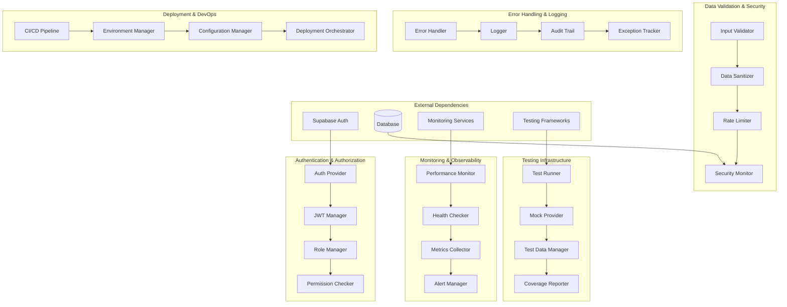
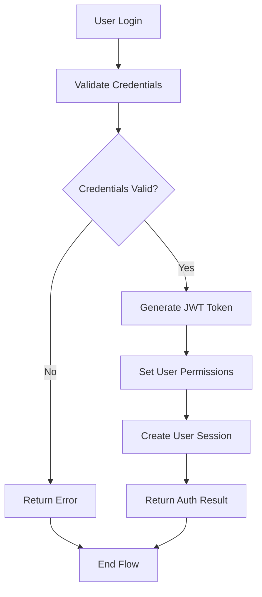
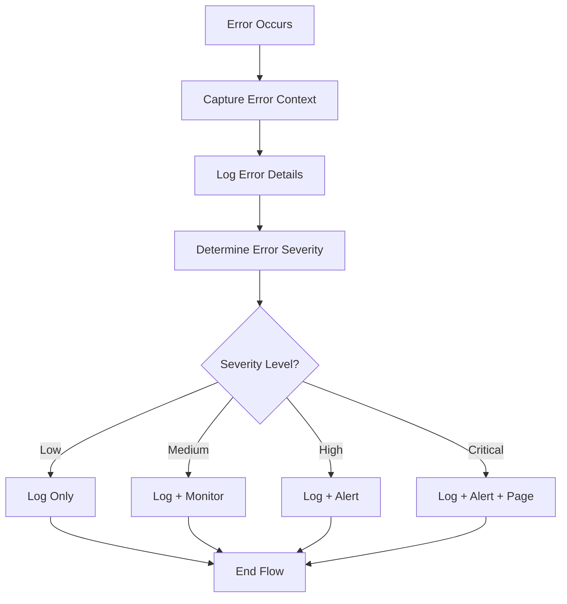
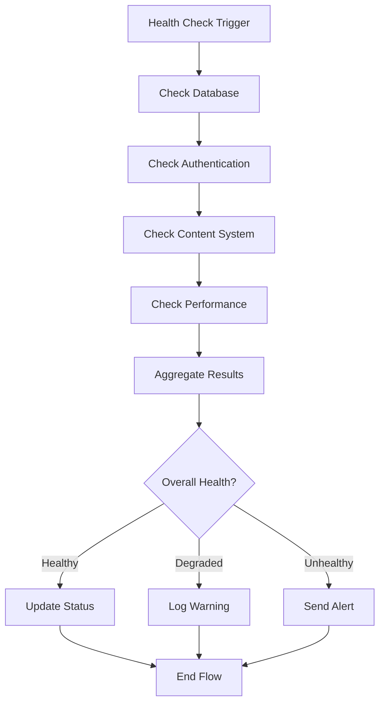

# Important Others - Additional System Concerns Low-Level Design Document

## Executive Summary

This document covers critical system concerns that are not explicitly addressed by the core components but are essential for system integrity, security, performance, and maintainability. These include authentication and authorization, data validation, error handling, logging, monitoring, testing infrastructure, and deployment concerns.

## Design Context

### Requirements Reference
**Functional Requirements**: R14.1, CR1, CR2, CR3

**Non-Functional Requirements**: Security, performance, reliability, maintainability, scalability

**User Journey Reference**: All user journeys depend on these foundational concerns

**Dependencies**: All core components depend on these foundational systems

### Scope & Boundaries
**In Scope**: Authentication, authorization, validation, error handling, logging, monitoring, testing, deployment

**Out of Scope**: Business logic implementation, specific feature development, content generation

**Assumptions**: Modern security practices, industry-standard tools, cloud-native deployment

## Detailed Component Design

### Component Architecture

#### Class/Module Diagram


#### Component Responsibilities
**Authentication & Authorization System**
- **Primary Responsibility**: Manage user authentication and authorization
- **Secondary Responsibilities**: JWT management, role-based access control, permission checking
- **Dependencies**: Supabase Auth, JWT libraries, role definitions
- **Dependents**: All authenticated components, protected routes

**Data Validation & Security System**
- **Primary Responsibility**: Ensure data integrity and security
- **Secondary Responsibilities**: Input validation, data sanitization, rate limiting, security monitoring
- **Dependencies**: Validation libraries, security tools, monitoring services
- **Dependents**: All data input components, API endpoints

**Error Handling & Logging System**
- **Primary Responsibility**: Handle errors gracefully and maintain audit trails
- **Secondary Responsibilities**: Error logging, audit trail management, exception tracking
- **Dependencies**: Logging libraries, audit systems, monitoring services
- **Dependents**: All system components, debugging tools

**Monitoring & Observability System**
- **Primary Responsibility**: Monitor system health and performance
- **Secondary Responsibilities**: Performance monitoring, health checking, metrics collection, alerting
- **Dependencies**: Monitoring services, metrics libraries, alert systems
- **Dependents**: Operations team, system administrators

**Testing Infrastructure System**
- **Primary Responsibility**: Provide comprehensive testing capabilities
- **Secondary Responsibilities**: Test execution, mock data, test data management, coverage reporting
- **Dependencies**: Testing frameworks, mock libraries, coverage tools
- **Dependents**: Development team, quality assurance

**Deployment & DevOps System**
- **Primary Responsibility**: Manage deployment and operational concerns
- **Secondary Responsibilities**: CI/CD pipeline, environment management, configuration management
- **Dependencies**: CI/CD tools, cloud services, configuration systems
- **Dependents**: Operations team, development team

### Interface Specifications

#### Public APIs
**authenticateUser**: User Authentication API
```typescript
Signature: authenticateUser(credentials: UserCredentials): Promise<AuthResult>
Purpose: Authenticate user and generate access token
Preconditions: Valid credentials, authentication service available
Postconditions: User authenticated, access token generated
Error Conditions: Invalid credentials, authentication service failure, rate limit exceeded
```

**validateInput**: Input Validation API
```typescript
Signature: validateInput<T>(input: unknown, schema: ZodSchema<T>): ValidationResult<T>
Purpose: Validate input data against schema and sanitize if needed
Preconditions: Input data available, validation schema defined
Postconditions: Input validated and sanitized if needed
Error Conditions: Invalid input, schema validation failure, sanitization error
```

**logError**: Error Logging API
```typescript
Signature: logError(error: Error, context: ErrorContext): Promise<void>
Purpose: Log error with context for debugging and monitoring
Preconditions: Error object available, logging service accessible
Postconditions: Error logged with full context
Error Conditions: Logging service failure, context validation error
```

**checkHealth**: Health Check API
```typescript
Signature: checkHealth(): Promise<HealthStatus>
Purpose: Check system health and return status
Preconditions: Health check services available
Postconditions: Health status returned
Error Conditions: Health check service failure, timeout
```

**runTests**: Test Execution API
```typescript
Signature: runTests(options: TestOptions): Promise<TestResults>
Purpose: Execute test suite and return results
Preconditions: Test environment available, test files accessible
Postconditions: Tests executed and results returned
Error Conditions: Test environment failure, test execution error
```

## Data Design

### Data Models
**UserCredentials** (Zod Schema)
```typescript
const UserCredentialsSchema = z.object({
  email: z.string().email(),
  password: z.string().min(8),
  rememberMe: z.boolean().default(false),
});

type UserCredentials = z.infer<typeof UserCredentialsSchema>;
```

**AuthResult** (TypeScript Interface)
```typescript
interface AuthResult {
  success: boolean;
  user: User | null;
  accessToken: string | null;
  refreshToken: string | null;
  expiresAt: Date | null;
  permissions: string[];
  roles: string[];
}
```

**ErrorContext** (Zod Schema)
```typescript
const ErrorContextSchema = z.object({
  userId: z.string().uuid().optional(),
  requestId: z.string().optional(),
  endpoint: z.string().optional(),
  userAgent: z.string().optional(),
  timestamp: z.date(),
  severity: z.enum(['low', 'medium', 'high', 'critical']),
  metadata: z.record(z.any()).optional(),
});

type ErrorContext = z.infer<typeof ErrorContextSchema>;
```

**HealthStatus** (TypeScript Interface)
```typescript
interface HealthStatus {
  overall: 'healthy' | 'degraded' | 'unhealthy';
  timestamp: Date;
  checks: {
    database: HealthCheck;
    authentication: HealthCheck;
    content: HealthCheck;
    performance: HealthCheck;
  };
  metrics: {
    responseTime: number;
    errorRate: number;
    activeUsers: number;
    systemLoad: number;
  };
}

interface HealthCheck {
  status: 'healthy' | 'degraded' | 'unhealthy';
  message: string;
  lastChecked: Date;
  responseTime: number;
}
```

**TestOptions** (Zod Schema)
```typescript
const TestOptionsSchema = z.object({
  testType: z.enum(['unit', 'integration', 'e2e', 'all']),
  environment: z.enum(['development', 'staging', 'production']),
  coverage: z.boolean().default(true),
  parallel: z.boolean().default(false),
  timeout: z.number().default(30000),
  filters: z.array(z.string()).optional(),
});

type TestOptions = z.infer<typeof TestOptionsSchema>;
```

**Business Rules**: 
- All user inputs must be validated before processing
- Authentication tokens must be validated on every request
- Errors must be logged with sufficient context for debugging
- Health checks must be performed regularly and automatically
- Tests must pass before deployment to production

**Relationships**: 
- UserCredentials are validated by InputValidator
- AuthResult contains user permissions and roles
- ErrorContext provides debugging information for errors
- HealthStatus reflects overall system health
- TestOptions control test execution behavior

**Indexing Strategy**: 
- User authentication data indexed by email and token
- Error logs indexed by timestamp and severity
- Health check results indexed by timestamp and service
- Test results indexed by test type and execution time

### Data Access Patterns
**Authentication Pattern**
- **Query Pattern**: SELECT user data, validate credentials, generate tokens
- **Caching Strategy**: User sessions cached, tokens cached with TTL
- **Transaction Boundaries**: Single transaction for authentication
- **Concurrency Handling**: User-level locking for session management

**Validation Pattern**
- **Query Pattern**: Validate input against schema, sanitize if needed
- **Caching Strategy**: Validation schemas cached, sanitization rules cached
- **Transaction Boundaries**: No transactions (stateless validation)
- **Concurrency Handling**: Read-only access, no concurrency issues

**Logging Pattern**
- **Query Pattern**: INSERT error logs with context and metadata
- **Caching Strategy**: No caching for error logs
- **Transaction Boundaries**: Single transaction for log entry
- **Concurrency Handling**: Concurrent logging supported

## Algorithm Design

### Core Algorithms
**JWT Validation Algorithm**
```
Input: JWT token, secret key, validation options
Output: Token validity and payload
Complexity: Time O(1), Space O(1)

Pseudocode:
1. Decode JWT token structure
2. Verify signature using secret key
3. Check expiration timestamp
4. Validate issuer and audience
5. Return token payload and validity
```

**Input Sanitization Algorithm**
```
Input: Raw input data, sanitization rules
Output: Sanitized data
Complexity: Time O(n), Space O(n) where n is input size

Pseudocode:
1. Apply input validation rules
2. Remove potentially dangerous characters
3. Encode special characters
4. Validate sanitized output
5. Return sanitized data
```

**Rate Limiting Algorithm**
```
Input: User identifier, request type, rate limits
Output: Request allowance decision
Complexity: Time O(1), Space O(1)

Pseudocode:
1. Check current request count for user
2. Compare against rate limit thresholds
3. Update request count if within limits
4. Return allowance decision
5. Apply rate limiting if exceeded
```

**Health Check Algorithm**
```
Input: Service endpoints, health check configuration
Output: Overall health status
Complexity: Time O(n), Space O(1) where n is number of services

Pseudocode:
1. Check each service endpoint
2. Measure response time
3. Validate response format
4. Aggregate health status
5. Return overall health status
```

**Business Logic Flows**
**Authentication Flow**


**Error Handling Flow**


**Health Check Flow**


## Implementation Specifications

### Key Implementation Details
**Authentication System**
- **Approach**: JWT-based authentication with Supabase integration
- **Libraries/Frameworks**: Supabase Auth, JWT libraries, bcrypt
- **Configuration**: JWT secrets, token expiration, refresh token settings
- **Environment Variables**: JWT_SECRET, TOKEN_EXPIRY, REFRESH_TOKEN_EXPIRY

**Input Validation**
- **Approach**: Schema-based validation with Zod
- **Libraries/Frameworks**: Zod, DOMPurify, XSS prevention
- **Configuration**: Validation schemas, sanitization rules, security policies
- **Environment Variables**: VALIDATION_STRICT_MODE, SANITIZATION_ENABLED

**Error Handling**
- **Approach**: Centralized error handling with structured logging
- **Libraries/Frameworks**: Winston, structured logging, error tracking
- **Configuration**: Log levels, error categorization, alert thresholds
- **Environment Variables**: LOG_LEVEL, ERROR_ALERT_THRESHOLD

**Health Monitoring**
- **Approach**: Proactive health checking with metrics collection
- **Libraries/Frameworks**: Health check libraries, metrics collection, alerting
- **Configuration**: Health check intervals, alert thresholds, metrics retention
- **Environment Variables**: HEALTH_CHECK_INTERVAL, ALERT_THRESHOLD

**Testing Infrastructure**
- **Approach**: Comprehensive testing with multiple frameworks
- **Libraries/Frameworks**: Vitest, Playwright, testing utilities
- **Configuration**: Test environments, coverage thresholds, parallel execution
- **Environment Variables**: TEST_ENVIRONMENT, COVERAGE_THRESHOLD

### Core Data Operations
**JWT Token Generation Operation**
```typescript
async function generateJWTToken(user: User, permissions: string[]): Promise<string> {
  const payload = {
    sub: user.id,
    email: user.email,
    permissions,
    roles: user.roles,
    iat: Math.floor(Date.now() / 1000),
    exp: Math.floor(Date.now() / 1000) + (60 * 60 * 24), // 24 hours
  };
  
  const secret = process.env.JWT_SECRET;
  if (!secret) {
    throw new Error('JWT_SECRET not configured');
  }
  
  return jwt.sign(payload, secret, { algorithm: 'HS256' });
}

async function validateJWTToken(token: string): Promise<JWTPayload> {
  const secret = process.env.JWT_SECRET;
  if (!secret) {
    throw new Error('JWT_SECRET not configured');
  }
  
  try {
    const decoded = jwt.verify(token, secret, { algorithms: ['HS256'] }) as JWTPayload;
    
    // Check if token is expired
    if (decoded.exp && Date.now() >= decoded.exp * 1000) {
      throw new Error('Token expired');
    }
    
    return decoded;
  } catch (error) {
    throw new Error(`Token validation failed: ${error.message}`);
  }
}
```

**Input Validation Operation**
```typescript
function validateAndSanitizeInput<T>(
  input: unknown, 
  schema: ZodSchema<T>,
  sanitizeOptions?: SanitizeOptions
): ValidationResult<T> {
  try {
    // Validate input against schema
    const validated = schema.parse(input);
    
    // Sanitize if options provided
    if (sanitizeOptions) {
      const sanitized = sanitizeData(validated, sanitizeOptions);
      return {
        success: true,
        data: sanitized,
        sanitized: true,
      };
    }
    
    return {
      success: true,
      data: validated,
      sanitized: false,
    };
  } catch (error) {
    if (error instanceof z.ZodError) {
      return {
        success: false,
        errors: error.errors,
        sanitized: false,
      };
    }
    
    throw error;
  }
}

function sanitizeData<T>(data: T, options: SanitizeOptions): T {
  if (typeof data === 'string') {
    return DOMPurify.sanitize(data, options.domPurifyConfig) as T;
  }
  
  if (typeof data === 'object' && data !== null) {
    const sanitized = { ...data };
    for (const [key, value] of Object.entries(sanitized)) {
      sanitized[key] = sanitizeData(value, options);
    }
    return sanitized as T;
  }
  
  return data;
}
```

**Error Logging Operation**
```typescript
async function logError(error: Error, context: ErrorContext): Promise<void> {
  const logEntry = {
    timestamp: context.timestamp,
    level: 'error',
    message: error.message,
    stack: error.stack,
    name: error.name,
    context: {
      userId: context.userId,
      requestId: context.requestId,
      endpoint: context.endpoint,
      userAgent: context.userAgent,
      severity: context.severity,
      metadata: context.metadata,
    },
  };
  
  // Log to structured logger
  await logger.error(logEntry);
  
  // Send to error tracking service if critical
  if (context.severity === 'critical') {
    await sendErrorAlert(logEntry);
  }
  
  // Update metrics
  await updateErrorMetrics(context.severity);
}

async function sendErrorAlert(logEntry: LogEntry): Promise<void> {
  const alert = {
    title: `Critical Error: ${logEntry.message}`,
    message: `Error occurred at ${logEntry.timestamp}`,
    severity: 'critical',
    context: logEntry.context,
    stackTrace: logEntry.stack,
  };
  
  // Send to alerting service
  await alertService.send(alert);
}
```

**Health Check Operation**
```typescript
async function performHealthCheck(): Promise<HealthStatus> {
  const checks = {
    database: await checkDatabaseHealth(),
    authentication: await checkAuthHealth(),
    content: await checkContentHealth(),
    performance: await checkPerformanceHealth(),
  };
  
  // Determine overall health
  const overall = determineOverallHealth(checks);
  
  // Collect metrics
  const metrics = await collectSystemMetrics();
  
  return {
    overall,
    timestamp: new Date(),
    checks,
    metrics,
  };
}

async function checkDatabaseHealth(): Promise<HealthCheck> {
  const startTime = Date.now();
  
  try {
    // Perform simple database query
    await db.query.users.findFirst({ limit: 1 });
    
    const responseTime = Date.now() - startTime;
    
    return {
      status: 'healthy',
      message: 'Database connection successful',
      lastChecked: new Date(),
      responseTime,
    };
  } catch (error) {
    const responseTime = Date.now() - startTime;
    
    return {
      status: 'unhealthy',
      message: `Database connection failed: ${error.message}`,
      lastChecked: new Date(),
      responseTime,
    };
  }
}

function determineOverallHealth(checks: Record<string, HealthCheck>): 'healthy' | 'degraded' | 'unhealthy' {
  const statuses = Object.values(checks).map(check => check.status);
  
  if (statuses.every(status => status === 'healthy')) {
    return 'healthy';
  }
  
  if (statuses.some(status => status === 'unhealthy')) {
    return 'unhealthy';
  }
  
  return 'degraded';
}
```

**Parameters**: Authentication data, validation schemas, error information, health check configuration

**Performance**: O(1) for JWT operations, O(n) for validation, O(1) for health checks

**Indexes Required**: User authentication index, error log timestamp index, health check timestamp index

## Error Handling & Validation

### Error Scenarios
**Authentication Errors**
- **Trigger Conditions**: Invalid credentials, expired tokens, permission denied
- **Error Response**: Clear error messages with appropriate HTTP status codes
- **Recovery Strategy**: Token refresh, re-authentication, permission escalation
- **Logging Requirements**: Authentication attempts, failures, security events

**Validation Errors**
- **Trigger Conditions**: Invalid input data, schema violations, sanitization failures
- **Error Response**: Detailed validation error messages with field-level feedback
- **Recovery Strategy**: Input correction, schema updates, fallback validation
- **Logging Requirements**: Validation failures, input patterns, security violations

**System Errors**
- **Trigger Conditions**: Service failures, database errors, network issues
- **Error Response**: User-friendly error messages with appropriate fallbacks
- **Recovery Strategy**: Automatic retry, circuit breaker, graceful degradation
- **Logging Requirements**: Error details, context, recovery actions

**Security Violations**
- **Trigger Conditions**: Unauthorized access, rate limit exceeded, suspicious activity
- **Error Response**: Security-focused error messages without information disclosure
- **Recovery Strategy**: Account lockout, security alerts, manual intervention
- **Logging Requirements**: Security events, violation details, response actions

### Business Rule Validation
**Authentication Security**
- **Rule Description**: All authentication attempts must be logged and monitored
- **Validation Logic**: Verify authentication logging and monitoring
- **Error Message**: "Authentication security violation: {details}"
- **System Behavior**: Authentication blocked, security alert triggered

**Input Security**
- **Rule Description**: All user inputs must be validated and sanitized
- **Validation Logic**: Check input validation and sanitization
- **Error Message**: "Input security violation: {details}"
- **System Behavior**: Input rejected, security alert triggered

**Error Handling**
- **Rule Description**: All errors must be logged with sufficient context
- **Validation Logic**: Verify error logging and context capture
- **Error Message**: "Error handling violation: {details}"
- **System Behavior**: Error logged, manual intervention required

**Health Monitoring**
- **Rule Description**: System health must be monitored continuously
- **Validation Logic**: Check health monitoring and alerting
- **Error Message**: "Health monitoring violation: {details}"
- **System Behavior**: Health check failed, alert triggered

## Testing Specifications

### Integration Test Scenarios
**Authentication Integration**
- **Components Involved**: Auth Provider, JWT Manager, Role Manager
- **Test Flow**: Authenticate user, verify token, check permissions
- **Mock Requirements**: Mock authentication service, mock user data, mock permissions
- **Assertion Points**: Authentication success, token validity, permission checking

**Validation Integration**
- **Components Involved**: Input Validator, Data Sanitizer, Security Monitor
- **Test Flow**: Validate input, sanitize data, check security
- **Mock Requirements**: Mock input data, mock validation schemas, mock security rules
- **Assertion Points**: Input validation, data sanitization, security compliance

**Error Handling Integration**
- **Components Involved**: Error Handler, Logger, Audit Trail
- **Test Flow**: Generate error, log details, verify audit trail
- **Mock Requirements**: Mock error scenarios, mock logging service, mock audit system
- **Assertion Points**: Error handling, logging accuracy, audit trail integrity

**Health Monitoring Integration**
- **Components Involved**: Health Checker, Metrics Collector, Alert Manager
- **Test Flow**: Perform health check, collect metrics, trigger alerts
- **Mock Requirements**: Mock health check services, mock metrics system, mock alert service
- **Assertion Points**: Health check accuracy, metrics collection, alert triggering

### Edge Cases & Boundary Tests
**Authentication Edge Cases**
- **Scenario**: Concurrent authentication attempts, token conflicts
- **Input Values**: Multiple login attempts, expired tokens, invalid tokens
- **Expected Behavior**: Proper handling, no security vulnerabilities
- **Validation**: Authentication integrity, security enforcement, error handling

**Validation Edge Cases**
- **Scenario**: Extremely large inputs, malformed data, injection attempts
- **Input Values**: Large payloads, SQL injection, XSS attempts
- **Expected Behavior**: Proper validation, security protection, graceful handling
- **Validation**: Input security, performance impact, error handling

**System Error Edge Cases**
- **Scenario**: Complete service failures, network partitions, resource exhaustion
- **Input Values**: Service unavailable, network errors, resource limits
- **Expected Behavior**: Graceful degradation, proper error reporting, recovery
- **Validation**: Error handling, system resilience, user experience

**Security Violation Edge Cases**
- **Scenario**: Brute force attacks, privilege escalation, data exfiltration
- **Input Values**: Multiple failed attempts, elevated permissions, sensitive data
- **Expected Behavior**: Security enforcement, proper logging, alert generation
- **Validation**: Security measures, logging accuracy, alert effectiveness
