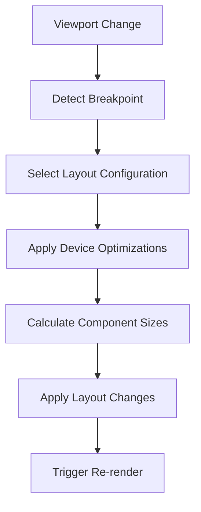
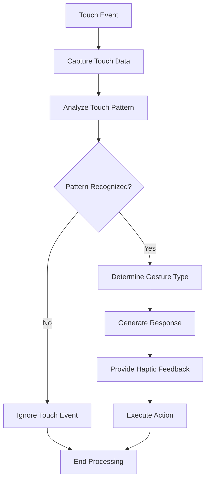
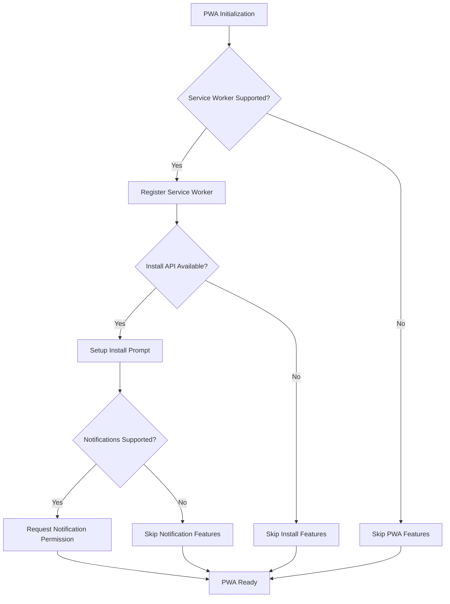

# Mobile Enabled User Interface Low-Level Design Document

## Executive Summary

The Mobile Enabled User Interface provides a native app-like experience across all devices with responsive design and PWA capabilities. This component ensures responsive layout, touch-optimized interactions, PWA installation, offline content access, and mobile-first design patterns for optimal user experience across all device types.

## Design Context

### Requirements Reference
**Functional Requirements**: R8.1, R8.2, R9.1, R9.2, R11.1, R11.2, R12.2

**Non-Functional Requirements**: Responsive design, touch optimization, PWA functionality, offline capability, mobile performance

**User Journey Reference**: All user journeys depend on this system for interface delivery

**Dependencies**: Content Management System, Game Session Engine, Achievement System, Avatar Progression System

### Scope & Boundaries
**In Scope**: Responsive UI components, PWA features, touch interactions, mobile optimization, offline functionality

**Out of Scope**: Content generation, business logic, data processing, authentication

**Assumptions**: Modern browsers support PWA features, responsive design principles are followed, touch devices are available

## Detailed Component Design

### Component Architecture

#### Class/Module Diagram

```mermaid
graph TB
    subgraph "Mobile Enabled User Interface"
        ResponsiveLayout[Responsive Layout Manager]
        TouchHandler[Touch Interaction Handler]
        PWAManager[PWA Manager]
        OfflineManager[Offline Content Manager]
        MobileOptimizer[Mobile Performance Optimizer]
    end
    
    subgraph "UI Components"
        GameInterface[Game Interface]
        HabitTracker[Habit Tracker]
        ProfileView[Profile View]
        AchievementDisplay[Achievement Display]
        AvatarViewer[Avatar Viewer]
        Navigation[Navigation System]
    end
    
    subgraph "PWA Features"
        ServiceWorker[Service Worker]
        Manifest[Web App Manifest]
        InstallPrompt[Install Prompt]
        PushNotifications[Push Notifications]
        OfflineCache[Offline Cache]
    end
    
    subgraph "Responsive Breakpoints"
        Mobile[< 768px]
        Tablet[768px - 1024px]
        Desktop[> 1024px]
        LargeDesktop[> 1440px]
    end
    
    subgraph "External Dependencies"
        ContentSystem[Content Management System]
        GameEngine[Game Session Engine]
        AchievementSystem[Achievement System]
        AvatarSystem[Avatar Progression System]
        BrowserAPI[Browser APIs]
    end
    
    ResponsiveLayout --> TouchHandler
    ResponsiveLayout --> PWAManager
    TouchHandler --> OfflineManager
    PWAManager --> MobileOptimizer
    
    ResponsiveLayout --> GameInterface
    ResponsiveLayout --> HabitTracker
    ResponsiveLayout --> ProfileView
    ResponsiveLayout --> AchievementDisplay
    ResponsiveLayout --> AvatarViewer
    ResponsiveLayout --> Navigation
    
    PWAManager --> ServiceWorker
    PWAManager --> Manifest
    PWAManager --> InstallPrompt
    PWAManager --> PushNotifications
    PWAManager --> OfflineCache
    
    ResponsiveLayout --> Mobile
    ResponsiveLayout --> Tablet
    ResponsiveLayout --> Desktop
    ResponsiveLayout --> LargeDesktop
    
    ContentSystem --> ResponsiveLayout
    GameEngine --> GameInterface
    AchievementSystem --> AchievementDisplay
    AvatarSystem --> AvatarViewer
    BrowserAPI --> PWAManager
```


#### Component Responsibilities
**ResponsiveLayout**
- **Primary Responsibility**: Manage responsive layout and breakpoint handling
- **Secondary Responsibilities**: Component sizing, layout adaptation, viewport management
- **Dependencies**: CSS framework, breakpoint definitions, component libraries
- **Dependents**: All UI components, layout system

**TouchHandler**
- **Primary Responsibility**: Handle touch interactions and mobile gestures
- **Secondary Responsibilities**: Touch event processing, gesture recognition, haptic feedback
- **Dependencies**: Touch events API, gesture libraries, haptic feedback
- **Dependents**: Interactive components, game interface

**PWAManager**
- **Primary Responsibility**: Manage PWA functionality and installation
- **Secondary Responsibilities**: Service worker registration, manifest management, install prompts
- **Dependencies**: Service Worker API, Web App Manifest, Install API
- **Dependents**: PWA features, offline functionality

**OfflineManager**
- **Primary Responsibility**: Manage offline content access and caching
- **Secondary Responsibilities**: Content caching, offline state management, sync handling
- **Dependencies**: Cache API, IndexedDB, Service Worker
- **Dependents**: Content display, offline functionality

**MobileOptimizer**
- **Primary Responsibility**: Optimize performance for mobile devices
- **Secondary Responsibilities**: Image optimization, lazy loading, performance monitoring
- **Dependencies**: Performance APIs, image optimization, lazy loading
- **Dependents**: All UI components, performance system

### Interface Specifications

#### Public APIs
**initializePWA**: PWA Initialization API
```typescript
Signature: initializePWA(): Promise<PWAInitializationResult>
Purpose: Initialize PWA features including service worker and install prompt
Preconditions: Browser supports PWA features, user has granted permissions
Postconditions: PWA features initialized and ready for use
Error Conditions: PWA not supported, permission denied, initialization failure
```

**handleTouchInteraction**: Touch Interaction API
```typescript
Signature: handleTouchInteraction(input: TouchInteractionInput): Promise<TouchInteractionResult>
Purpose: Process touch interactions and gestures for mobile devices
Preconditions: Touch events available, gesture recognition enabled
Postconditions: Touch interaction processed and appropriate response generated
Error Conditions: Touch not supported, gesture recognition failure, invalid input
```

**manageOfflineContent**: Offline Content Management API
```typescript
Signature: manageOfflineContent(action: OfflineAction, content?: ContentData): Promise<OfflineActionResult>
Purpose: Manage offline content caching and access
Preconditions: Offline storage available, content data valid
Postconditions: Offline content managed according to action
Error Conditions: Storage not available, content invalid, action failed
```

**optimizeForDevice**: Device Optimization API
```typescript
Signature: optimizeForDevice(deviceInfo: DeviceInfo): Promise<OptimizationResult>
Purpose: Optimize UI and performance for specific device characteristics
Preconditions: Device information available, optimization rules configured
Postconditions: UI optimized for device characteristics
Error Conditions: Device info invalid, optimization failure, configuration error
```

**getResponsiveLayout**: Responsive Layout API
```typescript
Signature: getResponsiveLayout(viewport: ViewportInfo): Promise<ResponsiveLayoutResult>
Purpose: Get responsive layout configuration for current viewport
Preconditions: Viewport information available, layout rules configured
Postconditions: Responsive layout configuration returned
Error Conditions: Viewport info invalid, layout configuration error
```

## Data Design

### Data Models
**DeviceInfo** (TypeScript Interface)
```typescript
interface DeviceInfo {
  type: 'mobile' | 'tablet' | 'desktop' | 'large-desktop';
  screenSize: {
    width: number;
    height: number;
  };
  pixelRatio: number;
  touchCapable: boolean;
  orientation: 'portrait' | 'landscape';
  userAgent: string;
  capabilities: DeviceCapabilities;
}
```

**ViewportInfo** (TypeScript Interface)
```typescript
interface ViewportInfo {
  width: number;
  height: number;
  orientation: 'portrait' | 'landscape';
  breakpoint: 'mobile' | 'tablet' | 'desktop' | 'large-desktop';
  zoomLevel: number;
  scrollPosition: {
    x: number;
    y: number;
  };
}
```

**TouchInteractionInput** (Zod Schema)
```typescript
const TouchInteractionInputSchema = z.object({
  interactionType: z.enum(['tap', 'double_tap', 'long_press', 'swipe', 'pinch', 'rotate']),
  coordinates: z.object({
    x: z.number(),
    y: z.number(),
  }),
  gestureData: z.record(z.any()).optional(),
  targetElement: z.string().optional(),
  timestamp: z.date(),
});

type TouchInteractionInput = z.infer<typeof TouchInteractionInputSchema>;
```

**OfflineAction** (TypeScript Interface)
```typescript
interface OfflineAction {
  type: 'cache' | 'retrieve' | 'update' | 'delete' | 'sync';
  contentId: string;
  contentType: 'question' | 'avatar' | 'achievement' | 'content';
  priority: 'high' | 'medium' | 'low';
  metadata?: Record<string, any>;
}
```

**PWAConfiguration** (TypeScript Interface)
```typescript
interface PWAConfiguration {
  name: string;
  shortName: string;
  description: string;
  themeColor: string;
  backgroundColor: string;
  display: 'standalone' | 'fullscreen' | 'minimal-ui' | 'browser';
  orientation: 'portrait' | 'landscape' | 'any';
  icons: PWAIcon[];
  startUrl: string;
  scope: string;
  categories: string[];
}
```

**Business Rules**: 
- Responsive design must work across all supported breakpoints
- Touch interactions must provide haptic feedback when available
- PWA features must gracefully degrade on unsupported browsers
- Offline content must be automatically synced when online
- Performance optimizations must not compromise functionality

**Relationships**: 
- DeviceInfo influences ResponsiveLayout and MobileOptimizer
- ViewportInfo determines ResponsiveLayout configuration
- TouchInteractionInput is processed by TouchHandler
- OfflineAction is managed by OfflineManager
- PWAConfiguration is used by PWAManager

**Indexing Strategy**: 
- Device characteristics indexed for optimization lookup
- Viewport breakpoints indexed for responsive layout
- Touch interaction patterns indexed for gesture recognition
- Offline content indexed by type and priority

### Data Access Patterns
**Responsive Layout Pattern**
- **Query Pattern**: SELECT layout configuration based on viewport breakpoint
- **Caching Strategy**: Layout configurations cached by breakpoint with TTL
- **Transaction Boundaries**: Read-only transactions for layout queries
- **Concurrency Handling**: Read-only access, no concurrency issues

**Touch Interaction Pattern**
- **Query Pattern**: SELECT gesture patterns and response configurations
- **Caching Strategy**: Gesture patterns cached, response configurations cached
- **Transaction Boundaries**: Read-only transactions for interaction queries
- **Concurrency Handling**: Read-only access, no concurrency issues

**PWA Configuration Pattern**
- **Query Pattern**: SELECT PWA configuration and feature availability
- **Caching Strategy**: PWA configuration cached, feature availability cached
- **Transaction Boundaries**: Read-only transactions for PWA queries
- **Concurrency Handling**: Read-only access, no concurrency issues

## Algorithm Design

### Core Algorithms
**Responsive Layout Algorithm**
```
Input: Viewport dimensions, device characteristics, content requirements
Output: Responsive layout configuration
Complexity: Time O(1), Space O(1)

Pseudocode:
1. Determine viewport breakpoint
2. Select layout configuration for breakpoint
3. Apply device-specific optimizations
4. Calculate component dimensions
5. Return responsive layout configuration
```

**Touch Gesture Recognition Algorithm**
```
Input: Touch event data, gesture patterns, interaction history
Output: Recognized gesture and response
Complexity: Time O(n), Space O(1) where n is gesture complexity

Pseudocode:
1. Capture touch event data
2. Analyze touch pattern and timing
3. Match against known gesture patterns
4. Determine gesture confidence level
5. Return recognized gesture and response
```

**Offline Content Management Algorithm**
```
Input: Content data, storage capacity, access patterns
Output: Offline content strategy and implementation
Complexity: Time O(n), Space O(n) where n is content size

Pseudocode:
1. Analyze content access patterns
2. Determine caching priority
3. Check storage capacity
4. Implement caching strategy
5. Return offline content status
```

**Business Logic Flows**
**Responsive Layout Flow**


**Touch Interaction Flow**


**PWA Initialization Flow**


## Implementation Specifications

### Key Implementation Details
**Responsive Design**
- **Approach**: CSS Grid and Flexbox with breakpoint-based layouts
- **Libraries/Frameworks**: Tailwind CSS, CSS Grid, Flexbox
- **Configuration**: Breakpoint definitions, component sizing rules, layout configurations
- **Environment Variables**: RESPONSIVE_BREAKPOINTS, COMPONENT_SIZING_RULES

**Touch Interactions**
- **Approach**: Event-driven touch handling with gesture recognition
- **Libraries/Frameworks**: Touch events API, gesture libraries, haptic feedback
- **Configuration**: Gesture patterns, touch sensitivity, haptic feedback settings
- **Environment Variables**: TOUCH_SENSITIVITY, HAPTIC_FEEDBACK_ENABLED

**PWA Features**
- **Approach**: Progressive enhancement with graceful degradation
- **Libraries/Frameworks**: Service Worker API, Web App Manifest, Install API
- **Configuration**: PWA manifest, service worker configuration, offline strategies
- **Environment Variables**: PWA_ENABLED, OFFLINE_CACHING_ENABLED

**Mobile Optimization**
- **Approach**: Performance-first optimization with mobile-specific enhancements
- **Libraries/Frameworks**: Performance APIs, image optimization, lazy loading
- **Configuration**: Performance budgets, optimization rules, monitoring settings
- **Environment Variables**: PERFORMANCE_BUDGET, IMAGE_OPTIMIZATION_ENABLED

### Core Data Operations
**Responsive Layout Operation**
```typescript
function getResponsiveLayout(viewport: ViewportInfo): ResponsiveLayoutResult {
  // Determine breakpoint
  const breakpoint = determineBreakpoint(viewport.width);
  
  // Get layout configuration for breakpoint
  const layoutConfig = LAYOUT_CONFIGURATIONS[breakpoint];
  
  // Apply device-specific optimizations
  const optimizedConfig = applyDeviceOptimizations(layoutConfig, viewport);
  
  // Calculate component dimensions
  const componentSizes = calculateComponentSizes(optimizedConfig, viewport);
  
  return {
    breakpoint,
    layout: optimizedConfig,
    componentSizes,
    orientation: viewport.orientation,
    responsive: true,
  };
}

function determineBreakpoint(width: number): string {
  if (width < 768) return 'mobile';
  if (width < 1024) return 'tablet';
  if (width < 1440) return 'desktop';
  return 'large-desktop';
}
```

**Touch Interaction Operation**
```typescript
async function handleTouchInteraction(input: TouchInteractionInput): Promise<TouchInteractionResult> {
  const { interactionType, coordinates, gestureData, targetElement, timestamp } = input;
  
  // Process touch interaction based on type
  let result: TouchInteractionResult;
  
  switch (interactionType) {
    case 'tap':
      result = await handleTap(coordinates, targetElement);
      break;
      
    case 'double_tap':
      result = await handleDoubleTap(coordinates, targetElement);
      break;
      
    case 'long_press':
      result = await handleLongPress(coordinates, targetElement);
      break;
      
    case 'swipe':
      result = await handleSwipe(coordinates, gestureData);
      break;
      
    case 'pinch':
      result = await handlePinch(coordinates, gestureData);
      break;
      
    case 'rotate':
      result = await handleRotate(coordinates, gestureData);
      break;
      
    default:
      throw new Error(`Unsupported interaction type: ${interactionType}`);
  }
  
  // Provide haptic feedback if available
  if (result.success && result.hapticFeedback) {
    await provideHapticFeedback(result.hapticFeedback);
  }
  
  return {
    ...result,
    timestamp,
    interactionType,
  };
}
```

**PWA Initialization Operation**
```typescript
async function initializePWA(): Promise<PWAInitializationResult> {
  const result: PWAInitializationResult = {
    serviceWorker: false,
    installPrompt: false,
    pushNotifications: false,
    offlineSupport: false,
  };
  
  try {
    // Register service worker if supported
    if ('serviceWorker' in navigator) {
      await navigator.serviceWorker.register('/sw.js');
      result.serviceWorker = true;
      result.offlineSupport = true;
    }
    
    // Setup install prompt if supported
    if ('BeforeInstallPromptEvent' in window) {
      setupInstallPrompt();
      result.installPrompt = true;
    }
    
    // Request notification permission if supported
    if ('Notification' in window && 'serviceWorker' in navigator) {
      const permission = await Notification.requestPermission();
      result.pushNotifications = permission === 'granted';
    }
    
    return result;
  } catch (error) {
    console.error('PWA initialization failed:', error);
    return result;
  }
}

function setupInstallPrompt(): void {
  let deferredPrompt: any;
  
  window.addEventListener('beforeinstallprompt', (e) => {
    e.preventDefault();
    deferredPrompt = e;
    
    // Show install button or prompt
    showInstallPrompt();
  });
  
  window.addEventListener('appinstalled', () => {
    // App was installed
    console.log('PWA was installed');
  });
}
```

**Parameters**: Viewport information, device characteristics, touch events, PWA configuration

**Performance**: O(1) for responsive layout, O(n) for touch recognition, O(1) for PWA initialization

**Indexes Required**: Breakpoint index, gesture pattern index, device capability index

## Error Handling & Validation

### Error Scenarios
**Responsive Layout Errors**
- **Trigger Conditions**: Invalid viewport data, layout configuration errors, component sizing failures
- **Error Response**: Fallback layout with error logging
- **Recovery Strategy**: Use default layout, log configuration errors, manual layout override
- **Logging Requirements**: Viewport details, layout errors, fallback actions

**Touch Interaction Errors**
- **Trigger Conditions**: Touch events not supported, gesture recognition failure, haptic feedback errors
- **Error Response**: Fallback to mouse events, error logging
- **Recovery Strategy**: Mouse event fallback, touch disabled, error reporting
- **Logging Requirements**: Touch event details, gesture failures, fallback actions

**PWA Feature Errors**
- **Trigger Conditions**: PWA not supported, service worker failure, permission denied
- **Error Response**: Graceful degradation, feature disabled
- **Recovery Strategy**: Disable PWA features, use standard web app, error reporting
- **Logging Requirements**: PWA support details, feature failures, degradation actions

**Mobile Optimization Errors**
- **Trigger Conditions**: Performance optimization failure, image loading errors, lazy loading issues
- **Error Response**: Fallback to standard loading, error logging
- **Recovery Strategy**: Standard loading, optimization disabled, error reporting
- **Logging Requirements**: Optimization details, performance failures, fallback actions

### Business Rule Validation
**Responsive Design Validation**
- **Rule Description**: Layout must adapt to all supported breakpoints
- **Validation Logic**: Test layout across breakpoint ranges
- **Error Message**: "Responsive layout failed for breakpoint: {breakpoint}"
- **System Behavior**: Fallback to default layout, error logged

**Touch Interaction Validation**
- **Rule Description**: Touch interactions must provide appropriate responses
- **Validation Logic**: Validate gesture recognition and response generation
- **Error Message**: "Touch interaction failed: {interactionType}"
- **System Behavior**: Fallback to mouse events, error logged

**PWA Feature Validation**
- **Rule Description**: PWA features must gracefully degrade when not supported
- **Validation Logic**: Check feature support and fallback mechanisms
- **Error Message**: "PWA feature not supported: {feature}"
- **System Behavior**: Feature disabled, standard web app used

**Performance Optimization Validation**
- **Rule Description**: Optimizations must not compromise core functionality
- **Validation Logic**: Test performance impact and functionality preservation
- **Error Message**: "Performance optimization failed: {optimization}"
- **System Behavior**: Optimization disabled, standard performance used

## Testing Specifications

### Integration Test Scenarios
**Responsive Layout Integration**
- **Components Involved**: ResponsiveLayout, UI Components, Breakpoint System
- **Test Flow**: Change viewport, verify layout adaptation, check component sizing
- **Mock Requirements**: Mock viewport changes, mock breakpoint definitions, mock component libraries
- **Assertion Points**: Layout adaptation, component sizing, breakpoint handling

**Touch Interaction Integration**
- **Components Involved**: TouchHandler, Interactive Components, Gesture Recognition
- **Test Flow**: Simulate touch events, verify gesture recognition, check response generation
- **Mock Requirements**: Mock touch events, mock gesture patterns, mock response systems
- **Assertion Points**: Touch recognition, gesture processing, response generation

**PWA Feature Integration**
- **Components Involved**: PWAManager, Service Worker, Install Prompt, Notifications
- **Test Flow**: Initialize PWA, verify feature availability, test functionality
- **Mock Requirements**: Mock PWA APIs, mock service worker, mock browser capabilities
- **Assertion Points**: PWA initialization, feature availability, functionality testing

**Mobile Optimization Integration**
- **Components Involved**: MobileOptimizer, Performance System, Image Loading
- **Test Flow**: Apply optimizations, verify performance impact, check functionality
- **Mock Requirements**: Mock performance data, mock image loading, mock optimization rules
- **Assertion Points**: Optimization application, performance impact, functionality preservation

### Edge Cases & Boundary Tests
**Extreme Viewport Sizes**
- **Scenario**: Very small or very large viewport dimensions
- **Input Values**: Extremely small screens, ultra-wide displays, unusual aspect ratios
- **Expected Behavior**: Graceful layout adaptation, no layout breaking
- **Validation**: Layout integrity, component sizing, responsive behavior

**Touch Device Limitations**
- **Scenario**: Touch devices with limited capabilities or unusual configurations
- **Input Values**: Limited touch points, unusual gesture patterns, haptic feedback unavailable
- **Expected Behavior**: Graceful degradation, alternative interaction methods
- **Validation**: Touch handling, fallback mechanisms, error handling

**PWA Feature Unavailability**
- **Scenario**: Browsers or devices that don't support PWA features
- **Input Values**: No service worker support, no install API, no notifications
- **Expected Behavior**: Graceful degradation, standard web app functionality
- **Validation**: Feature detection, fallback mechanisms, error handling

**Performance Constraints**
- **Scenario**: Devices with limited performance capabilities
- **Input Values**: Low-end devices, slow networks, limited memory
- **Expected Behavior**: Performance optimization, graceful degradation
- **Validation**: Performance monitoring, optimization application, fallback handling
