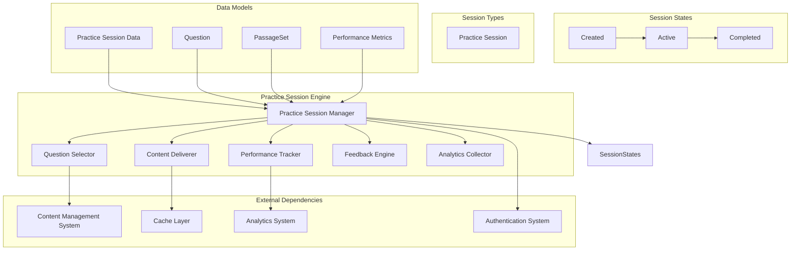
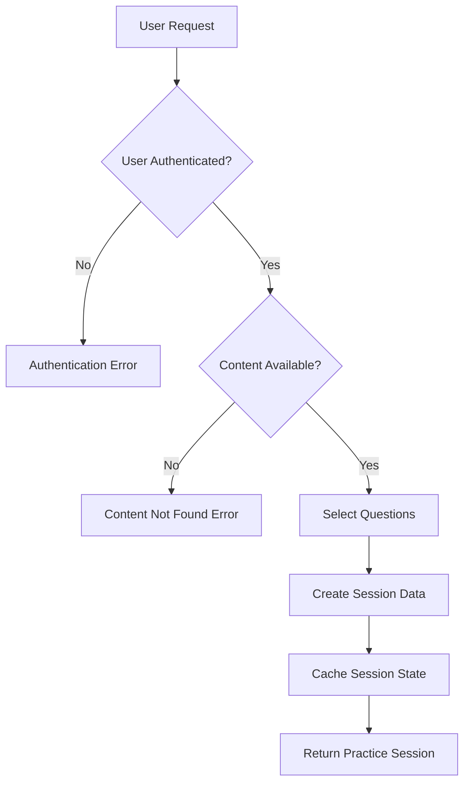
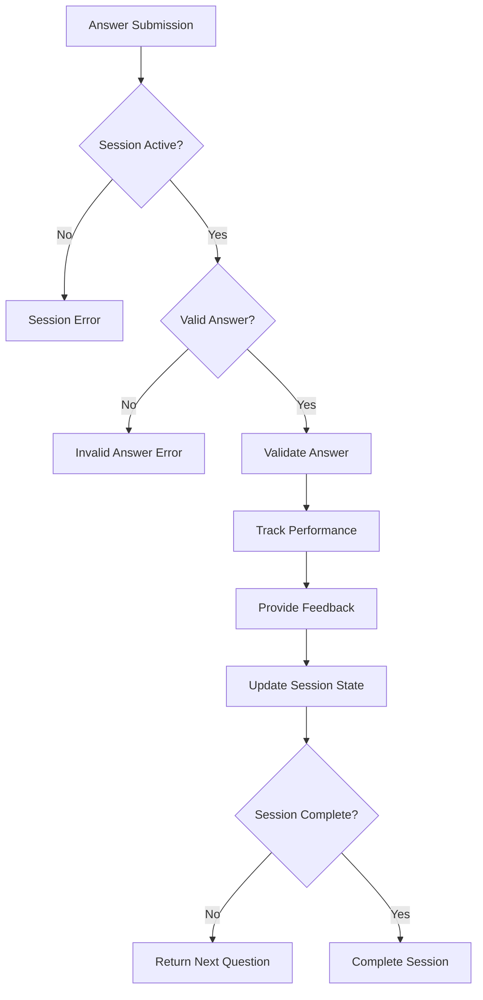
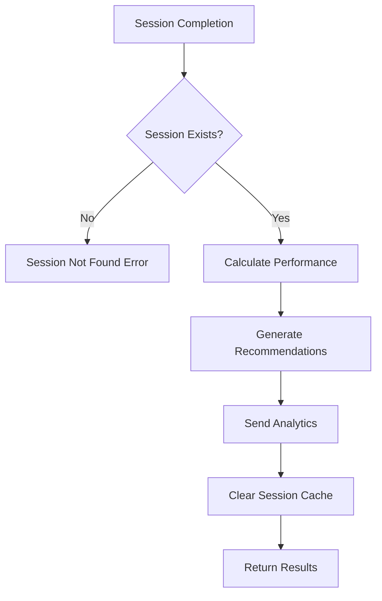

# Practice Session Engine Low-Level Design Document

## Executive Summary

The Practice Session Engine provides ephemeral practice sessions for users to practice specific content categories without creating persistent database records. This component manages question selection, content delivery, performance tracking, and immediate feedback for practice sessions. Unlike the Game Session Engine, practice sessions are stateless and designed for learning and skill development rather than progress tracking.

## Design Context

### Requirements Reference
**Functional Requirements**: R4.1, R4.2

**Non-Functional Requirements**: Fast response times, content caching, performance analytics, stateless operation

**User Journey Reference**: Practice Session Journey

**Dependencies**: Content Management System, Performance Analytics System, Caching Layer

### Scope & Boundaries
**In Scope**: Practice session creation, question selection, content delivery, performance tracking, immediate feedback, analytics collection

**Out of Scope**: Persistent session storage, user progress tracking, streak management, achievement system, timezone handling

**Assumptions**: Content is available, user is authenticated, caching layer is accessible, analytics system is operational

## Detailed Component Design

### Component Architecture

#### Class/Module Diagram


#### Component Responsibilities
**Practice Session Manager**
- **Primary Responsibility**: Orchestrate practice session lifecycle and coordinate components
- **Secondary Responsibilities**: Session creation, state management, component coordination
- **Dependencies**: All other practice session components, Content System, Cache Layer
- **Dependents**: UI Components, API endpoints

**Question Selector**
- **Primary Responsibility**: Select appropriate questions for practice sessions
- **Secondary Responsibilities**: Question randomization, difficulty balancing, content category filtering
- **Dependencies**: Content Management System, Question metadata
- **Dependents**: Practice Session Manager, Content Deliverer

**Content Deliverer**
- **Primary Responsibility**: Deliver question content and manage caching
- **Secondary Responsibilities**: Content formatting, cache management, content optimization
- **Dependencies**: Cache Layer, Content Management System
- **Dependents**: Practice Session Manager, UI Components

**Performance Tracker**
- **Primary Responsibility**: Track session performance metrics in real-time
- **Secondary Responsibilities**: Timing data, accuracy tracking, question-level metrics
- **Dependencies**: Session state, Question attempts
- **Dependents**: Practice Session Manager, Analytics Collector

**Feedback Engine**
- **Primary Responsibility**: Provide immediate feedback for practice questions
- **Secondary Responsibilities**: Answer validation, explanation display, hint management
- **Dependencies**: Question metadata, Answer validation logic
- **Dependents**: Practice Session Manager, UI Components

**Analytics Collector**
- **Primary Responsibility**: Collect and send performance data to analytics system
- **Secondary Responsibilities**: Data aggregation, performance insights, content optimization data
- **Dependencies**: Performance data, Analytics System
- **Dependents**: Practice Session Manager, Performance Tracker

### Interface Specifications

#### Public APIs
**getPracticeQuestions**: Practice Session Creation API
```typescript
const GetPracticeQuestionsInputSchema = z.object({
  contentCategoryId: z.string(),
  questionCount: z.number().int().min(1).max(20).default(10),
  difficultyLevel: z.number().int().min(1).max(5).optional(),
  includePassageBased: z.boolean().default(true),
});

type GetPracticeQuestionsInput = z.infer<typeof GetPracticeQuestionsInputSchema>;

Signature: getPracticeQuestions(input: GetPracticeQuestionsInput): Promise<PracticeSessionData>
Purpose: Create an ephemeral practice session with selected questions
Preconditions: User authenticated, content available, valid content category
Postconditions: Practice session created with questions, no database persistence
Error Conditions: Authentication failure, content not found, invalid parameters
```

**submitPracticeAnswer**: Practice Answer Submission API
```typescript
const SubmitPracticeAnswerInputSchema = z.object({
  sessionId: string, // ephemeral session ID
  questionId: string,
  selectedAnswerIndex: number,
  timeSpentSeconds: number,
  hintUsed: boolean,
});

type SubmitPracticeAnswerInput = z.infer<typeof SubmitPracticeAnswerInputSchema>;

Signature: submitPracticeAnswer(input: SubmitPracticeAnswerInput): Promise<PracticeAnswerResult>
Purpose: Submit answer for practice question and receive immediate feedback
Preconditions: Practice session active, question available, valid answer format
Postconditions: Answer validated, feedback provided, performance tracked
Error Conditions: Session not active, invalid answer, question not found
```

**completePracticeSession**: Practice Session Completion API
```typescript
const CompletePracticeSessionInputSchema = z.object({
  sessionId: string, // ephemeral session ID
});

type CompletePracticeSessionInput = z.infer<typeof CompletePracticeSessionInputSchema>;

Signature: completePracticeSession(input: CompletePracticeSessionInput): Promise<PracticeSessionResult>
Purpose: Complete practice session and collect final performance metrics
Preconditions: Practice session exists and is active
Postconditions: Session completed, performance calculated, analytics sent
Error Conditions: Session not found, session already completed
```

**getPracticeSessionState**: Practice Session State Retrieval API
```typescript
const GetPracticeSessionStateInputSchema = z.object({
  sessionId: string, // ephemeral session ID
});

type GetPracticeSessionStateInput = z.infer<typeof GetPracticeSessionStateInputSchema>;

Signature: getPracticeSessionState(input: GetPracticeSessionStateInput): Promise<PracticeSessionState>
Purpose: Get current state and progress of a practice session
Preconditions: Practice session exists
Postconditions: Current session state returned
Error Conditions: Session not found
```

## Data Design

### Data Models
**PracticeSessionData** (In-Memory Data Structure)
```typescript
interface PracticeSessionData {
  sessionId: string; // ephemeral UUID, not persisted
  contentCategoryId: string;
  questions: Array<Question | PassageQuestion>;
  totalQuestions: number;
  createdAt: Date;
  expiresAt: Date; // session expires after 24 hours
  metadata: {
    difficultyLevel?: number;
    includePassageBased: boolean;
    estimatedDuration: number; // minutes
  };
}
```

**PracticeSessionState** (TypeScript Interface)
```typescript
interface PracticeSessionState {
  sessionId: string;
  currentState: 'created' | 'active' | 'completed';
  currentQuestionIndex: number;
  totalQuestions: number;
  answeredQuestions: number;
  correctAnswers: number;
  timeSpent: number;
  progress: number; // 0-100 percentage
  currentQuestion?: Question | PassageQuestion;
  performance: {
    accuracy: number; // 0-100 percentage
    averageTimePerQuestion: number; // seconds
    hintsUsed: number;
  };
}
```

**PracticeAnswerResult** (TypeScript Interface)
```typescript
interface PracticeAnswerResult {
  isCorrect: boolean;
  correctAnswerIndex: number;
  explanation: string;
  hints: Array<string>;
  performance: {
    questionTime: number; // seconds
    accuracy: number; // 0-100 percentage
    hintsUsed: number;
  };
  nextQuestion?: Question | PassageQuestion;
  sessionState: PracticeSessionState;
}
```

**PracticeSessionResult** (TypeScript Interface)
```typescript
interface PracticeSessionResult {
  isComplete: boolean;
  totalQuestions: number;
  correctAnswers: number;
  accuracy: number; // 0-100 percentage
  totalTime: number; // seconds
  averageTimePerQuestion: number; // seconds
  hintsUsed: number;
  performance: {
    overall: number; // 0-100 percentage
    byDifficulty: Record<number, number>; // difficulty level -> accuracy
    byQuestionType: Record<string, number>; // question type -> accuracy
  };
  recommendations: Array<string>; // improvement suggestions
  sessionState: PracticeSessionState;
}
```

**PerformanceMetrics** (Analytics Data Structure)
```typescript
interface PerformanceMetrics {
  sessionId: string;
  userId: string;
  contentCategoryId: string;
  totalQuestions: number;
  correctAnswers: number;
  accuracy: number;
  totalTime: number;
  averageTimePerQuestion: number;
  hintsUsed: number;
  difficultyDistribution: Record<number, number>;
  questionTypeDistribution: Record<string, number>;
  completionRate: number; // 0-100 percentage
  sessionDuration: number; // seconds
  createdAt: Date;
  metadata: {
    userLevel: string; // beginner, intermediate, advanced
    deviceType: string; // mobile, desktop, tablet
    browserInfo: string;
  };
}
```

**Business Rules**: 
- Practice sessions are ephemeral and never persisted to database
- Sessions expire after 24 hours for memory management
- Question selection is randomized but balanced for difficulty
- Performance tracking is real-time and analytics-focused
- No user progress or streak impact from practice sessions

**Relationships**: 
- PracticeSessionData contains questions from Content Management System
- Performance metrics are sent to Analytics System
- No persistent relationships with user data

**Caching Strategy**: 
- Question content cached for fast delivery
- Session state cached in memory during active session
- Performance data cached temporarily before analytics transmission

### Data Access Patterns
**Question Selection Pattern**
- **Query Pattern**: SELECT from cached content with filtering and randomization
- **Caching Strategy**: Content cached with category and difficulty indexing
- **Transaction Boundaries**: No database transactions (read-only from cache)
- **Concurrency Handling**: Read-only operations, no locking required

**Performance Tracking Pattern**
- **Query Pattern**: In-memory tracking with periodic analytics transmission
- **Caching Strategy**: Performance data cached in session state
- **Transaction Boundaries**: No database transactions (in-memory operations)
- **Concurrency Handling**: Session-scoped data, no cross-session conflicts

**Content Delivery Pattern**
- **Query Pattern**: Cache lookup with fallback to content system
- **Caching Strategy**: Multi-level caching (session, content, global)
- **Transaction Boundaries**: No database transactions (cache operations)
- **Concurrency Handling**: Read-only cache access, no conflicts

## Algorithm Design

### Core Algorithms
**Question Selection Algorithm**
```
Input: Content category, question count, difficulty preferences
Output: Balanced question set for practice session
Complexity: Time O(n log n), Space O(n)

Pseudocode:
1. Filter questions by content category and difficulty
2. Balance standalone vs passage-based questions
3. Randomize question order while maintaining difficulty distribution
4. Select optimal question count based on user preferences
5. Return balanced question set with metadata
```

**Performance Calculation Algorithm**
```
Input: Question attempts, timing data, accuracy metrics
Output: Comprehensive performance analysis
Complexity: Time O(n), Space O(1)

Pseudocode:
1. Calculate overall accuracy and timing metrics
2. Analyze performance by difficulty level
3. Analyze performance by question type
4. Generate improvement recommendations
5. Return detailed performance report
```

**Content Caching Algorithm**
```
Input: Content requests, cache state, memory constraints
Output: Optimized content delivery
Complexity: Time O(1), Space O(n)

Pseudocode:
1. Check session-level cache for content
2. Fall back to global content cache
3. Update cache with new content if needed
4. Optimize cache based on access patterns
5. Return cached content with metadata
```

**Business Logic Flows**
**Practice Session Creation Flow**


**Question Answer Flow**


**Session Completion Flow**


## Implementation Specifications

### Key Implementation Details
**Session Management**
- **Approach**: In-memory session management with expiration handling
- **Libraries/Frameworks**: Node.js crypto for session IDs, date-fns for expiration
- **Configuration**: Session timeout, question limits, cache settings
- **Environment Variables**: PRACTICE_SESSION_TIMEOUT_HOURS, MAX_QUESTIONS_PER_SESSION, CACHE_TTL_SECONDS

**Question Selection**
- **Approach**: Intelligent randomization with difficulty balancing
- **Libraries/Frameworks**: Content filtering algorithms, randomization utilities
- **Configuration**: Difficulty distribution, question type balance, selection algorithms
- **Environment Variables**: DIFFICULTY_BALANCE_STRICT, QUESTION_TYPE_BALANCE, RANDOMIZATION_SEED

**Content Delivery**
- **Approach**: Multi-level caching with content optimization
- **Libraries/Frameworks**: Redis for global cache, in-memory caching
- **Configuration**: Cache levels, TTL settings, content optimization
- **Environment Variables**: CACHE_LEVELS, CONTENT_TTL_SECONDS, OPTIMIZATION_ENABLED

**Performance Tracking**
- **Approach**: Real-time metrics with analytics transmission
- **Libraries/Frameworks**: Performance.now(), analytics SDK, metrics aggregation
- **Configuration**: Metrics collection, analytics endpoints, performance thresholds
- **Environment Variables**: ANALYTICS_ENDPOINT, METRICS_COLLECTION_INTERVAL, PERFORMANCE_THRESHOLDS

**Feedback Engine**
- **Approach**: Immediate validation with detailed explanations
- **Libraries/Frameworks**: Answer validation logic, explanation formatting
- **Configuration**: Feedback timing, explanation detail, hint management
- **Environment Variables**: FEEDBACK_DELAY_MS, EXPLANATION_DETAIL_LEVEL, HINT_ENABLED

### Core Data Operations
**Practice Session Creation Operation**
```typescript
async function getPracticeQuestions(input: GetPracticeQuestionsInput): Promise<PracticeSessionData> {
  // Validate user authentication
  const userId = getCurrentUserId();
  
  // Get content from cache or content system
  const questions = await getQuestionsForCategory(input.contentCategoryId, {
    count: input.questionCount,
    difficultyLevel: input.difficultyLevel,
    includePassageBased: input.includePassageBased,
  });
  
  // Create ephemeral session data
  const sessionData: PracticeSessionData = {
    sessionId: generateEphemeralSessionId(),
    contentCategoryId: input.contentCategoryId,
    questions: questions,
    totalQuestions: questions.length,
    createdAt: new Date(),
    expiresAt: addHours(new Date(), 24), // 24 hour expiration
    metadata: {
      difficultyLevel: input.difficultyLevel,
      includePassageBased: input.includePassageBased,
      estimatedDuration: calculateEstimatedDuration(questions),
    },
  };
  
  // Cache session data
  await cacheSessionData(sessionData);
  
  return sessionData;
}
```

**Practice Answer Submission Operation**
```typescript
async function submitPracticeAnswer(input: SubmitPracticeAnswerInput): Promise<PracticeAnswerResult> {
  // Get session data from cache
  const sessionData = await getCachedSessionData(input.sessionId);
  
  if (!sessionData || sessionData.currentState !== 'active') {
    throw new Error('Practice session not active');
  }
  
  // Get current question
  const currentQuestion = sessionData.questions[input.questionIndex];
  if (!currentQuestion || currentQuestion.id !== input.questionId) {
    throw new Error('Question not found or invalid');
  }
  
  // Validate answer
  const isCorrect = await validateAnswer(input.questionId, input.selectedAnswerIndex);
  const correctAnswerIndex = currentQuestion.correct_answer_index;
  
  // Track performance
  const performance = await trackQuestionPerformance({
    sessionId: input.sessionId,
    questionId: input.questionId,
    isCorrect,
    timeSpent: input.timeSpentSeconds,
    hintUsed: input.hintUsed,
  });
  
  // Update session state
  await updateSessionState(input.sessionId, {
    answeredQuestions: sessionData.answeredQuestions + 1,
    correctAnswers: sessionData.correctAnswers + (isCorrect ? 1 : 0),
    timeSpent: sessionData.timeSpent + input.timeSpentSeconds,
  });
  
  // Get next question if available
  const nextQuestion = getNextQuestion(sessionData, input.questionIndex);
  
  return {
    isCorrect,
    correctAnswerIndex,
    explanation: currentQuestion.explanation,
    hints: currentQuestion.hints,
    performance,
    nextQuestion,
    sessionState: await getPracticeSessionState({ sessionId: input.sessionId }),
  };
}
```

**Practice Session Completion Operation**
```typescript
async function completePracticeSession(input: CompletePracticeSessionInput): Promise<PracticeSessionResult> {
  // Get session data from cache
  const sessionData = await getCachedSessionData(input.sessionId);
  
  if (!sessionData || sessionData.currentState === 'completed') {
    throw new Error('Practice session not found or already completed');
  }
  
  // Calculate final performance metrics
  const performance = calculateSessionPerformance(sessionData);
  
  // Generate recommendations
  const recommendations = generateImprovementRecommendations(performance);
  
  // Send analytics data
  await sendAnalyticsData({
    sessionId: input.sessionId,
    userId: getCurrentUserId(),
    contentCategoryId: sessionData.contentCategoryId,
    performance,
    metadata: getSessionMetadata(sessionData),
  });
  
  // Mark session as completed
  await updateSessionState(input.sessionId, { currentState: 'completed' });
  
  // Clear session cache after delay for potential review
  setTimeout(() => clearSessionCache(input.sessionId), 300000); // 5 minutes
  
  return {
    isComplete: true,
    totalQuestions: sessionData.totalQuestions,
    correctAnswers: sessionData.correctAnswers,
    accuracy: (sessionData.correctAnswers / sessionData.totalQuestions) * 100,
    totalTime: sessionData.timeSpent,
    averageTimePerQuestion: sessionData.timeSpent / sessionData.totalQuestions,
    hintsUsed: sessionData.hintsUsed,
    performance,
    recommendations,
    sessionState: await getPracticeSessionState({ sessionId: input.sessionId }),
  };
}
```

**Parameters**: Content category data, user preferences, session state, performance metrics, cache configuration

**Performance**: O(1) for cache operations, O(n log n) for question selection, O(n) for performance calculation, O(1) for session state updates

**Memory Requirements**: Session data cached in memory, content cached globally, performance data temporarily stored

## Error Handling & Validation

### Error Scenarios
**Session Creation Errors**
- **Trigger Conditions**: Invalid content category, insufficient questions, cache failure, authentication failure
- **Error Response**: Specific error messages with content availability information
- **Recovery Strategy**: Fallback to available content, cache refresh, authentication retry
- **Logging Requirements**: User ID, error context, content availability, cache status

**Question Answer Errors**
- **Trigger Conditions**: Invalid session state, question not found, invalid answer format, session expired
- **Error Response**: Clear error message with session status and recovery options
- **Recovery Strategy**: Session refresh, question reload, session restart if needed
- **Logging Requirements**: Session ID, question ID, error details, session state

**Session Completion Errors**
- **Trigger Conditions**: Session not found, already completed, analytics failure, cache corruption
- **Error Response**: Completion status with partial results if available
- **Recovery Strategy**: Analytics retry, cache cleanup, partial result return
- **Logging Requirements**: Session ID, completion status, analytics status, cache state

**Performance Tracking Errors**
- **Trigger Conditions**: Metrics calculation failure, analytics transmission failure, cache corruption
- **Error Response**: Performance data with error indicators
- **Recovery Strategy**: Metrics recalculation, analytics retry, cache refresh
- **Logging Requirements**: Session ID, error details, metrics status, analytics status

### Business Rule Validation
**Session State Validation**
- **Rule Description**: Practice sessions follow valid state transitions with expiration handling
- **Validation Logic**: Check state machine rules, validate expiration, ensure data integrity
- **Error Message**: "Invalid session state: {currentState} -> {targetState}"
- **System Behavior**: State transition rejected, session remains in current state

**Question Selection Validation**
- **Rule Description**: Question selection maintains difficulty balance and content variety
- **Validation Logic**: Check difficulty distribution, question type balance, content availability
- **Error Message**: "Insufficient questions available for category: {categoryId}"
- **System Behavior**: Fallback to available content, adjust question count if needed

**Performance Calculation Validation**
- **Rule Description**: Performance metrics are accurate and within valid ranges
- **Validation Logic**: Validate metric calculations, check for outliers, ensure data consistency
- **Error Message**: "Performance calculation error: {metricName} out of range"
- **System Behavior**: Use fallback calculations, log error for investigation

**Content Caching Validation**
- **Rule Description**: Cached content is valid and up-to-date
- **Validation Logic**: Check cache integrity, validate content format, ensure freshness
- **Error Message**: "Cache validation failed: {cacheLevel} corrupted"
- **System Behavior**: Refresh cache, fallback to content system, log corruption

## Testing Specifications

### Integration Test Scenarios
**Practice Session Lifecycle Integration**
- **Components Involved**: Practice Session Manager, Question Selector, Content Deliverer, Cache Layer
- **Test Flow**: Create session, answer questions, complete session, validate analytics
- **Mock Requirements**: Mock content system, mock cache layer, mock analytics system
- **Assertion Points**: Session creation, question delivery, performance tracking, analytics transmission

**Content Delivery Integration**
- **Components Involved**: Content Deliverer, Cache Layer, Content Management System
- **Test Flow**: Request content, check cache, fallback to content system, validate delivery
- **Mock Requirements**: Mock cache layer, mock content system, mock content validation
- **Assertion Points**: Cache hits, content fallback, delivery performance, content integrity

**Performance Tracking Integration**
- **Components Involved**: Performance Tracker, Analytics Collector, Analytics System
- **Test Flow**: Track performance, calculate metrics, send analytics, validate transmission
- **Mock Requirements**: Mock analytics system, mock performance data, mock transmission
- **Assertion Points**: Metric accuracy, analytics transmission, performance impact, data integrity

**Cache Management Integration**
- **Components Involved**: Cache Layer, Session Manager, Content Deliverer
- **Test Flow**: Cache operations, session management, content delivery, cache optimization
- **Mock Requirements**: Mock cache layer, mock session data, mock content operations
- **Assertion Points**: Cache performance, session persistence, content delivery, optimization

### Edge Cases & Boundary Tests
**Session Expiration Handling**
- **Scenario**: Sessions that exceed timeout limits with proper cleanup
- **Input Values**: Expired sessions, cleanup operations, memory constraints
- **Expected Behavior**: Proper expiration handling, cleanup procedures, memory management
- **Validation**: Expiration enforcement, cleanup procedures, error reporting, memory usage

**Content Availability Edge Cases**
- **Scenario**: Limited content availability with fallback strategies
- **Input Values**: Minimal content, difficulty imbalances, content type shortages
- **Expected Behavior**: Graceful fallback, content optimization, user guidance
- **Validation**: Fallback strategies, content optimization, user experience, error handling

**Performance Tracking Edge Cases**
- **Scenario**: Performance tracking with corrupted or incomplete data
- **Input Values**: Corrupted metrics, incomplete data, calculation errors
- **Expected Behavior**: Robust error handling, fallback calculations, data recovery
- **Validation**: Error detection, recovery procedures, fallback strategies, data integrity

**Cache Management Edge Cases**
- **Scenario**: Cache failures with content delivery fallback
- **Input Values**: Cache corruption, memory constraints, network failures
- **Expected Behavior**: Graceful degradation, content fallback, performance optimization
- **Validation**: Cache failure handling, fallback strategies, performance impact, user experience

**Memory Management Edge Cases**
- **Scenario**: High memory usage with session cleanup and optimization
- **Input Values**: Large session data, memory constraints, cleanup operations
- **Expected Behavior**: Efficient memory usage, proactive cleanup, performance optimization
- **Validation**: Memory usage, cleanup efficiency, performance impact, resource management
