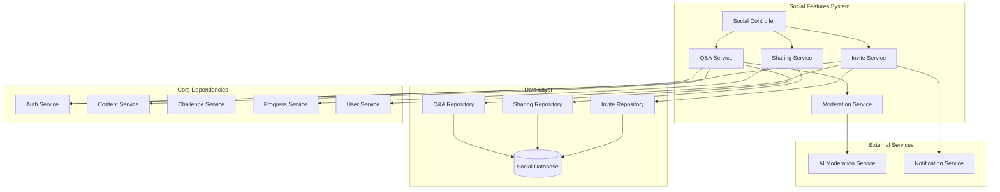
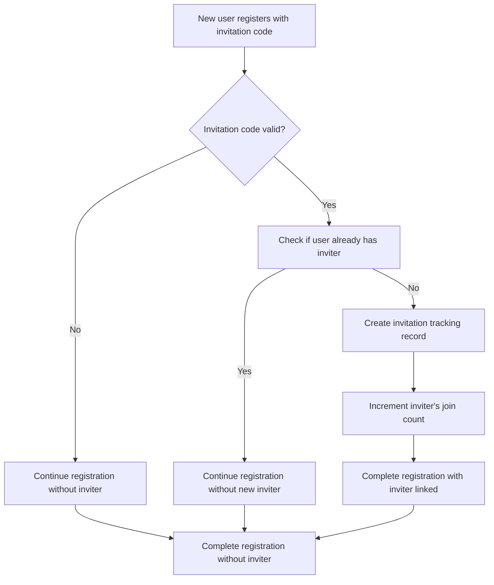
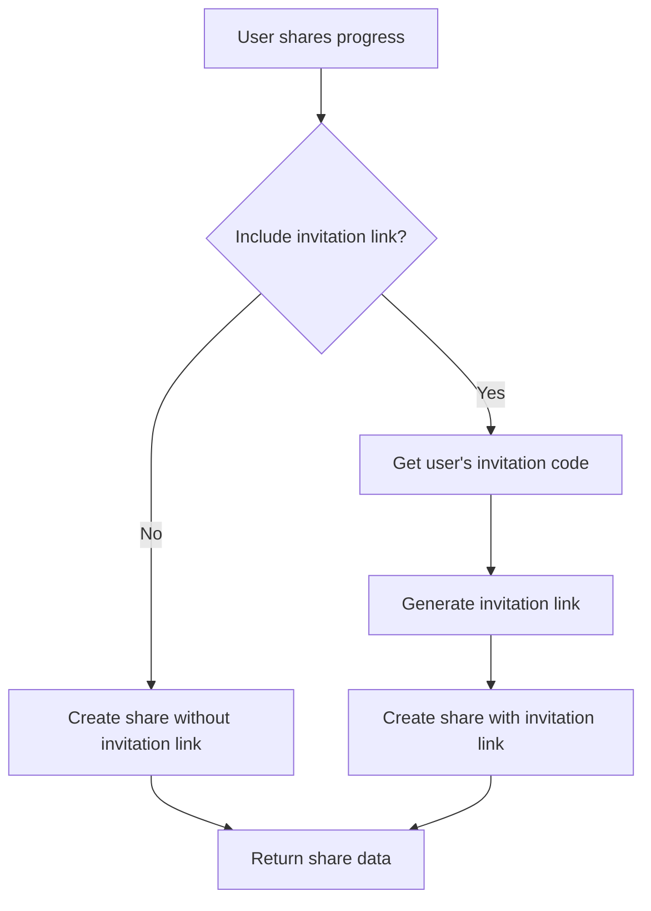

# Social Features & Knowledge Q&A Community Low-Level Design Document

## Executive Summary

This document provides a detailed low-level design for the **Social Features and Knowledge Q&A Community**. This feature introduces beginner-friendly social interaction capabilities that build user confidence through structured, learning-focused community engagement. The system includes article-specific Q&A discussions, simplified user invitation codes (like Zoom), progress sharing with emoji reactions, and a moderation system to maintain a supportive environment. This design focuses on simplicity and safety to encourage participation from users who have built sufficient confidence through the core fitness journey.

## Design Context

### Requirements Reference
**Functional Requirements**:
- Each user has a unique invitation code (UUID) stored in their profile
- Users can share their invitation link/code through any mechanism (copy link, share to social media, etc.)
- New users can register with an invitation code to automatically link with the inviter
- Users can share progress with optional invitation link inclusion
- Viewers can react to shared content using predefined emoji reactions (👏 💪 🎉)
- Each article has a context-specific Q&A section
- Beginner-safe environment with clear "No question is too basic here!" messaging
- AI + human moderation to prevent intimidation
- Users must be sufficiently engaged (completed at least one challenge) before accessing social features
- Dashboard shows invitation join count for each user

**Non-Functional Requirements**:
- **Security**: Social content must be properly moderated and filtered
- **Performance**: Q&A loading should be fast (<300ms) to maintain engagement
- **Scalability**: System must handle growing community without performance degradation
- **Privacy**: Users control what aspects of their profile/progress are visible
- **Reliability**: Moderation system must be robust and responsive

**User Journey Reference**:
This design covers the social engagement journey from a user completing their first challenge, receiving an invitation to join the community, participating in article-specific Q&A, sharing progress with optional invitation links.

**Dependencies**:
- **Authentication Service**: Provides user identity and profile data
- **Content Management System**: Provides article metadata and content
- **Challenge System**: Determines user eligibility for social features
- **Progress Tracking**: Provides data for progress sharing
- **Avatar Progression System**: Provides avatar data for sharing

### Scope & Boundaries
**In Scope**:
- Database schema for social interactions (questions, answers, reactions, invitation tracking)
- API endpoints for Q&A operations, sharing, and reactions
- Moderation system with AI filtering and human oversight
- Simplified invitation system with unique user codes
- Progress sharing with optional invitation links
- Invitation join count tracking

**Out of Scope**:
- Real-time chat or messaging systems
- Complex social networking features (following, feeds)
- Video or image sharing beyond avatar progressions
- Advanced community management tools
- Integration with external social platforms
- Complex invitation management (no invite lists needed)

**Assumptions**:
- Users have completed at least one challenge before accessing social features
- AI moderation service is available and reliable
- Human moderators are available for escalation
- Users understand and accept community guidelines
- Invitation codes are generated once per user and never change

## Detailed Component Design

### Component Architecture

#### Class/Module Diagram


#### Component Responsibilities
**Social Controller**
- **Primary Responsibility**: Handle HTTP requests for social features, validate requests, route to appropriate services
- **Secondary Responsibilities**: Rate limiting, request validation, response formatting
- **Dependencies**: QAService, SharingService, InviteService
- **Dependents**: API Gateway/Router

**Q&A Service**
- **Primary Responsibility**: Manage article-specific Q&A discussions, moderation
- **Secondary Responsibilities**: Content filtering, user eligibility checking
- **Dependencies**: QARepository, ModerationService, AuthService, ContentService
- **Dependents**: SocialController

**Sharing Service**
- **Primary Responsibility**: Handle progress sharing, emoji reactions, privacy controls, optional invitation links
- **Secondary Responsibilities**: Content formatting, reaction aggregation, sharing analytics
- **Dependencies**: SharingRepository, ProgressService, AuthService, InviteService
- **Dependents**: SocialController

**Invite Service**
- **Primary Responsibility**: Manage invitation codes, track invitation usage, generate invitation links
- **Secondary Responsibilities**: Invitation analytics, referral tracking, dashboard data
- **Dependencies**: InviteRepository, AuthService, UserService
- **Dependents**: SocialController, SharingService

**Moderation Service**
- **Primary Responsibility**: Content moderation, inappropriate content detection, escalation handling
- **Secondary Responsibilities**: AI service integration, human moderator coordination, content flagging
- **Dependencies**: AIService, QARepository
- **Dependents**: QAService

## Interface Specifications

#### Public APIs
**POST /api/v1/social/questions**: Create a new question
```
Signature: submitQuestion(articleIds: string[], title: string, body: string, isAnonymous: boolean)
Purpose: Submit a question with title and body associated with one or more articles
Preconditions: User must be authenticated and eligible for social features
Postconditions: Question is created with article associations and queued for moderation
Error Conditions: Invalid article IDs, user not eligible, content fails moderation
```

**GET /api/v1/social/questions?articleId={foo-bar}**: List questions for an article
```
Signature: listQuestions(articleId: string, page: number, limit: number)
Purpose: Retrieve paginated questions for a specific article
Preconditions: User must be authenticated
Postconditions: Returns questions with answers and reaction counts
Error Conditions: Invalid article ID, pagination errors
```

**GET /api/v1/social/questions/{questionId}/answers**: Get answers for a question
```
Signature: listQuestionAnswers(questionId: string, page: number, limit: number)
Purpose: Retrieve paginated answers for a specific question
Preconditions: User must be authenticated
Postconditions: Returns answers with reaction counts
Error Conditions: Invalid question ID, pagination errors
```

**POST /api/v1/social/questions/{questionId}/answers**: Answer a question
```
Signature: submitQuestionAnswer(questionId: string, answer: string, isAnonymous: boolean)
Purpose: Submit an answer to a question
Preconditions: User must be authenticated and eligible
Postconditions: Answer is created and queued for moderation
Error Conditions: Invalid question ID, user not eligible, content fails moderation
```

**POST /api/v1/social/questions/{questionId}/reactions**: React to a question
```
Signature: addReaction(questionId: string, reactionType: 'helpful' | 'not_helpful')
Purpose: Add a reaction to a question
Preconditions: User must be authenticated
Postconditions: Reaction is recorded and aggregated
Error Conditions: Invalid question ID, duplicate reaction
```

**POST /api/v1/social/questions/{questionId}/answers/{answerId}/reactions**: React to an answer
```
Signature: addAnswerReaction(questionId: string, answerId: string, reactionType: 'helpful' | 'not_helpful')
Purpose: Add a reaction to an answer
Preconditions: User must be authenticated
Postconditions: Reaction is recorded and aggregated
Error Conditions: Invalid answer ID, duplicate reaction
```

**POST /api/v1/social/share**: Share progress
```
Signature: shareProgress(shareType: 'challenge_completion' | 'avatar_progression' | 'quiz_achievement', shareTypeId: string?, includeInviteLink: boolean, isPublic: boolean)
Purpose: Share user progress or achievements with optional invitation link
Preconditions: User must be authenticated and eligible
Postconditions: Share is created with system-generated content and visible to appropriate audience
Error Conditions: Invalid share type, invalid shareTypeId, user not eligible
```

**POST /api/v1/social/shares/{shareId}/reactions**: React to shared content
```
Signature: addShareReaction(shareId: string, reactionType: 'clap' | 'muscle' | 'party')
Purpose: Add emoji reaction to shared content (public, unlimited reactions)
Preconditions: User must be authenticated
Postconditions: Reaction count is incremented (no individual tracking)
Error Conditions: Invalid share ID, invalid reaction type
```

## Data Design

### Data Models
**Updated User Table** (add invitation code and inviter reference)
```typescript
// Add to existing users table
export const users = pgTable('users', {
  // ... existing fields ...
  invitationCode: uuid('invitation_code').unique(), // UUID string, generated once
  invitationJoinCount: integer('invitation_join_count').notNull(), // Count of successful invites
  inviterUserId: uuid('inviter_user_id').references(() => users.id, { onDelete: 'set null' }), // Nullable reference to inviter
  createdAt: timestamp('created_at').defaultNow().notNull(),
  updatedAt: timestamp('updated_at').defaultNow().notNull(),
}, (table) => {
  return [
    index('users_inviter_index').on(table.inviterUserId), // Index for finding users by inviter
  ];
});
```

**Questions** (no longer tied to specific articles)
```typescript
export const questions = pgTable('questions', {
  id: uuid('id').primaryKey().defaultRandom(),
  userId: uuid('user_id').notNull().references(() => users.id, { onDelete: 'cascade' }),
  title: text('title').notNull(), // Short, descriptive title for the question
  body: text('body').notNull(), // Detailed question content
  isAnonymous: boolean('is_anonymous').notNull().default(false),
  status: questionStatusEnum('status').notNull().default('pending'), // pending, approved, rejected, hidden
  moderationNotes: text('moderation_notes'),
  helpfulCount: integer('helpful_count').notNull().default(0), // Count of helpful reactions
  notHelpfulCount: integer('not_helpful_count').notNull().default(0), // Count of not helpful reactions
  createdAt: timestamp('created_at').notNull(),
  updatedAt: timestamp('updated_at').notNull(),
}, (table) => {
  return [
    index('questions_status_index').on(table.status),
    index('questions_approved_index').on(table.status).where(sql`${table.status} = 'approved'`), // Optimized for user-facing queries
    index('questions_user_index').on(table.userId),
  ];
});
```

**Question Articles** (many-to-many relationship)
```typescript
export const questionArticles = pgTable('question_articles', {
  questionId: uuid('question_id').notNull().references(() => questions.id, { onDelete: 'cascade' }),
  articleId: text('article_id').notNull(), // References static content
  createdAt: timestamp('created_at').notNull(),
}, (table) => {
  return [
    primaryKey({ columns: [table.questionId, table.articleId] }), // Composite primary key
    index('question_articles_question_index').on(table.questionId),
    index('question_articles_article_index').on(table.articleId),
  ];
});
```

**Question Answers**
```typescript
export const questionAnswers = pgTable('question_answers', {
  id: uuid('id').primaryKey().defaultRandom(),
  questionId: uuid('question_id').notNull().references(() => questions.id, { onDelete: 'cascade' }),
  userId: uuid('user_id').notNull().references(() => users.id, { onDelete: 'cascade' }),
  answer: text('answer').notNull(),
  isAnonymous: boolean('is_anonymous').notNull().default(false),
  status: answerStatusEnum('status').notNull().default('pending'), // pending, approved, rejected, hidden
  moderationNotes: text('moderation_notes'),
  helpfulCount: integer('helpful_count').notNull().default(0), // Count of helpful reactions
  notHelpfulCount: integer('not_helpful_count').notNull().default(0), // Count of not helpful reactions
  createdAt: timestamp('created_at').notNull(),
  updatedAt: timestamp('updated_at').notNull(),
}, (table) => {
  return [
    index('question_answers_question_index').on(table.questionId),
    index('question_answers_approved_index').on(table.status).where(sql`${table.status} = 'approved'`), // Optimized for user-facing queries
    index('question_answers_user_index').on(table.userId),
  ];
});
```

**Question Reactions**
```typescript
export const questionReactions = pgTable('question_reactions', {
  id: uuid('id').primaryKey().defaultRandom(),
  questionId: uuid('question_id').notNull().references(() => questions.id, { onDelete: 'cascade' }),
  userId: uuid('user_id').notNull().references(() => users.id, { onDelete: 'cascade' }),
  reactionType: reactionTypeEnum('reaction_type').notNull(), // helpful, not_helpful
  createdAt: timestamp('created_at').notNull(),
}, (table) => {
  return [
    unique('question_reactions_unique').on(table.questionId, table.userId),
    index('question_reactions_question_index').on(table.questionId),
  ];
});
```

**Answer Reactions** (new - for reacting to answers)
```typescript
export const answerReactions = pgTable('answer_reactions', {
  id: uuid('id').primaryKey().defaultRandom(),
  answerId: uuid('answer_id').notNull().references(() => questionAnswers.id, { onDelete: 'cascade' }),
  userId: uuid('user_id').notNull().references(() => users.id, { onDelete: 'cascade' }),
  reactionType: reactionTypeEnum('reaction_type').notNull(), // helpful, not_helpful
  createdAt: timestamp('created_at').notNull(),
}, (table) => {
  return [
    unique('answer_reactions_unique').on(table.answerId, table.userId),
    index('answer_reactions_answer_index').on(table.answerId),
  ];
});
```

**Progress Shares** (updated to include structured content)
```typescript
export const progressShares = pgTable('progress_shares', {
  id: uuid('id').primaryKey().defaultRandom(),
  userId: uuid('user_id').notNull().references(() => users.id, { onDelete: 'cascade' }),
  shareType: shareTypeEnum('share_type').notNull(), // challenge_completion, avatar_progression, quiz_achievement
  shareTypeId: text('share_type_id').notNull(), // ID of the specific item being shared (challengeId, avatarLevel, quizId)
  contentVersion: text('content_version').notNull().default('1.0'), // Version of content template used
  generatedContent: jsonb('generated_content').notNull(), // System-generated content based on shareType and shareTypeId
  includeInviteLink: boolean('include_invite_link').notNull().default(false), // Whether to include invitation link
  isPublic: boolean('is_public').notNull().default(true),
  status: shareStatusEnum('status').notNull().default('active'), // active, hidden, deleted
  clapCount: integer('clap_count').notNull().default(0), // Count of clap reactions
  muscleCount: integer('muscle_count').notNull().default(0), // Count of muscle reactions
  partyCount: integer('party_count').notNull().default(0), // Count of party reactions
  createdAt: timestamp('created_at').notNull(),
  updatedAt: timestamp('updated_at').notNull(),
}, (table) => {
  return [
    index('progress_shares_user_index').on(table.userId),
    index('progress_shares_type_status_index').on(table.shareType, table.status),
    index('progress_shares_type_id_index').on(table.shareType, table.shareTypeId),
  ];
});
```

**Note**: Share reactions are public and don't require individual tracking. Reactions are handled by directly updating the count fields (`clapCount`, `muscleCount`, `partyCount`) on the `progressShares` table. This simplifies the system and allows for overcounting without privacy concerns.


**Business Rules**: 
- Users must complete at least one challenge before accessing social features
- Each user gets one unique invitation code (UUID) that never changes
- Questions must have both title (10-100 chars) and body (10-2000 chars)
- Questions and answers must pass AI moderation before being visible
- Users can only react once per question/answer (share reactions are public and unlimited)
- Reaction counts are maintained as integer fields for performance
- Share reactions are public and don't require individual tracking (overcounting is acceptable)
- Invitation join count is tracked automatically when new users register with invitation code
- Users can only have one inviter (first invitation code used wins)
- Self-referencing relationship: users.inviterUserId → users.id

**Relationships**: 
- Questions belong to users and can be associated with multiple articles (many-to-many)
- Question Articles junction table links questions to articles
- Answers belong to questions and users
- Reactions belong to questions/answers and users (share reactions are public counters only)
- Users have optional self-referencing relationship to inviter (users.inviterUserId → users.id)

**Indexing Strategy**: 
- Index on questions.status for general question filtering (admin/moderator use)
- Partial index on questions.status WHERE status = 'approved' for optimized user-facing queries
- Index on questionAnswers.status for general answer filtering (admin/moderator use)
- Partial index on questionAnswers.status WHERE status = 'approved' for optimized user-facing queries
- Index on questionArticles.articleId for finding questions by article
- Index on questionArticles.questionId for finding articles by question
- Composite primary key on questionArticles (questionId, articleId) prevents duplicates and enables efficient lookups
- User-based indexes for personal content retrieval
- Unique constraints to prevent duplicate reactions (questions/answers only)
- Unique index on invitationCode for fast lookups during registration
- Index on inviterUserId for finding users by inviter

### Data Access Patterns
**Question Retrieval Pattern**
- **Query Pattern**: SELECT questions JOIN questionArticles WHERE articleId = ? AND status = 'approved'
- **Caching Strategy**: Cache approved questions for 5 minutes, invalidate on new questions
- **Transaction Boundaries**: Read-only queries, no transactions needed
- **Concurrency Handling**: Optimistic concurrency for reaction updates

**Answer Retrieval Pattern**
- **Query Pattern**: SELECT answers for specific question with reaction counts
- **Caching Strategy**: Cache approved answers for 5 minutes, invalidate on new answers
- **Transaction Boundaries**: Read-only queries, no transactions needed
- **Concurrency Handling**: Optimistic concurrency for reaction updates

**Invitation Code Generation Pattern**
- **Query Pattern**: Generate UUID, check uniqueness, insert into user record
- **Caching Strategy**: No caching needed for invitation codes
- **Transaction Boundaries**: Single transaction for code generation and user update
- **Concurrency Handling**: Database-level unique constraint prevents duplicates

## Algorithm Design

### Core Algorithms
**Invitation Code Generation Algorithm**
```
Input: userId (string)
Output: invitationCode (string)
Complexity: Time O(1), Space O(1)

Pseudocode:
1. Generate UUID v4 string
2. Update user record with invitationCode
3. Return invitationCode
```

**Invitation Link Generation Algorithm**
```
Input: invitationCode (string), baseUrl (string)
Output: invitationLink (string)
Complexity: Time O(1), Space O(1)

Pseudocode:
1. Construct invitation URL: baseUrl + "/invite/" + invitationCode
2. Return invitationLink
```

**Invitation Tracking Algorithm** (during user registration)
```
Input: invitationCode (string), newUserId (string)
Output: trackingResult { success: boolean, inviterId?: string }
Complexity: Time O(1), Space O(1)

Pseudocode:
1. Find user with matching invitationCode
2. If found and new user doesn't already have inviter:
   a. Update new user's inviterUserId field
   b. Increment inviter's invitationJoinCount
   c. Return success with inviterId
3. Else return failure
```

**Content Moderation Algorithm**
```
Input: content (string), contentType ('question_title' | 'question_body' | 'answer' | 'share')
Output: moderationResult { status: 'approved' | 'rejected' | 'needs_review', confidence: number, reasons: string[] }
Complexity: Time O(n), Space O(1)

Pseudocode:
1. Initialize moderationResult with default values
2. Check content length based on type:
   a. question_title: min 10 chars, max 100 chars
   b. question_body: min 10 chars, max 2000 chars
   c. answer: min 10 chars, max 2000 chars
   d. share: min 10 chars, max 1000 chars
3. Run AI content analysis for inappropriate content
4. Check for spam patterns (repeated text, excessive links)
5. Validate content relevance to fitness topics
6. Calculate confidence score based on all checks
7. Return moderationResult with final status
```


### Business Logic Flows
**User Registration with Invitation Code Flow**


**Progress Sharing with Invitation Link Flow**


## Implementation Specifications

### Key Implementation Details
**Invitation Code Generation**
- **Approach**: Generate UUID v4 once per user, store in user table
- **Libraries/Frameworks**: crypto.randomUUID() or uuid library
- **Configuration**: Base URL for invitation links
- **Environment Variables**: INVITATION_BASE_URL

**Invitation Link Generation**
- **Approach**: Simple URL construction with invitation code
- **Libraries/Frameworks**: URL constructor
- **Configuration**: Base URL, invitation path
- **Environment Variables**: INVITATION_BASE_URL

**Moderation Integration**
- **Approach**: Integrate with OpenAI Moderation API or similar service
- **Libraries/Frameworks**: OpenAI SDK, custom moderation service wrapper
- **Configuration**: Moderation thresholds, content type specific rules
- **Environment Variables**: OPENAI_API_KEY, MODERATION_SERVICE_URL

### Core Data Operations
**Generate Invitation Code Operation**
```typescript
async function generateInvitationCode(userId: string) {
  const invitationCode = crypto.randomUUID();
  
  await db.update(users)
    .set({ 
      invitationCode,
      updatedAt: new Date()
    })
    .where(eq(users.id, userId));
  
  return invitationCode;
}
```

**Get Invitation Code and Link Operation**
```typescript
async function getInvitationCodeAndLink(userId: string) {
  const user = await db.select({
    invitationCode: users.invitationCode
  })
  .from(users)
  .where(eq(users.id, userId))
  .limit(1);
  
  if (!user[0]?.invitationCode) {
    throw new Error('User not eligible for invitations');
  }
  
  const invitationLink = `${process.env.INVITATION_BASE_URL}/invite/${user[0].invitationCode}`;
  
  return {
    invitationCode: user[0].invitationCode,
    invitationLink
  };
}
```

**Track Invitation Usage Operation**
```typescript
async function trackInvitationUsage(invitationCode: string, newUserId: string) {
  // Find inviter
  const inviter = await db.select({ id: users.id })
    .from(users)
    .where(eq(users.invitationCode, invitationCode))
    .limit(1);
  
  if (!inviter[0]) {
    return { success: false };
  }
  
  // Check if new user already has inviter
  const existingUser = await db.select({ inviterUserId: users.inviterUserId })
    .from(users)
    .where(eq(users.id, newUserId))
    .limit(1);
  
  if (existingUser[0]?.inviterUserId) {
    return { success: false, reason: 'User already has inviter' };
  }
  
  // Update new user's inviter and increment inviter's count
  await db.transaction(async (tx) => {
    await tx.update(users)
      .set({ 
        inviterUserId: inviter[0].id,
        updatedAt: new Date()
      })
      .where(eq(users.id, newUserId));
    
    await tx.update(users)
      .set({ 
        invitationJoinCount: sql`${users.invitationJoinCount} + 1`,
        updatedAt: new Date()
      })
      .where(eq(users.id, inviter[0].id));
  });
  
  return { success: true, inviterId: inviter[0].id };
}
```

**Submit Question Operation** (updated for title/body and many-to-many)
```typescript
async function submitQuestion(articleIds: string[], userId: string, title: string, body: string, isAnonymous: boolean) {
  // Moderate both title and body
  const titleModeration = await moderationService.moderateContent(title, 'question_title');
  const bodyModeration = await moderationService.moderateContent(body, 'question_body');
  
  if (titleModeration.status === 'rejected' || bodyModeration.status === 'rejected') {
    throw new Error('Content rejected by moderation');
  }
  
  const questionRecord = await db.transaction(async (tx) => {
    // Create the question
    const [questionResult] = await tx.insert(questions).values({
      userId,
      title,
      body,
      isAnonymous,
      status: (titleModeration.status === 'approved' && bodyModeration.status === 'approved') ? 'approved' : 'pending',
      moderationNotes: [
        titleModeration.reasons?.join(', '),
        bodyModeration.reasons?.join(', ')
      ].filter(Boolean).join('; '),
      createdAt: new Date(),
      updatedAt: new Date(),
    }).returning();
    
    // Create article associations
    if (articleIds.length > 0) {
      await tx.insert(questionArticles).values(
        articleIds.map(articleId => ({
          questionId: questionResult.id,
          articleId,
          createdAt: new Date(),
        }))
      );
    }
    
    return questionResult;
  });
  
  return questionRecord;
}
```

**Get Questions for Article Operation** (updated for title/body, many-to-many, and count fields)
```typescript
async function getQuestionsForArticle(articleId: string, page: number = 1, limit: number = 20) {
  const offset = (page - 1) * limit;
  
  const questions = await db.select({
    id: questions.id,
    title: questions.title,
    body: questions.body,
    isAnonymous: questions.isAnonymous,
    status: questions.status,
    createdAt: questions.createdAt,
    userId: questions.userId,
    helpfulCount: questions.helpfulCount,
    notHelpfulCount: questions.notHelpfulCount,
  })
  .from(questions)
  .innerJoin(questionArticles, eq(questions.id, questionArticles.questionId))
  .where(
    and(
      eq(questionArticles.articleId, articleId),
      eq(questions.status, 'approved')
    )
  )
  .orderBy(desc(questions.createdAt))
  .limit(limit)
  .offset(offset);
  
  return questions;
}
```

**Get Answers Operation** (updated to use count fields)
```typescript
async function getAnswers(questionId: string, page: number = 1, limit: number = 20) {
  const offset = (page - 1) * limit;
  
  const answers = await db.select({
    id: questionAnswers.id,
    answer: questionAnswers.answer,
    isAnonymous: questionAnswers.isAnonymous,
    status: questionAnswers.status,
    createdAt: questionAnswers.createdAt,
    userId: questionAnswers.userId,
    helpfulCount: questionAnswers.helpfulCount,
    notHelpfulCount: questionAnswers.notHelpfulCount,
  })
  .from(questionAnswers)
  .where(
    and(
      eq(questionAnswers.questionId, questionId),
      eq(questionAnswers.status, 'approved')
    )
  )
  .orderBy(desc(questionAnswers.createdAt))
  .limit(limit)
  .offset(offset);
  
  return answers;
}
```

**Add Question Reaction Operation** (updates count fields)
```typescript
async function addQuestionReaction(questionId: string, userId: string, reactionType: 'helpful' | 'not_helpful') {
  await db.transaction(async (tx) => {
    // Check if user already reacted
    const existingReaction = await tx.select({ reactionType: questionReactions.reactionType })
      .from(questionReactions)
      .where(
        and(
          eq(questionReactions.questionId, questionId),
          eq(questionReactions.userId, userId)
        )
      )
      .limit(1);
    
    if (existingReaction[0]) {
      throw new Error('User has already reacted to this question');
    }
    
    // Insert reaction
    await tx.insert(questionReactions).values({
      questionId,
      userId,
      reactionType,
      createdAt: new Date(),
    });
    
    // Update count
    const countField = reactionType === 'helpful' ? 'helpfulCount' : 'notHelpfulCount';
    await tx.update(questions)
      .set({ 
        [countField]: sql`${questions[countField]} + 1`,
        updatedAt: new Date()
      })
      .where(eq(questions.id, questionId));
  });
}
```

**Add Share Reaction Operation** (simplified - no individual tracking)
```typescript
async function addShareReaction(shareId: string, reactionType: 'clap' | 'muscle' | 'party') {
  // Simply increment the count - no individual tracking needed for public shares
  const countField = `${reactionType}Count`;
  await db.update(progressShares)
    .set({ 
      [countField]: sql`${progressShares[countField]} + 1`,
      updatedAt: new Date()
    })
    .where(eq(progressShares.id, shareId));
}
```

**Create Progress Share Operation** (with system-generated content)
```typescript
async function createProgressShare(
  userId: string, 
  shareType: 'challenge_completion' | 'avatar_progression' | 'quiz_achievement',
  shareTypeId: string?,
  includeInviteLink: boolean,
  isPublic: boolean
) {
  // Generate content based on shareType and shareTypeId
  const generatedContent = await generateShareContent(shareType, shareTypeId, userId);
  
  const shareRecord = await db.insert(progressShares).values({
    userId,
    shareType,
    shareTypeId,
    contentVersion: '1.0', // Could be dynamic based on content template version
    generatedContent,
    includeInviteLink,
    isPublic,
    status: 'active',
    createdAt: new Date(),
    updatedAt: new Date(),
  }).returning();
  
  return shareRecord[0];
}

**ProgressContentHelper** (Internal Service)
```typescript
// External template renderer type definition
type TemplateRenderer<T extends keyof GeneratedContentTypes> = {
  render: (data: GeneratedContentTypes[T][keyof GeneratedContentTypes[T]]) => string;
};

// External template registry
const templateRegistry = new Map<string, TemplateRenderer<any>>();

// External template render functions
const challengeCompletionV1Renderer: TemplateRenderer<'challenge_completion'> = {
  render: (data) => {
    return `
      <div class="share-content challenge-completion v1">
        <div class="share-header">
          
          <h3 class="share-title">${data.title}</h3>
        </div>
        <div class="share-message">${data.message}</div>
        <div class="share-stats">
          <div class="stat-item">
            <span class="stat-label">Duration:</span>
            <span class="stat-value">${data.stats.duration}</span>
          </div>
          <div class="stat-item">
            <span class="stat-label">Articles Completed:</span>
            <span class="stat-value">${data.stats.articlesCompleted}</span>
          </div>
          <div class="stat-item">
            <span class="stat-label">Logs Completed:</span>
            <span class="stat-value">${data.stats.logsCompleted}</span>
          </div>
        </div>
      </div>
    `;
  }
};

const challengeCompletionV2Renderer: TemplateRenderer<'challenge_completion'> = {
  render: (data) => {
    return `
      <div class="share-content challenge-completion v2">
        <div class="share-header">
          
          <h3 class="share-title">${data.title}</h3>
          ${data.badge ? `<div class="share-badge">${data.badge}</div>` : ''}
        </div>
        <div class="share-message">${data.message}</div>
        <div class="share-stats">
          <div class="stat-item">
            <span class="stat-label">Duration:</span>
            <span class="stat-value">${data.stats.duration}</span>
          </div>
          <div class="stat-item">
            <span class="stat-label">Articles Completed:</span>
            <span class="stat-value">${data.stats.articlesCompleted}</span>
          </div>
          <div class="stat-item">
            <span class="stat-label">Logs Completed:</span>
            <span class="stat-value">${data.stats.logsCompleted}</span>
          </div>
          <div class="stat-item">
            <span class="stat-label">Streak Days:</span>
            <span class="stat-value">${data.stats.streakDays}</span>
          </div>
        </div>
      </div>
    `;
  }
};

const avatarProgressionV1Renderer: TemplateRenderer<'avatar_progression'> = {
  render: (data) => {
    return `
      <div class="share-content avatar-progression v1">
        <div class="share-header">
          
          <h3 class="share-title">${data.title}</h3>
        </div>
        <div class="share-message">${data.message}</div>
        <div class="share-stats">
          <div class="stat-item">
            <span class="stat-label">Level:</span>
            <span class="stat-value">${data.stats.level}</span>
          </div>
          <div class="stat-item">
            <span class="stat-label">Total XP:</span>
            <span class="stat-value">${data.stats.totalXP}</span>
          </div>
          <div class="stat-item">
            <span class="stat-label">Next Level XP:</span>
            <span class="stat-value">${data.stats.nextLevelXP}</span>
          </div>
        </div>
      </div>
    `;
  }
};

const avatarProgressionV2Renderer: TemplateRenderer<'avatar_progression'> = {
  render: (data) => {
    return `
      <div class="share-content avatar-progression v2">
        <div class="share-header">
          
          <h3 class="share-title">${data.title}</h3>
          ${data.animation ? `<div class="share-animation">${data.animation}</div>` : ''}
        </div>
        <div class="share-message">${data.message}</div>
        <div class="share-stats">
          <div class="stat-item">
            <span class="stat-label">Level:</span>
            <span class="stat-value">${data.stats.level}</span>
          </div>
          <div class="stat-item">
            <span class="stat-label">Total XP:</span>
            <span class="stat-value">${data.stats.totalXP}</span>
          </div>
          <div class="stat-item">
            <span class="stat-label">Next Level XP:</span>
            <span class="stat-value">${data.stats.nextLevelXP}</span>
          </div>
          <div class="stat-item">
            <span class="stat-label">XP Gained:</span>
            <span class="stat-value">${data.stats.xpGained}</span>
          </div>
        </div>
      </div>
    `;
  }
};

const quizAchievementV1Renderer: TemplateRenderer<'quiz_achievement'> = {
  render: (data) => {
    return `
      <div class="share-content quiz-achievement v1">
        <div class="share-header">
          
          <h3 class="share-title">${data.title}</h3>
        </div>
        <div class="share-message">${data.message}</div>
        <div class="share-stats">
          <div class="stat-item">
            <span class="stat-label">Score:</span>
            <span class="stat-value">${data.stats.score}%</span>
          </div>
          <div class="stat-item">
            <span class="stat-label">Total Questions:</span>
            <span class="stat-value">${data.stats.totalQuestions}</span>
          </div>
          <div class="stat-item">
            <span class="stat-label">Correct Answers:</span>
            <span class="stat-value">${data.stats.correctAnswers}</span>
          </div>
        </div>
      </div>
    `;
  }
};

const quizAchievementV2Renderer: TemplateRenderer<'quiz_achievement'> = {
  render: (data) => {
    return `
      <div class="share-content quiz-achievement v2">
        <div class="share-header">
          
          <h3 class="share-title">${data.title}</h3>
          ${data.certificate ? `<div class="share-certificate">${data.certificate}</div>` : ''}
        </div>
        <div class="share-message">${data.message}</div>
        <div class="share-stats">
          <div class="stat-item">
            <span class="stat-label">Score:</span>
            <span class="stat-value">${data.stats.score}%</span>
          </div>
          <div class="stat-item">
            <span class="stat-label">Total Questions:</span>
            <span class="stat-value">${data.stats.totalQuestions}</span>
          </div>
          <div class="stat-item">
            <span class="stat-label">Correct Answers:</span>
            <span class="stat-value">${data.stats.correctAnswers}</span>
          </div>
          <div class="stat-item">
            <span class="stat-label">Time Spent:</span>
            <span class="stat-value">${data.stats.timeSpent}s</span>
          </div>
        </div>
      </div>
    `;
  }
};

// Initialize template registry
templateRegistry.set('challenge_completion_V1', challengeCompletionV1Renderer);
templateRegistry.set('challenge_completion_V2', challengeCompletionV2Renderer);
templateRegistry.set('avatar_progression_V1', avatarProgressionV1Renderer);
templateRegistry.set('avatar_progression_V2', avatarProgressionV2Renderer);
templateRegistry.set('quiz_achievement_V1', quizAchievementV1Renderer);
templateRegistry.set('quiz_achievement_V2', quizAchievementV2Renderer);

// Type definitions for generated content versions
type GeneratedContentTypes = {
  challenge_completion: {
    V1: {
      title: string;
      message: string;
      stats: {
        duration: string;
        articlesCompleted: number;
        logsCompleted: number;
      };
      image: string;
    };
    V2: {
      title: string;
      message: string;
      stats: {
        duration: string;
        articlesCompleted: number;
        logsCompleted: number;
        streakDays: number;
      };
      image: string;
      badge?: string;
    };
  };
  avatar_progression: {
    V1: {
      title: string;
      message: string;
      stats: {
        level: number;
        totalXP: number;
        nextLevelXP: number;
      };
      image: string;
    };
    V2: {
      title: string;
      message: string;
      stats: {
        level: number;
        totalXP: number;
        nextLevelXP: number;
        xpGained: number;
      };
      image: string;
      animation?: string;
    };
  };
  quiz_achievement: {
    V1: {
      title: string;
      message: string;
      stats: {
        score: number;
        totalQuestions: number;
        correctAnswers: number;
      };
      image: string;
    };
    V2: {
      title: string;
      message: string;
      stats: {
        score: number;
        totalQuestions: number;
        correctAnswers: number;
        timeSpent: number;
      };
      image: string;
      certificate?: string;
    };
  };
};

class ProgressContentHelper {
  /**
   * Generic method to generate share content based on share type and optional share ID
   * @param shareType - The type of content to generate
   * @param shareId - Optional ID for specific content (challenge ID, avatar level, quiz ID)
   * @returns Object containing generated content and version ID
   */
  async generateShareContent<T extends keyof GeneratedContentTypes>(
    shareType: T,
    shareId?: string
  ): Promise<{
    content: GeneratedContentTypes[T][keyof GeneratedContentTypes[T]];
    versionId: string;
  }> {
    const versionId = await this.getLatestVersion(shareType);
    
    switch (shareType) {
      case 'challenge_completion':
        return this.generateChallengeCompletionContent(shareId, versionId);
        
      case 'avatar_progression':
        return this.generateAvatarProgressionContent(shareId, versionId);
        
      case 'quiz_achievement':
        return this.generateQuizAchievementContent(shareId, versionId);
        
      default:
        throw new Error(`Unsupported share type: ${shareType}`);
    }
  }

  /**
   * Templatized method to render content for Svelte pages
   * @param shareType - The type of content to render
   * @param generatedContent - The generated content object
   * @param contentVersion - The version of the content template to use
   * @returns HTML string ready for inclusion in Svelte components
   */
  renderContent<T extends keyof GeneratedContentTypes>(
    shareType: T,
    generatedContent: GeneratedContentTypes[T][keyof GeneratedContentTypes[T]],
    contentVersion: string
  ): string {
    const template = this.getTemplate(shareType, contentVersion);
    return template.render(generatedContent);
  }

  private async getLatestVersion(shareType: keyof GeneratedContentTypes): Promise<string> {
    // In a real implementation, this would check a configuration or database
    // to determine the latest version for each share type
    const versionMap: Record<keyof GeneratedContentTypes, string> = {
      challenge_completion: 'V2',
      avatar_progression: 'V2',
      quiz_achievement: 'V2'
    };
    
    return versionMap[shareType];
  }

  private async generateChallengeCompletionContent(
    challengeId?: string,
    versionId: string = 'V1'
  ): Promise<{
    content: GeneratedContentTypes['challenge_completion'][keyof GeneratedContentTypes['challenge_completion']];
    versionId: string;
  }> {
    if (!challengeId) {
      throw new Error('Challenge ID is required for challenge completion content');
    }

    const challenge = await getChallengeById(challengeId);
    const userChallenge = await getUserChallenge(challengeId);

    if (versionId === 'V1') {
      return {
        content: {
          title: `Completed ${challenge.name}!`,
          message: `I just finished the ${challenge.name} challenge! ${challenge.description}`,
          stats: {
            duration: challenge.duration,
            articlesCompleted: userChallenge.knowledgeBaseCompletedCount,
            logsCompleted: userChallenge.dailyLogCount,
          },
          image: challenge.completionImage || '/static/images/challenge-complete.png'
        },
        versionId: 'V1'
      };
    } else if (versionId === 'V2') {
      return {
        content: {
          title: `Completed ${challenge.name}!`,
          message: `I just finished the ${challenge.name} challenge! ${challenge.description}`,
          stats: {
            duration: challenge.duration,
            articlesCompleted: userChallenge.knowledgeBaseCompletedCount,
            logsCompleted: userChallenge.dailyLogCount,
            streakDays: userChallenge.streakDays || 0,
          },
          image: challenge.completionImage || '/static/images/challenge-complete.png',
          badge: challenge.completionBadge
        },
        versionId: 'V2'
      };
    }

    throw new Error(`Unsupported version: ${versionId}`);
  }

  private async generateAvatarProgressionContent(
    avatarLevelId?: string,
    versionId: string = 'V1'
  ): Promise<{
    content: GeneratedContentTypes['avatar_progression'][keyof GeneratedContentTypes['avatar_progression']];
    versionId: string;
  }> {
    if (!avatarLevelId) {
      throw new Error('Avatar level ID is required for avatar progression content');
    }

    const avatarLevel = await getAvatarLevel(avatarLevelId);

    if (versionId === 'V1') {
      return {
        content: {
          title: `Leveled up to ${avatarLevel.name}!`,
          message: `My fitness avatar just reached ${avatarLevel.name}! ${avatarLevel.description}`,
          stats: {
            level: avatarLevel.level,
            totalXP: avatarLevel.totalXP,
            nextLevelXP: avatarLevel.nextLevelXP,
          },
          image: avatarLevel.imageUrl
        },
        versionId: 'V1'
      };
    } else if (versionId === 'V2') {
      return {
        content: {
          title: `Leveled up to ${avatarLevel.name}!`,
          message: `My fitness avatar just reached ${avatarLevel.name}! ${avatarLevel.description}`,
          stats: {
            level: avatarLevel.level,
            totalXP: avatarLevel.totalXP,
            nextLevelXP: avatarLevel.nextLevelXP,
            xpGained: avatarLevel.xpGained || 0,
          },
          image: avatarLevel.imageUrl,
          animation: avatarLevel.levelUpAnimation
        },
        versionId: 'V2'
      };
    }

    throw new Error(`Unsupported version: ${versionId}`);
  }

  private async generateQuizAchievementContent(
    quizId?: string,
    versionId: string = 'V1'
  ): Promise<{
    content: GeneratedContentTypes['quiz_achievement'][keyof GeneratedContentTypes['quiz_achievement']];
    versionId: string;
  }> {
    if (!quizId) {
      throw new Error('Quiz ID is required for quiz achievement content');
    }

    const quiz = await getQuizById(quizId);
    const userQuizResult = await getUserQuizResult(quizId);

    if (versionId === 'V1') {
      return {
        content: {
          title: `Scored ${userQuizResult.score}% on ${quiz.title}!`,
          message: `Just completed the ${quiz.title} quiz with a ${userQuizResult.score}% score!`,
          stats: {
            score: userQuizResult.score,
            totalQuestions: quiz.questions.length,
            correctAnswers: userQuizResult.correctAnswers,
          },
          image: '/static/images/quiz-complete.png'
        },
        versionId: 'V1'
      };
    } else if (versionId === 'V2') {
      return {
        content: {
          title: `Scored ${userQuizResult.score}% on ${quiz.title}!`,
          message: `Just completed the ${quiz.title} quiz with a ${userQuizResult.score}% score!`,
          stats: {
            score: userQuizResult.score,
            totalQuestions: quiz.questions.length,
            correctAnswers: userQuizResult.correctAnswers,
            timeSpent: userQuizResult.timeSpent || 0,
          },
          image: '/static/images/quiz-complete.png',
          certificate: userQuizResult.certificateUrl
        },
        versionId: 'V2'
      };
    }

    throw new Error(`Unsupported version: ${versionId}`);
  }

  private getTemplate<T extends keyof GeneratedContentTypes>(
    shareType: T,
    contentVersion: string
  ): TemplateRenderer<T> {
    const templateKey = `${shareType}_${contentVersion}`;
    const template = templateRegistry.get(templateKey);
    
    if (!template) {
      throw new Error(`Template not found for ${shareType} version ${contentVersion}`);
    }
    
    return template;
  }
}

// Usage example in SharingService
const progressContentHelper = new ProgressContentHelper();

async function createProgressShare(
  userId: string, 
  shareType: 'challenge_completion' | 'avatar_progression' | 'quiz_achievement',
  shareTypeId: string?,
  includeInviteLink: boolean,
  isPublic: boolean
) {
  // Generate content using the helper
  const { content, versionId } = await progressContentHelper.generateShareContent(shareType, shareTypeId);
  
  const shareRecord = await db.insert(progressShares).values({
    userId,
    shareType,
    shareTypeId,
    contentVersion: versionId,
    generatedContent: content,
    includeInviteLink,
    isPublic,
    status: 'active',
    createdAt: new Date(),
    updatedAt: new Date(),
  }).returning();
  
  return shareRecord[0];
}
```

**Performance**: 
- Invitation code generation: <50ms (one-time during user eligibility)
- Invitation link generation: <10ms
- Invitation tracking: <100ms (simplified with direct user table update)
- Question submission: <200ms (including article associations)
- Answer retrieval: <50ms for 20 answers (no runtime counting)
- Question retrieval for article: <100ms for 20 questions (optimized with partial index)
- Question/Answer reaction addition: <100ms (includes count update and duplicate check)
- Share reaction addition: <20ms (simplified - just count increment)
- Progress share creation: <300ms (includes content generation and data fetching)

**Indexes Required**: 
- Unique index on users.invitationCode for fast lookups
- Index on users.inviterUserId for finding users by inviter
- Index on questions.status for general question filtering (admin/moderator use)
- Partial index on questions.status WHERE status = 'approved' for optimized user-facing queries
- Index on questionAnswers.status for general answer filtering (admin/moderator use)
- Partial index on questionAnswers.status WHERE status = 'approved' for optimized user-facing queries
- Composite primary key on questionArticles (questionId, articleId) for efficient lookups and duplicate prevention
- Index on questionArticles.articleId for finding questions by article
- Index on questionArticles.questionId for finding articles by question
- Unique indexes on question/answer reaction tables to prevent duplicates (share reactions are public and unlimited)

## Error Handling & Validation

### Error Scenarios
**Invalid Invitation Code**
- **Trigger Conditions**: User registers with non-existent invitation code
- **Error Response**: Continue registration without inviter, no error shown
- **Recovery Strategy**: Log invalid code attempts for analytics
- **Logging Requirements**: Log invalid invitation code attempts

**Duplicate Invitation Code** (should never happen with UUID)
- **Trigger Conditions**: UUID collision (extremely rare)
- **Error Response**: Return 500 Internal Server Error
- **Recovery Strategy**: Regenerate code and retry
- **Logging Requirements**: Log UUID collision events

**User Already Has Inviter**
- **Trigger Conditions**: User tries to use invitation code but already has inviter
- **Error Response**: Continue registration without new inviter
- **Recovery Strategy**: Log attempt, continue normally
- **Logging Requirements**: Log duplicate inviter attempts

### Business Rule Validation
**Social Feature Eligibility**
- **Rule Description**: Users must complete at least one challenge to access social features
- **Validation Logic**: Check userChallengeProgress table for completed challenges
- **Error Message**: "Complete your first challenge to join the community!"
- **System Behavior**: Block access to social features until eligibility met

**Invitation Code Uniqueness**
- **Rule Description**: Each user must have a unique invitation code
- **Validation Logic**: Database unique constraint on invitationCode field
- **Error Message**: "Invitation code generation failed, please try again"
- **System Behavior**: Retry invitation code generation

**Content Length Limits**
- **Rule Description**: Question titles must be 10-100 characters, question bodies 10-2000 characters, answers 10-2000 characters
- **Validation Logic**: Check string length before submission
- **Error Message**: "Question title must be between 10 and 100 characters" or "Question body must be between 10 and 2000 characters"
- **System Behavior**: Reject submission with validation error

## Testing Specifications

### Integration Test Scenarios
**Invitation System Integration**
- **Components Involved**: InviteService, UserService, InviteRepository
- **Test Flow**: 
  1. Create user and generate invitation code
  2. Verify invitation code is unique UUID
  3. Generate invitation link
  4. Simulate new user registration with invitation code
  5. Verify invitation tracking record created
  6. Verify inviter's join count incremented
- **Mock Requirements**: Mock database, mock user creation
- **Assertion Points**: Invitation code format, tracking record, join count

**Q&A System with Answers Integration**
- **Components Involved**: SocialController, QAService, QARepository
- **Test Flow**:
  1. Create question and multiple answers
  2. Retrieve questions for article
  3. Retrieve answers for question
  4. Verify answer ordering and reaction counts
  5. Test answer reactions
- **Mock Requirements**: Mock database with question/answer data
- **Assertion Points**: Answer retrieval, reaction counts, ordering

### Edge Cases & Boundary Tests
**Invitation Code Collision**
- **Scenario**: UUID collision during invitation code generation
- **Input Values**: Same UUID generated twice
- **Expected Behavior**: Database constraint prevents duplicate, system retries
- **Validation**: Check constraint handling, retry mechanism

**Large Answer Sets**
- **Scenario**: Question with hundreds of answers
- **Input Values**: Question with 500+ answers, pagination requests
- **Expected Behavior**: Efficient pagination, reasonable response times
- **Validation**: Check pagination performance, memory usage
```

### Implementation Updates
1. Invitation System
Invitation Code Generation: Auto-generated at the DB layer in "fitness-game/src/lib/server/db/schema.ts"
Invitation Link Creation: No link creation service, the invitation link is just the standard registration page with a param ?inviteCode={user's invitation code}, the user's invitationCode is in the invitationCode property in the user profile.
Invitation Tracking: This is done using Postgres Triggers in "/fitness-game/drizzle/0001_custom-ddl.sql"
Registration with Invitation Code: That's already implemented on the Sign-up page with SupaBase metadata.