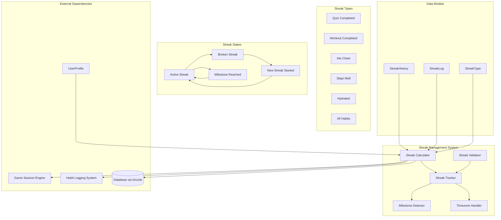
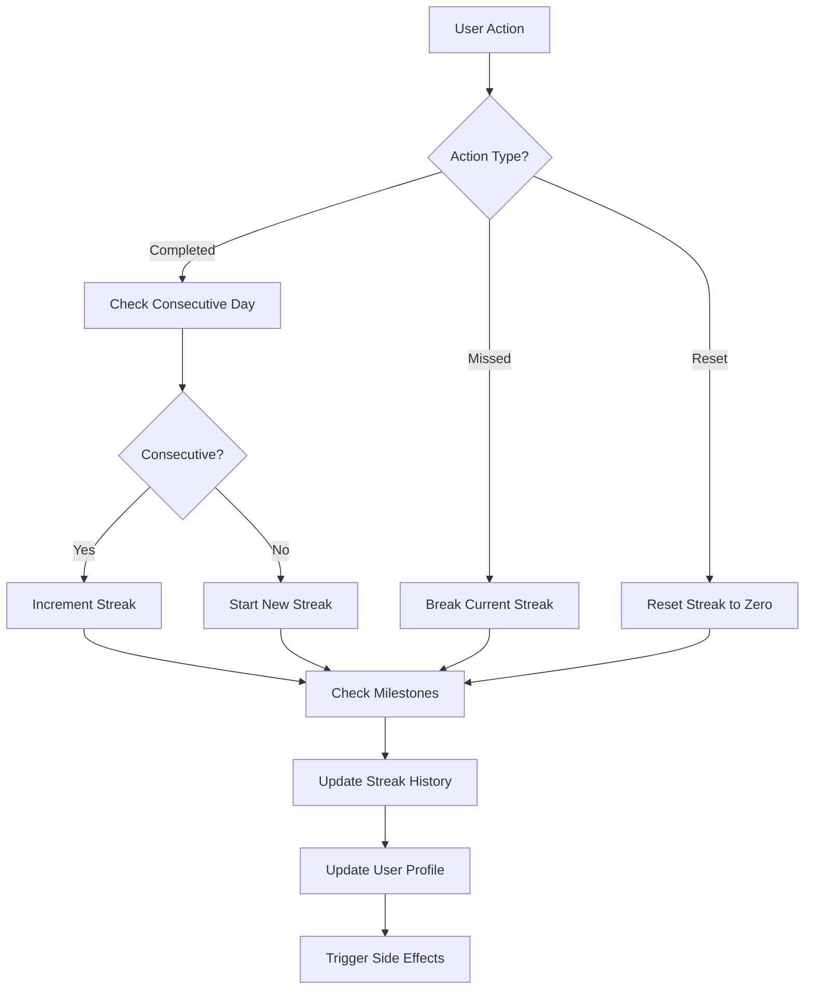
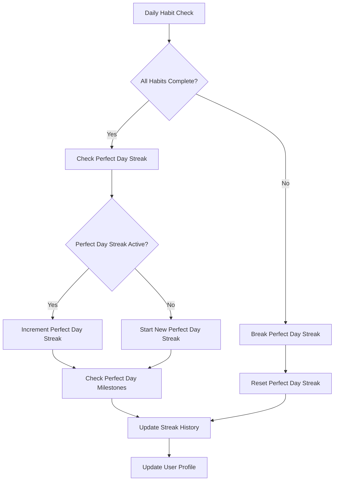
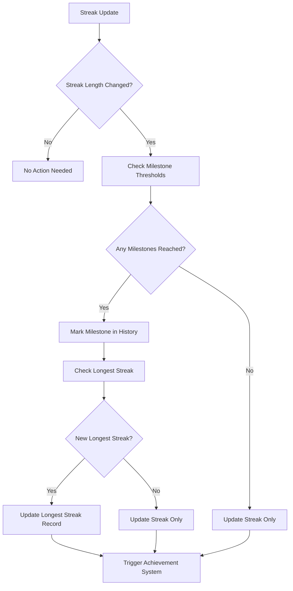

# Streak Management System Low-Level Design Document

## Executive Summary

The Streak Management System tracks user progress across multiple habit types and quiz completion, managing multi-type streak calculation, milestone detection, and streak history. This component uses an event-driven architecture with timezone-aware date calculations to maintain accurate streak tracking and prevent manipulation.

## Design Context

### Requirements Reference
**Functional Requirements**: R5.1, R5.2, R5.3, R6.1, R6.2, R15.1, R16.1, R16.2

**Non-Functional Requirements**: Real-time streak updates, timezone accuracy, streak manipulation prevention, performance under high user activity

**User Journey Reference**: Habit Tracking Journey, Daily Challenge Journey, Achievement & Progress Journey

**Dependencies**: Game Session Engine, Database Layer (Drizzle), Content Management System, User Profile System

### Scope & Boundaries
**In Scope**: Multi-type streak tracking, streak calculation, milestone detection, streak history management, timezone-aware date handling

**Out of Scope**: Content generation, user authentication, achievement unlocking, avatar progression

**Assumptions**: User actions are properly authenticated, timezone data is accurate, database is accessible

## Detailed Component Design

### Component Architecture

#### Class/Module Diagram


#### Component Responsibilities
**StreakCalculator**
- **Primary Responsibility**: Calculate and update streak values based on user actions
- **Secondary Responsibilities**: Handle streak breaks, streak resets, streak continuations
- **Dependencies**: Database, Game Session Engine, Habit System
- **Dependents**: MilestoneDetector, StreakTracker

**StreakTracker**
- **Primary Responsibility**: Track current streak states and maintain streak history
- **Secondary Responsibilities**: Streak persistence, streak queries, streak analytics
- **Dependencies**: StreakCalculator, Database, TimezoneHandler
- **Dependents**: User Profile System, Achievement System

**MilestoneDetector**
- **Primary Responsibility**: Detect when streaks reach milestone values
- **Secondary Responsibilities**: Milestone validation, milestone notification
- **Dependencies**: StreakTracker, Content Management System
- **Dependents**: Achievement System, Notification System

**TimezoneHandler**
- **Primary Responsibility**: Handle timezone-aware date calculations for streaks
- **Secondary Responsibilities**: Timezone validation, DST handling, date boundary detection
- **Dependencies**: User Profile, Session Timezone data
- **Dependents**: StreakCalculator, StreakTracker

**StreakValidator**
- **Primary Responsibility**: Validate streak data integrity and prevent manipulation
- **Secondary Responsibilities**: Streak anomaly detection, security monitoring
- **Dependencies**: Streak data, timezone data, user activity patterns
- **Dependents**: StreakTracker, Security System

### Interface Specifications

#### Public APIs
**updateStreak**: Streak Update API
```typescript
Signature: updateStreak(input: StreakUpdateInput): Promise<StreakUpdateResult>
Purpose: Update streak for a specific habit type based on user action
Preconditions: User authenticated, valid habit type, valid action data
Postconditions: Streak updated, milestone checked, history recorded
Error Conditions: Invalid habit type, authentication failure, data validation error
```

**getCurrentStreaks**: Current Streaks Retrieval API
```typescript
Signature: getCurrentStreaks(userId: string): Promise<CurrentStreaks>
Purpose: Get current streak information for all habit types
Preconditions: User authenticated, user exists
Postconditions: Current streak data returned for all types
Error Conditions: User not found, access denied, data loading failure
```

**getStreakHistory**: Streak History Retrieval API
```typescript
Signature: getStreakHistory(input: StreakHistoryInput): Promise<StreakHistoryResult>
Purpose: Get streak history for specific type and time period
Preconditions: User authenticated, valid time period, valid streak type
Postconditions: Streak history data returned
Error Conditions: Invalid parameters, access denied, data not found
```

**checkMilestones**: Milestone Check API
```typescript
Signature: checkMilestones(userId: string): Promise<MilestoneCheckResult>
Purpose: Check if user has reached any new milestones
Preconditions: User authenticated, user exists
Postconditions: Milestone status returned with any new achievements
Error Conditions: User not found, access denied, milestone check failure
```

**validateStreak**: Streak Validation API
```typescript
Signature: validateStreak(input: StreakValidationInput): Promise<StreakValidationResult>
Purpose: Validate streak data integrity and detect anomalies
Preconditions: Streak data exists, validation rules configured
Postconditions: Validation result with any detected issues
Error Conditions: Invalid data, validation rule failure, system error
```

## Data Design

### Data Models
**StreakHistory** (Database Entity via Drizzle)
```typescript
// Drizzle schema
export const streakHistories = pgTable('streak_histories', {
  id: uuid('id').primaryKey().defaultRandom(),
  user_id: uuid('user_id').notNull().references(() => users.id),
  streak_type: text('streak_type').notNull(), // References StreakType.id
  streak_length: integer('streak_length').notNull(),
  started_date: date('started_date').notNull(),
  ended_date: date('ended_date'), // null if current streak
  is_current: boolean('is_current').notNull().default(true),
  milestone_reached: integer('milestone_reached'), // 7, 14, 30, etc.
  created_at: timestamp('created_at').notNull().defaultNow(),
  updated_at: timestamp('updated_at').notNull().defaultNow(),
});
```

**StreakLog** (Database Entity via Drizzle)
```typescript
// Drizzle schema
export const streakLogs = pgTable('streak_logs', {
  id: uuid('id').primaryKey().defaultRandom(),
  user_id: uuid('user_id').notNull().references(() => users.id),
  date: date('date').notNull(), // YYYY-MM-DD
  entries: jsonb('entries').notNull(), // { workout_completed: true, ate_clean: false, ... }
  logged_at: timestamp('logged_at').notNull().defaultNow(),
  timezone: text('timezone').notNull(), // Timezone when logged
  created_at: timestamp('created_at').notNull().defaultNow(),
  updated_at: timestamp('updated_at').notNull().defaultNow(),
});
```

**UserProfile** (Database Entity via Drizzle)
```typescript
// Drizzle schema
export const userProfiles = pgTable('user_profiles', {
  id: uuid('id').primaryKey().defaultRandom(),
  user_id: uuid('user_id').notNull().references(() => users.id),
  current_game_session: text('current_game_session').references(() => gameSessions.id),
  current_state: text('current_state').references(() => userStates.id),
  current_streak_ids: jsonb('current_streak_ids'), // { quiz_completed: "uuid", workout_completed: "uuid", ... }
  longest_streaks: jsonb('longest_streaks'), // { quiz_completed: "uuid", workout_completed: "uuid", ... }
  last_activity_date: date('last_activity_date'),
  created_at: timestamp('created_at').notNull().defaultNow(),
  updated_at: timestamp('updated_at').notNull().defaultNow(),
});
```

**StreakUpdateInput** (Zod Schema)
```typescript
const StreakUpdateInputSchema = z.object({
  userId: z.string().uuid(),
  streakType: z.enum(['quiz_completed', 'workout_completed', 'ate_clean', 'slept_well', 'hydrated', 'all']),
  action: z.enum(['completed', 'missed', 'reset']),
  actionDate: z.date(),
  timezone: z.string(),
  metadata: z.record(z.any()).optional(),
});

type StreakUpdateInput = z.infer<typeof StreakUpdateInputSchema>;
```

**StreakUpdateResult** (TypeScript Interface)
```typescript
interface StreakUpdateResult {
  success: boolean;
  streakType: string;
  previousLength: number;
  newLength: number;
  milestoneReached?: number;
  streakBroken: boolean;
  newStreakStarted: boolean;
  updatedAt: Date;
}
```

**CurrentStreaks** (TypeScript Interface)
```typescript
interface CurrentStreaks {
  userId: string;
  streaks: {
    [streakType: string]: {
      currentLength: number;
      longestLength: number;
      startedDate: Date;
      isActive: boolean;
      nextMilestone?: number;
    };
  };
  lastUpdated: Date;
}
```

**Business Rules**: 
- Streaks are calculated using timezone-aware date boundaries
- Streak breaks occur when a day is missed (no completion by 11:59 PM in timezone)
- Perfect day streaks require all habit types to be completed
- Streak history maintains complete audit trail
- Milestone detection happens automatically on streak updates

**Relationships**: 
- StreakHistory belongs to User and references StreakType
- StreakLog belongs to User and contains daily habit entries
- UserProfile contains current streak references and longest streak records
- StreakType defines available streak types and their properties

**Indexing Strategy**: 
- Primary key on StreakHistory.id
- Composite index on (user_id, streak_type, is_current) for current streak queries
- Index on StreakHistory.started_date for date-based queries
- Index on StreakLog(user_id, date) for daily habit queries
- Index on UserProfile.current_streak_ids for profile updates

### Data Access Patterns
**Streak Update Pattern**
- **Query Pattern**: SELECT current streak, UPDATE streak, INSERT new streak if needed
- **Caching Strategy**: Current streaks cached in UserProfile, history cached for recent periods
- **Transaction Boundaries**: Single transaction for streak update and history recording
- **Concurrency Handling**: Optimistic locking on streak updates, user-level locking

**Streak Query Pattern**
- **Query Pattern**: SELECT current streaks and history for user
- **Caching Strategy**: Current streaks cached in UserProfile, history cached with TTL
- **Transaction Boundaries**: Read-only transactions for streak queries
- **Concurrency Handling**: Read-only access, no concurrency issues

**Milestone Detection Pattern**
- **Query Pattern**: SELECT streak lengths, check against milestone thresholds
- **Caching Strategy**: Milestone thresholds cached, detection results cached
- **Transaction Boundaries**: Read-only transactions for milestone checking
- **Concurrency Handling**: Read-only access, milestone updates handled separately

## Algorithm Design

### Core Algorithms
**Streak Calculation Algorithm**
```
Input: User action, habit type, action date, timezone
Output: Updated streak information
Complexity: Time O(1), Space O(1)

Pseudocode:
1. Get current streak for habit type
2. Calculate date difference in user's timezone
3. If action is 'completed' and date is consecutive, increment streak
4. If action is 'missed' or date is not consecutive, break streak
5. Update streak history and current streak
6. Check for milestones
7. Return updated streak information
```

**Perfect Day Detection Algorithm**
```
Input: Daily habit entries for a user
Output: Perfect day status and streak update
Complexity: Time O(n), Space O(1) where n is habit types

Pseudocode:
1. Check all habit types for completion status
2. If all habits completed, create/update 'all' streak
3. If any habit missed, break 'all' streak
4. Update perfect day streak history
5. Return perfect day status
```

**Milestone Detection Algorithm**
```
Input: Current streak length, streak type
Output: Milestone status and achievement triggers
Complexity: Time O(1), Space O(1)

Pseudocode:
1. Check if current length reaches any milestone thresholds
2. If milestone reached, mark milestone in history
3. Trigger achievement system notification
4. Update longest streak if applicable
5. Return milestone information
```

**Business Logic Flows**
**Daily Streak Update Flow**


**Perfect Day Streak Flow**


**Milestone Detection Flow**


## Implementation Specifications

### Key Implementation Details
**Streak Calculation**
- **Approach**: Event-driven updates with timezone-aware date handling
- **Libraries/Frameworks**: Drizzle ORM, date-fns, timezone handling
- **Configuration**: Streak rules, milestone thresholds, timezone validation
- **Environment Variables**: STREAK_MILESTONE_THRESHOLDS, TIMEZONE_VALIDATION_STRICT

**Milestone Detection**
- **Approach**: Automatic detection on streak updates with configurable thresholds
- **Libraries/Frameworks**: Content Management System for milestone definitions
- **Configuration**: Milestone values, achievement triggers, notification settings
- **Environment Variables**: MILESTONE_CHECK_ENABLED, ACHIEVEMENT_TRIGGER_DELAY

**Timezone Handling**
- **Approach**: Session-level timezone locking with user profile fallback
- **Libraries/Frameworks**: date-fns-tz, timezone validation
- **Configuration**: Default timezone, DST handling, timezone validation rules
- **Environment Variables**: DEFAULT_TIMEZONE, DST_HANDLING_ENABLED

**Streak Validation**
- **Approach**: Real-time validation with anomaly detection and security monitoring
- **Libraries/Frameworks**: Custom validation logic, security monitoring
- **Configuration**: Validation rules, anomaly thresholds, security alerts
- **Environment Variables**: STREAK_VALIDATION_ENABLED, ANOMALY_DETECTION_THRESHOLD

### Core Data Operations
**Streak Update Operation**
```typescript
async function updateStreak(input: StreakUpdateInput): Promise<StreakUpdateResult> {
  const { userId, streakType, action, actionDate, timezone } = input;
  
  // Get current streak
  const currentStreak = await db.query.streakHistories.findFirst({
    where: and(
      eq(streakHistories.user_id, userId),
      eq(streakHistories.streak_type, streakType),
      eq(streakHistories.is_current, true)
    ),
  });
  
  // Calculate new streak length
  let newLength = 0;
  let streakBroken = false;
  let newStreakStarted = false;
  
  if (action === 'completed') {
    if (currentStreak) {
      const daysDiff = differenceInDays(actionDate, currentStreak.started_date);
      if (daysDiff === 1) {
        // Consecutive day
        newLength = currentStreak.streak_length + 1;
      } else if (daysDiff === 0) {
        // Same day, no change
        newLength = currentStreak.streak_length;
      } else {
        // Gap in streak, start new one
        newLength = 1;
        streakBroken = true;
        newStreakStarted = true;
      }
    } else {
      // First time, start new streak
      newLength = 1;
      newStreakStarted = true;
    }
  } else if (action === 'missed') {
    streakBroken = true;
    newLength = 0;
  }
  
  // Update streak history
  if (currentStreak && (streakBroken || action === 'missed')) {
    await db.update(streakHistories)
      .set({
        ended_date: actionDate,
        is_current: false,
        updated_at: new Date(),
      })
      .where(eq(streakHistories.id, currentStreak.id));
  }
  
  // Create new streak if needed
  let newStreakId: string | undefined;
  if (newStreakStarted || (action === 'completed' && newLength > 0)) {
    const newStreak = await db.insert(streakHistories).values({
      user_id: userId,
      streak_type: streakType,
      streak_length: newLength,
      started_date: actionDate,
      is_current: true,
    }).returning();
    
    newStreakId = newStreak[0].id;
  }
  
  // Update user profile
  await updateUserProfileStreaks(userId, streakType, newStreakId);
  
  // Check milestones
  const milestoneReached = await checkMilestones(userId, streakType, newLength);
  
  return {
    success: true,
    streakType,
    previousLength: currentStreak?.streak_length || 0,
    newLength,
    milestoneReached,
    streakBroken,
    newStreakStarted,
    updatedAt: new Date(),
  };
}
```

**Perfect Day Streak Operation**
```typescript
async function updatePerfectDayStreak(userId: string, date: Date, timezone: string): Promise<void> {
  // Get daily habit entries
  const habitLog = await db.query.streakLogs.findFirst({
    where: and(
      eq(streakLogs.user_id, userId),
      eq(streakLogs.date, date)
    ),
  });
  
  if (!habitLog) return;
  
  const entries = habitLog.entries as Record<string, boolean>;
  const allHabitsCompleted = Object.values(entries).every(completed => completed);
  
  if (allHabitsCompleted) {
    // Update perfect day streak
    await updateStreak({
      userId,
      streakType: 'all',
      action: 'completed',
      actionDate: date,
      timezone,
    });
  } else {
    // Break perfect day streak
    await updateStreak({
      userId,
      streakType: 'all',
      action: 'missed',
      actionDate: date,
      timezone,
    });
  }
}
```

**Parameters**: User ID, streak type, action data, date information, timezone data

**Performance**: O(1) for streak updates, O(n) for perfect day detection, O(1) for milestone checking

**Indexes Required**: Composite index on (user_id, streak_type, is_current), index on (user_id, date)

## Error Handling & Validation

### Error Scenarios
**Streak Calculation Errors**
- **Trigger Conditions**: Invalid date data, timezone errors, database connection failure
- **Error Response**: Specific error messages with error codes and recovery suggestions
- **Recovery Strategy**: Retry with exponential backoff, fallback to last known state
- **Logging Requirements**: User ID, streak type, error context, stack trace

**Timezone Handling Errors**
- **Trigger Conditions**: Invalid timezone format, DST transition issues, timezone validation failure
- **Error Response**: Timezone error with fallback to default timezone
- **Recovery Strategy**: Use default timezone, log timezone issues for investigation
- **Logging Requirements**: User ID, attempted timezone, error details, fallback action

**Data Integrity Errors**
- **Trigger Conditions**: Corrupted streak data, invalid streak relationships, data consistency issues
- **Error Response**: Data integrity error with system maintenance notification
- **Recovery Strategy**: Data repair procedures, fallback to backup data
- **Logging Requirements**: Data corruption details, affected records, recovery actions

**Milestone Detection Errors**
- **Trigger Conditions**: Milestone threshold errors, achievement system failure, notification failure
- **Error Response**: Milestone error with manual check recommendation
- **Recovery Strategy**: Retry milestone detection, manual milestone verification
- **Logging Requirements**: Milestone details, error context, retry attempts

### Business Rule Validation
**Streak Continuity Validation**
- **Rule Description**: Streaks must be consecutive days in user's timezone
- **Validation Logic**: Check date differences and timezone boundaries
- **Error Message**: "Streak continuity violation: {details}"
- **System Behavior**: Streak broken, new streak started, audit trail maintained

**Perfect Day Validation**
- **Rule Description**: Perfect day requires all habit types to be completed
- **Validation Logic**: Verify all habit entries are true for the day
- **Error Message**: "Perfect day validation failed: {missing_habits}"
- **System Behavior**: Perfect day streak broken, individual streaks maintained

**Milestone Threshold Validation**
- **Rule Description**: Milestones must be reached in ascending order
- **Validation Logic**: Check milestone progression and prevent milestone regression
- **Error Message**: "Milestone validation failed: {details}"
- **System Behavior**: Milestone rejected, streak updated without milestone

**Timezone Manipulation Prevention**
- **Rule Description**: Users cannot manipulate timezones to extend streak windows
- **Validation Logic**: Validate timezone changes and detect suspicious patterns
- **Error Message**: "Timezone manipulation detected: {details}"
- **System Behavior**: Timezone change blocked, security alert triggered

## Testing Specifications

### Integration Test Scenarios
**Streak Calculation Integration**
- **Components Involved**: StreakCalculator, Database, TimezoneHandler
- **Test Flow**: Update streak, verify calculation, check database updates
- **Mock Requirements**: Mock user actions, mock timezone data, mock database
- **Assertion Points**: Streak calculation accuracy, database consistency, timezone handling

**Perfect Day Streak Integration**
- **Components Involved**: StreakCalculator, HabitSystem, MilestoneDetector
- **Test Flow**: Complete all habits, verify perfect day streak, check milestones
- **Mock Requirements**: Mock habit completion, mock streak data, mock milestone thresholds
- **Assertion Points**: Perfect day detection, streak updates, milestone triggering

**Milestone Detection Integration**
- **Components Involved**: MilestoneDetector, Achievement System, Notification System
- **Test Flow**: Reach milestone, verify detection, check achievement trigger
- **Mock Requirements**: Mock milestone thresholds, mock achievement system, mock notifications
- **Assertion Points**: Milestone detection accuracy, achievement triggering, notification delivery

**Timezone Handling Integration**
- **Components Involved**: TimezoneHandler, StreakCalculator, User Profile System
- **Test Flow**: Change timezone, verify streak calculations, check boundary handling
- **Mock Requirements**: Mock timezone changes, mock DST transitions, mock boundary conditions
- **Assertion Points**: Timezone accuracy, DST handling, boundary calculations

### Edge Cases & Boundary Tests
**DST Transition Handling**
- **Scenario**: Streaks that span daylight saving time transitions
- **Input Values**: DST start/end dates, timezone changes, boundary conditions
- **Expected Behavior**: Consistent streak calculation, no manipulation opportunities
- **Validation**: Timezone accuracy, DST handling, security enforcement

**Leap Year and Month Boundary Handling**
- **Scenario**: Streaks that span month boundaries and leap years
- **Input Values**: Month end dates, leap year dates, boundary conditions
- **Expected Behavior**: Accurate date calculations, proper boundary detection
- **Validation**: Date calculation accuracy, boundary handling, streak continuity

**Concurrent Streak Updates**
- **Scenario**: Multiple simultaneous streak updates for the same user
- **Input Values**: Concurrent API calls, race conditions, simultaneous habit completions
- **Expected Behavior**: Consistent streak state, no data corruption
- **Validation**: Data consistency, race condition handling, error prevention

**Invalid Streak Data Recovery**
- **Scenario**: Recovery from corrupted or invalid streak data
- **Input Values**: Corrupted streak records, invalid relationships, missing data
- **Expected Behavior**: Graceful error handling, data recovery, system stability
- **Validation**: Error handling, recovery procedures, system resilience
