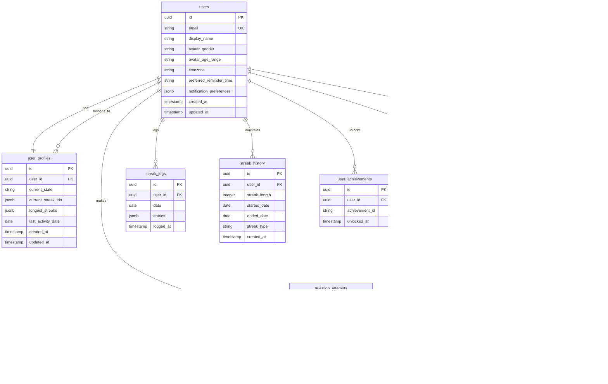

# FitJourney Game - Visual Architecture Diagrams

## System Overview Diagram


## User Journey Flow


## Component Hierarchy & Data Flow


## Database Schema Visualization



## API Endpoint Architecture

```mermaid
graph LR
    subgraph "Client Layer"
        A[React Components]
        B[Service Worker]
        C[Local Storage]
    end
    
    subgraph "API Routes"
        D[/api/auth/*]
        E[/api/sessions/*]
        F[/api/profile/*]
        G[/api/streaks/*]
        H[/api/achievements/*]
        I[/api/habits/*]
        J[/api/challenges/*]
    end
    
    subgraph "Database Layer"
        K[Supabase]
        L[PostgreSQL]
        M[Row Level Security]
    end
    
    subgraph "Static Content"
        N[Questions JSON]
        O[Challenges JSON]
        P[States JSON]
        Q[Achievements JSON]
    end
    
    A --> D
    A --> E
    A --> F
    A --> G
    A --> H
    A --> I
    A --> J
    
    D --> K
    E --> K
    F --> K
    G --> K
    H --> K
    I --> K
    J --> N
    J --> O
    J --> P
    J --> Q
    
    K --> L
    L --> M
```

## State Management Flow


## Offline-First Architecture


## Content Generation Pipeline


## Performance Optimization Strategy


## Security Architecture


## Deployment & CI/CD Pipeline


## Monitoring & Analytics


## Scalability Roadmap


These visual diagrams provide a comprehensive understanding of the FitJourney Game architecture, showing how all components interact, how data flows through the system, and how the application scales from MVP to enterprise levels. Each diagram focuses on a specific aspect of the system, making it easier to understand the complex relationships and dependencies.
